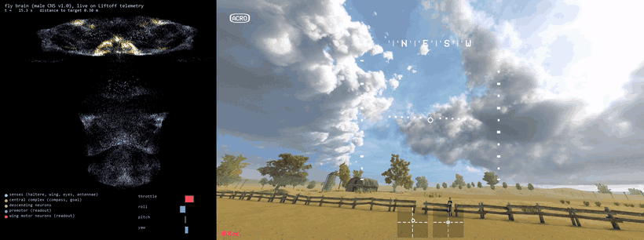
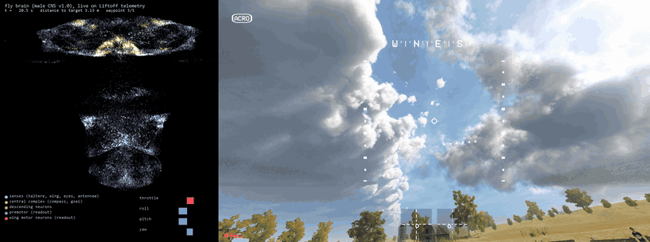
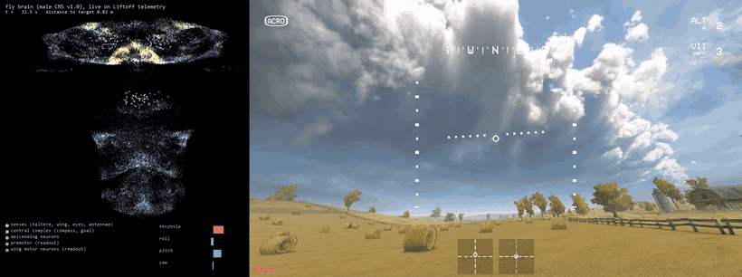
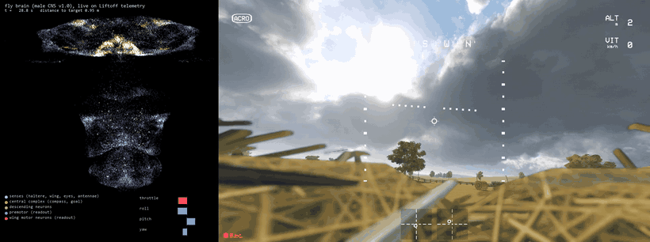
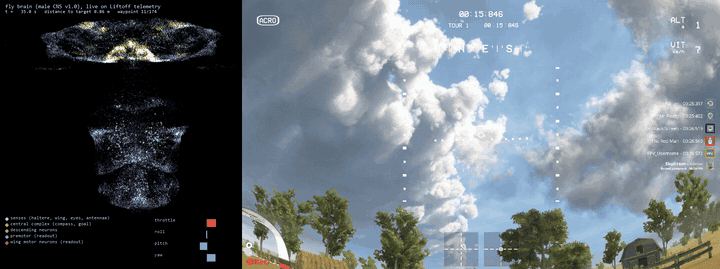
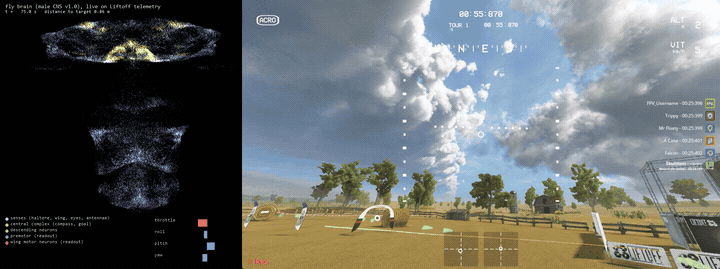

# Haltere

A fruit-fly brain, wired exactly as in the newest fly connectome, trained to fly an FPV drone in
[Liftoff](https://store.steampowered.com/app/410340/Liftoff_FPV_Drone_Racing/).



*Left: the 30,000 neurons of the flight circuit drawn at their real positions in the male CNS
(brain on top, nerve cord below), brightening as they fire, live on Liftoff's telemetry. Right:
Liftoff's own FPV view of the drone they are flying, through a virtual Xbox controller. This is the
first flight: take-off and a hover 2 m above the reset point, mean error 0.34 m over 40 s.
Videos: [hover](docs/liftoff_hover.mp4), [a 3 m square pattern](docs/liftoff_square.mp4)
(GIF: [docs/liftoff_square.gif](docs/liftoff_square.gif)). Recorded with
`haltere liftoff fly runs/ftRobust_best.pt --record ...`.*



Freestyle patterns with the smoother brain (`artifacts/ftSmooth_best.pt`): an orbit
([video](docs/liftoff_orbit.mp4)) and a climb-and-dive ([video](docs/liftoff_climbdive.mp4)),
targets moving continuously while the brain follows.







The same brain in the training simulator, with the drone drawn in 3D:
[docs/flight.gif](docs/flight.gif) / [docs/flight.mp4](docs/flight.mp4)
(`haltere render runs/imJ_best.pt`, or `--live` for a window).

The brain is a **connectome-constrained recurrent network** built from the
[male CNS connectome v1.0](https://www.janelia.org/project-team/flyem/male-cns-connectome)
(Janelia FlyEM, Cambridge Connectomics and Google Connectomics, released June 2026; Berg et al.,
Cell, September 2026). It is hosted on [neuPrint](https://neuprint.janelia.org) as `male-cns:v1.0`
and mirrored as public bulk files in Google Cloud Storage, which is what this project downloads.

The drone's senses are written into the fly's own sensory neurons and the drone's sticks are read
out of the fly's own wing motor neurons:

| drone signal | fly neurons (male-CNS v1.0 annotations) | count |
|---|---|---|
| angular rates (gyro) | haltere afferents, dorsal metathoracic nerve | 439 |
| aerodynamic load | wing campaniform sensilla, anterior dorsal mesothoracic nerve | 218 |
| optic flow (rotation + translation) | lobula-plate tangential cells HS / VS / H / CH | 48 |
| attitude (horizon) | ocellar pathway, OCG interneurons | 22 |
| airflow | Johnston's organ wind/gravity neurons | 475 |
| heading | compass cells EPG | 50 |
| goal direction | fan-shaped body goal cells PFL3 / FC2 | 116 |
| **sticks out** | wing and haltere muscle motor neurons (b1, b2, b3, i1, i2, iii1, iii3, hg1-4, tp1, tp2, tpn, ps1, ps2, DLMn, DVMn, hi1, hi2, hDVM, ...) | 83 |

Between them sit every traced neuron that lies on a path of at most two synapses from a sense to a
motor neuron (and vice versa), plus the whole central complex and all descending neurons: 30,000
neurons and 2.77 million connections carrying 37.5 million synapses. Synaptic **structure** and
**sign** (from the connectome's neurotransmitter predictions: acetylcholine excitatory; GABA,
glutamate and histamine inhibitory; monoamines learnable) are fixed by the data. What training
changes is the per-connection gain (initialised so that weight is proportional to synapse count and
regularised towards that prior), per-neuron gains, biases and time constants, the sensory encoders,
and a small linear readout from the motor neurons to the four stick axes. This is the recipe of
Lappalainen et al. 2024 ("Connectome-constrained networks predict neural activity across the fly
visual system", Nature) applied to flight control.

Training happens in a batched, differentiable quadrotor simulator (PyTorch, thousands of drones in
parallel on the GPU) that reproduces Liftoff's control chain: Betaflight rate curves, a Betaflight-
style rate PID with the gains from your Liftoff drone configuration, the motor mixer, motor lag,
rigid-body dynamics and drag. The flight cost is back-propagated through the simulator and the brain
(truncated BPTT). The trained brain then flies the real Liftoff drone through Liftoff's UDP
telemetry stream and a virtual Xbox controller.

## Layout

```
haltere/connectome   download the flat connectome, select populations, build the graph (+ optional neuPrint path)
haltere/brain        the connectome-constrained RNN (sparse recurrent core, sensory encoders, motor readout)
haltere/sim          differentiable quadrotor, Betaflight rates + rate PID + mixer, tasks (hover / waypoints)
haltere/train        truncated-BPTT training loop, evaluation, checkpoints
haltere/liftoff      telemetry receiver, virtual gamepad, system identification, the live pilot
configs/flight.yaml  which neurons make up the brain
configs/train.yaml   task, brain, simulator and training settings
```

## Setup

Requirements: Windows (for Liftoff), an NVIDIA GPU, Python 3.11+, [uv](https://docs.astral.sh/uv/).

```bash
uv venv --python 3.13 .venv
uv pip install --python .venv/Scripts/python.exe torch --index-url https://download.pytorch.org/whl/cu128
uv pip install --python .venv/Scripts/python.exe -e ".[dev,neuprint]"
.venv/Scripts/python.exe -m pytest -q
```

Everything below uses the `haltere` command (`.venv/Scripts/haltere.exe`, or `python -m haltere.cli`).

## 1. Connectome

```bash
haltere fetch                 # 570 MB: neuron annotations, neurotransmitter predictions, connection weights
haltere populations           # show what each named population selects
haltere build                 # -> data/built/flight.{npz,nodes.parquet,meta.json}   (a few seconds)
```

The bulk files need no login. If you have a neuPrint token (log in at neuprint.janelia.org, Account,
copy the Auth Token into `NEUPRINT_APPLICATION_CREDENTIALS`), `haltere neuprint check` verifies it
and `haltere build --source neuprint` rebuilds the same tables through the live API
(slow for the full adjacency; useful for newer snapshots or cross-checks).

## 2. Train in the simulator

```bash
haltere train --run runs/hover            # configs/train.yaml; ~1 s per iteration on an RTX 4090
haltere eval runs/hover/best.pt           # distance to target, crash rate, ...
```

`configs/train.yaml` is where the task (hover box, waypoint hopping), the regularisation strength
that keeps weights close to the connectome, and the drone physics live. The `ctl`/`rates` sections
mirror a Liftoff drone configuration (Zetaflight P/I/D 29/34/22 etc., Rate 100 / SuperExpo 70).

### Moving targets

Hovering brains follow a moving target only at about 1 m/s: the goal vector saturates and nothing
teaches them to lead it. `configs/train_path.yaml` and `train_path2.yaml` fine-tune a hovering
brain on targets that drift along a slowly turning heading at a random speed (`path_speed` is the
ceiling; `path_static_frac` keeps a share of static targets so hover precision survives;
`pos_huber` makes the position cost linear beyond 1 m so far-behind targets do not drown the
smoothness terms). `max_gpu_temp: 78` pauses training whenever `nvidia-smi` reports the GPU above
that temperature (`haltere/train/thermal.py`), and `iter_sleep` caps the average power draw.

### Imitation first

`haltere imitate` trains the brain to reproduce a working controller's commands on that
controller's own flights (the MLP baseline is the teacher), with a growing share of flights flown
by the student itself, and evaluates the student in closed loop every 50 iterations:

```bash
haltere imitate --config configs/train_dn.yaml --imitate-config configs/imitate_long.yaml --run runs/imitate
haltere imitate ... --resume runs/imitate/last.pt      # continue
haltere train --config configs/train_dn.yaml --resume runs/imitate/best.pt --run runs/finetune   # then the flight cost
```

`configs/train_dn.yaml` also writes the goal and heading channels into the 499 descending neurons
that synapse directly onto the wing motor neurons (`dn_wing`, a population derived from the
connectivity), which is what gave the throttle channel any fidelity at all.

## 3. Fly in Liftoff

`haltere liftoff doctor` checks every prerequisite and prints the next step. Two things need you at
the keyboard once: a virtual-gamepad driver (an admin install) and Liftoff's controller wizard.

```bash
haltere liftoff doctor     # what is missing, in order
haltere liftoff setup      # writes %USERPROFILE%\AppData\LocalLow\LuGus Studios\Liftoff\TelemetryConfiguration.json
haltere liftoff listen     # start a flight in Liftoff; you should see ~100 Hz frames
```

Then, as printed by `setup`: install [ViGEmBus 1.22.0](https://github.com/nefarius/ViGEmBus/releases/tag/v1.22.0),
`set VGAMEPAD_SKIP_VIGEMBUS_INSTALL=true` and `uv pip install --python .venv/Scripts/python.exe vgamepad`,
disable Steam Input for Liftoff, and map the virtual pad in Liftoff's controller wizard. The pad
exists only while a Haltere process holds it, so run `haltere liftoff calibrate` in a terminal
*before* opening Liftoff's controller settings: Liftoff then lists an "Xbox 360 Controller", and
when the wizard asks for an axis you press Enter in the terminal to sweep it (throttle, yaw, pitch,
roll). `haltere liftoff calibrate --auto 8` sweeps the axes on a timer instead of waiting for Enter,
and `haltere liftoff pad` just keeps the controller present with neutral sticks. Give the axes a
deadband of about 0.1 in Liftoff. Your real radio stays mapped too: you fly it for `record`.

```bash
haltere liftoff record --seconds 120     # fly manually with your radio: hover, then clear single-axis inputs
haltere liftoff fit                      # -> configs/liftoff.yaml: stick/gyro sign conventions + fitted physics
```

Copy the fitted `quad`/`ctl` sections into `configs/train.yaml`, train (or fine-tune with `--resume`),
then:

```bash
haltere liftoff fly runs/imJ_best.pt --offset 0,0,2            # hover 2 m above the reset point
haltere liftoff fly runs/imJ_best.pt --waypoints "3,0,2;3,3,2;0,3,2;0,0,2" --dwell 4
haltere liftoff fly runs/imJ_best.pt --dry-run                  # brain runs on telemetry, no pad output
```

Reset the drone in Liftoff (with it on the ground) to re-zero the pilot's reference frame.

### Racing and freestyle, and recording the video inside Liftoff

The brain does position control: it flies to targets. A race track is a list of gate positions,
a freestyle line is any path you like, and both are taught by flying them once yourself:

```bash
haltere liftoff record --seconds 90 --out data/liftoff/track.csv      # fly the track manually, reset first
haltere liftoff waypoints --csv data/liftoff/track.csv --spacing 3 --out configs/track.yaml
haltere liftoff fly runs/imJ_best.pt --waypoints-file configs/track.yaml --advance-radius 1.0 \
        --record docs/liftoff_race.mp4 --show
```

Freestyle patterns need no manual flight: `--pattern orbit --radius 3 --period 12` circles the
reset point, `--pattern climbdive --radius 3 --amplitude 1.5` sweeps back and forth while climbing
and diving, `--pattern figure8` flies a figure of eight; the target moves continuously and the
brain follows it. `--stick-gain 0.7 --stick-lpf 0.12` scale and low-pass the sticks the brain
sends (Liftoff's input path adds latency the simulator did not have) and `--gyro telemetry` uses
the game's gyro instead of attitude differences.

`--advance-radius` makes the brain move on to the next waypoint as soon as it gets within that
distance (racing); without it waypoints change on a timer. `--path-speed 1.5 --lookahead 2.0`
follows the taught lap as a continuous path instead: a carrot moves along the polyline at that
speed, 2 m ahead of the drone's progress, and slows down smoothly when the drone falls behind (a
stop/go gate here excited a 0.5 Hz pitch oscillation). Path-following brains swing the throttle
more than a hovering brain; `--throttle-scale 0.6` keeps those swings out of Liftoff's throttle
deadband, which starts only 0.08 stick below the hover point. The brain has no camera and no
heading objective (its goal is a vector in its own body frame), so left alone it flies sideways or
backwards along the path; `--face-travel 0.8` adds a yaw command that keeps the nose, and the FPV
camera, pointed at the carrot. `--stick-gain 1,0.7,1` scales roll, pitch and yaw separately. `--record` captures the Liftoff window
from the screen and composes it with a live panel of the brain's activity into an MP4, encoded in a
separate process so the 100 Hz control loop is never slowed down; `--show` opens that panel in a
window while you watch the game. `--capture-rect x,y,w,h` records a screen region instead of a window.

**Which checkpoint to fly in Liftoff: `runs/ftRobust_best.pt`.** It is the imitation brain
fine-tuned with wide domain randomization (thrust, thrust curve, motor lag, drag, yaw torque and
the per-axis controller gains all jittered by 35 to 40%, `configs/train_premotor_robust.yaml`). On
the stand-in, whose physics were never fitted, it holds 0.6 m from the target without crashing,
where the plain imitation brain drifts 1.4 to 1.7 m and a brain fine-tuned on an *imprecisely*
fitted model did worse still. Fitting the physics (`haltere liftoff fit`) is still useful for the
sign conventions, which the pilot needs, and for reading off how far Liftoff's drone is from the
randomization range; if it is far outside, put the fitted values into the robust config's `quad`
section and fine-tune again.

### Flying by sight: the gate detector

Everything above steers by coordinates taught from a manual lap; the brain never sees a gate. The
vision pipeline (`haltere/vision/`) replaces the telemetry goal with one that comes from the FPV
image, so the fly flies toward what it sees:

```bash
haltere liftoff fly runs/ftPath2_best.pt --waypoints-file configs/track_strawbale.yaml --path-speed 1.5     --face-travel 0.8 --face-ahead 6 --face-wobble 35 --seconds 280 --dataset data/vision/run11   # lap frames + pose, camera sweeping
haltere vision calibrate data/vision/run11 --tilts 20,25,30,35 --out configs/camera_seat.yaml    # focal length and tilt of the FPV camera
haltere vision gates-from-frames data/vision/run2 --frames 105,240,338,468,578,700,805    # passage frames -> gate list
haltere vision label data/vision/run11 --camera configs/camera_seat.yaml   # project the next gate into every frame
haltere vision train data/vision/run9 data/vision/run10 data/vision/run11 --out runs/gatenet --max-gpu-temp 70
haltere vision eval runs/gatenet/best.pt data/vision/run10       # accuracy, false positives, centre/range bias per distance
haltere vision inspect data/vision/run10 --ckpt runs/gatenet/best.pt     # labels (green) and predictions (red) on frames
haltere liftoff fly runs/ftPath2_best.pt --vision runs/gatenet/best.pt --camera configs/camera_seat.yaml     --face-travel 0.8 --dataset data/vision/run12   # fly by sight, recording the frames for the next round
haltere vision passes data/vision/run12                          # which gates that flight went through
```

How the pieces work. Liftoff stores neither the track layout nor the camera's field of view, so
both are recovered from flights: the focal length by matching features between consecutive frames
and asking which pinhole model makes the telemetry rotation explain their motion (345 px at
640 wide, an 86 degree horizontal field; the 30 degree camera tilt comes from the drone file), and
the gates by noting the frames in which the drone passes through one (read off thumbnail sheets)
and snapping the drone's position at that moment to the taught path, which the human flew through
the gate centres. Two passes over the course agreed within 6 m for every gate. With the gates known
the next gate along the course is projected into each frame with the drone's attitude, which
labels thousands of frames for free. GateNet is a small convolutional network (5 M parameters,
320 x 180 input) that outputs whether a gate is in view, its centre and its apparent width; the
pilot unprojects the centre into a body-frame direction, turns the width into a distance through
the nominal gate size, and feeds that goal vector to the brain in place of the telemetry one,
remembering the last gate briefly when it leaves the view and hovering when nothing is in sight.
The drone's own senses (gyro, gravity, velocity, motor load) still come from telemetry, as a fly's
would from its halteres and wings.



*Flight by sight: the detector picks the arch out of the view, the pilot turns its centre and
width into a goal, the brain flies through it (gate 1 of the Straw Bale lap, first flight).*

Where it stands. The detector is only as good as the viewpoints it has seen. Trained on lap
frames alone, where the camera always looked along the course and every gate sat near the middle
of the image, it put off-centre gates far too close to the centre (up to 84 px) and read them as
twice too wide, so the first flight by sight aimed 3 m to the right of the first gate and missed
it, flew through the second (1.2 m from its centre) and then lost the course chasing phantoms.
Two fixes followed: the path pilot now sweeps its camera 35 degrees either way while it records
frames (`--face-wobble`), and the range from the apparent width accounts for the stretch of a
wide-angle image away from its centre (a 116 degree camera shows a gate at the edge 2.5 times
wider than at the centre). Retrained on the flight's own frames plus a sweeping lap, the detector
agrees with the projected labels on 97% of a held-out tenth of the frames (centre error 7 px at
320 wide), no longer hallucinates gates on that flight's gate-less views and keeps a 15 px centre
bias, which the next flight will test. Every flight by sight records its frames with
the pose, and the gate list labels them, so each round of flying adds exactly the views the last
round got wrong.

The flights run inside an [Anode](https://github.com/skulitom/Anode) seat, a second Windows
session with its own screen and input, so the desktop stays free while the fly practises. The
sandboxed game there keeps its own video settings, hence the second camera file next to the
desktop's: 200 px focal length and a 116 degree field at 640 wide (`configs/camera_seat.yaml`)
against 345 px and 86 degrees (`configs/camera.yaml`). Pass the one that matches the game you
capture; the detector itself is shared.

### Rehearsing without the game

`haltere liftoff fake` is a stand-in for Liftoff: it simulates a drone with deliberately different
physics and sign conventions, streams telemetry in Liftoff's exact binary format, accepts stick
commands over UDP, and flies itself (with excitation) when nobody is sending sticks. The whole
workflow can be rehearsed against it:

```bash
haltere liftoff fake --seconds 120 &                     # terminal 1
haltere liftoff record --seconds 30 --out data/liftoff/fake.csv
haltere liftoff fit --csv data/liftoff/fake.csv --out configs/liftoff_fake.yaml
haltere liftoff fly runs/hover/best.pt --udp-out 127.0.0.1:9002 --liftoff-config configs/liftoff_fake.yaml --seconds 30
```

`fit` should report `stick_sign (1, -1, -1)` and `gyro_axis (1, 0, 2)` with `gyro_sign (-1, 1, 1)`
for the fake, which is how it was built.

### Baseline

`brain.model: mlp` in the training config swaps the connectome for a small MLP on the same
observations (`configs/train_mlp.yaml`). It is the control experiment: if the MLP learns to hover
and the connectome brain does not, the problem is the brain's parameterisation, not the task.

## How the pieces fit

- `haltere/liftoff/telemetry.py` decodes Liftoff's header-less little-endian UDP frames
  (Timestamp, Position, Attitude, Velocity, Gyro, Input, Battery, MotorRPM) and writes the config file.
- `haltere/liftoff/frames.py` converts Unity's left-handed, y-up frame to the simulator's right-handed,
  z-up frame through rotation matrices, so quaternions survive the handedness flip exactly.
- `haltere/liftoff/sysid.py` learns which way each stick and gyro axis goes by correlation, then fits
  thrust-to-weight, thrust curve, motor lag, drag and per-axis controller gains by gradient descent
  through the simulator on windows of your recording.
- `haltere/sim/tasks.py::observe_from_sensors` is the single place that turns physical quantities into
  the brain's sensory channels; both the simulator and the live pilot go through it.

## Trained brains and where to get them

`artifacts/` holds slim inference checkpoints (parameters only, 12 MB each; the gate detector 20 MB) that work with the
committed flight graph in `data/built/`; the GitHub releases
([v0.1.0](https://github.com/skulitom/haltere/releases/tag/v0.1.0): hover, patterns;
[v0.2.0](https://github.com/skulitom/haltere/releases/tag/v0.2.0): the lap brain, the race video and
the taught track) add the full checkpoints with optimizer state and the videos, and the same
artifacts with a model card are on Hugging Face:
[huggingface.co/Skulitom/haltere](https://huggingface.co/Skulitom/haltere) (`haltere publish-hf` mirrors them).

| checkpoint | trained by | pick it when |
|---|---|---|
| `artifacts/ftPath2_best.pt` | the smooth brain fine-tuned on moving targets (two stages: speed, then smoothness back) | following a lap in Liftoff (`--path-speed 1.5 --face-travel 0.8`) |
| `artifacts/ftSmooth_best.pt` | imitation, then flight cost with 50 ms extra latency and a smoothness penalty | hovering and patterns in Liftoff |
| `artifacts/ftRobust_best.pt` | imitation, then flight cost with wide domain randomization | the first brain that flew in Liftoff |
| `artifacts/imJ_best.pt` | imitation of the MLP with the premotor readout | best simulator accuracy |
| `artifacts/mlp_baseline.pt` | the MLP teacher, no connectome | control experiment |
| `artifacts/gatenet_best.pt` | GateNet, 5 M parameters, on 8.7k labelled frames from lap and by-sight flights in both camera setups | flying by sight (`--vision artifacts/gatenet_best.pt --camera configs/camera_seat.yaml`) |

## Prior art

- Lappalainen et al. 2024, Nature, connectome-constrained visual-system model (flyvis).
- Shiu et al. 2024, Nature, leaky integrate-and-fire whole-brain FlyWire model.
- Vaxenburg et al. 2025, Nature, whole-body fly simulation with learned flight controllers (flybody).
- Jin et al. 2026, FlyGM: a whole-brain connectomic graph model controlling flybody locomotion.
- Pugliese et al. 2026, connectome simulations of the male CNS identify a walking CPG.

## What the first experiments taught

- The training loop and task are learnable: the MLP baseline hovers within about 10 cm after
  70 iterations (a few minutes).
- The connectome brain learned nothing with its first parameterisation, and the reason was not
  saturation but silence: with unit-range sigmoid units, row-normalised synapse counts and weak
  sensory currents, a large roll rate changed the wing-motor-neuron rates by less than 0.2%, so
  the readout saw a constant signal. Three changes fix the transmission by more than an order of
  magnitude (`haltere/brain/model.py`, `encoders.py`): rates are `rate_max * sigmoid(v)` with
  `rate_max` 4 (unit slope at the operating point), sensory currents are 12 per unit input, and
  neurons of one cell type and body side share a tuning direction so that their common downstream
  targets receive a coherent signal instead of a cancelling mixture. Haltere afferents make 1,017
  direct synapses onto 58 of the 83 wing motor neurons, so the reflex path exists; the compass and
  goal cells reach the motor neurons only through the central complex and descending neurons.
- System identification on the stand-in recovers every sign convention exactly and moves the
  physics towards the truth, but thrust-to-weight, thrust exponent, motor lag and controller gains
  trade off against each other on hover-dominated data; treat the fitted numbers as a starting
  point and record flights with clear single-axis inputs.
- After the transmission fixes the connectome brain still does not learn to hover (runs `cx3`
  to `cx8` in `runs/`, about 100-150 iterations each). What was ruled out, in order: output
  saturation; baseline drift of the motor population (fixed by whitening every motor neuron with
  slowly tracked running statistics; normalising with the current batch's statistics is wrong
  inside a control loop because it subtracts the control signal); exploding gradients (pre-clip
  norms are 3-15); joint optimisation of the 2.8 M internal parameters (reservoir mode with
  3,072 trainable parameters fails the same way). The remaining evidence points at the features
  themselves: a linear readout of the whitened motor-neuron rates reproduces the MLP's smoothed
  actions offline with R² 0.96, but only R² 0.4 for the raw commands, and the fitted readout does
  not stabilise the drone in closed loop. The motor neurons are a lagged, low-dimensional view of
  the state.
- Imitation experiments (runs `imA` to `imJ`): a clean offline analysis put the linear ceiling of
  the whitened wing-motor-neuron features at R² 0.4-0.5 for roll/pitch/throttle and 0.75 for
  yaw against the teacher's commands, rising to 0.7 when the command is lagged by 50 ms (the
  features are late). The network's activity is low-dimensional everywhere (participation ratio
  about 3), and pruning to each neuron's strongest inputs changes nothing. Online imitation is
  stable only with small learning rates (readout 1e-4 to 3e-4, internals 1e-4); faster rates
  oscillate. Learnable tuning directions did not help; writing goal and heading into the
  wing-driving descending neurons gave the throttle channel some fidelity but hurt the rest.
- **What worked: reading the sticks out of the premotor population as well.** The 3,830 neurons
  that synapse directly onto the wing motor neurons (VNC interneurons, descending and ascending
  neurons, derived from the connectivity) decode the teacher's commands at R² 0.7-0.8, against
  0.4-0.5 for the 83 motor neurons alone. With `motor: [wing_mn, premotor]` and the slow recipe
  (`configs/imitate_premotor.yaml`), run `imJ` went from 94% crashes to holding position in 450
  iterations. Interpretation: the wing motor neurons are the last, most compressed stage; the
  premotor layer is where the fly's flight commands are still separable.

## Results

| controller | simulator, difficulty 1.0 (mean distance, within 0.5 m, crashed) | stand-in "Liftoff" hover, 26 s (mean distance, crashed) |
|---|---|---|
| MLP baseline (`runs/mlp300/best.pt`) | 0.05 m, 100%, 0% | not tested |
| **connectome brain**, imitation, premotor readout (`runs/imJ_best.pt`) | 0.22 m, 95%, 0% | 1.4 m, no crashes |
| **connectome brain**, + wide domain randomization (`runs/ftRobust_best.pt`) | 0.20 m, 99.6%, 0% (physics jittered 35%) | **0.55 m, no crashes**; in Liftoff: 0.34 m hover |
| **connectome brain**, + latency and smoothness fine-tune (`runs/ftSmooth_best.pt`) | 0.30 m, 95%, 0% (50 ms delay) | in Liftoff: 0.35 m hover with a quarter of the stick jitter; orbit and climb-and-dive; follows the taught lap at 1.2 m/s with 0.9-1.0 m error |
| **connectome brain**, + moving-target fine-tune (`runs/ftPath2_best.pt`) | 0.37 m, 80%, 2% static; 0.76 m at 1 m/s, 3.1 m at 2 m/s | in Liftoff: follows the taught lap at 1.5 m/s with 0.67 m mean error, 46% of the time within 0.5 m, nose along the path |
| connectome brain, wing-motor-neuron readout only (`runs/imD2`) | 2.4 m, 0%, 1% | not tested |

Difficulty 1.0 means every drone starts with up to 25 degrees of tilt, 90 deg/s of rotation,
1 m/s of velocity and 1 m of offset from a target placed anywhere in a 6 x 6 x 2 m box.
`runs/imJ_flight.png` shows one evaluation flight. Against the Liftoff stand-in, whose physics and
sign conventions differ from training, the un-adapted brain stays airborne at the right altitude
with a lateral offset of about 1.4 m; fine-tuning on the identified physics is the intended remedy
(`configs/train_premotor_fakefit.yaml`, run `ftFake`).

## In Liftoff: what actually happened

- Liftoff's Xbox 360 profile mapped the virtual pad by itself. Its input processing, measured with
  `haltere liftoff stickcal` (ramps on the ground) and `haltere liftoff autotest` (an automated
  lift-off, altitude hold, six pulses and landing): a 0.25 centre deadband followed by a linear
  rescale on roll, pitch and throttle, roll inverted, a milder curve on yaw, and each stick
  normalised to the unit circle. Above the deadband, Liftoff's processed input maps to angular
  rate exactly as the Betaflight formula the simulator uses (a 0.13 input gave 27 deg/s; the
  formula says 29). The pilot inverts these curves (`configs/liftoff.yaml`) and remaps the throttle
  around the measured hover point (raw stick +0.33, processed +0.11).
- With no controller connected, Liftoff's throttle sits at mid-stick and the drone climbs, so a
  pad process must stay alive: `haltere liftoff pad --udp-in 9003 --control-file ... --log ...` is
  the persistent bridge and `fly --udp-out 127.0.0.1:9003` sends sticks through it. Liftoff also
  arms only after the throttle has been low, so `fly` holds the throttle low for 0.8 s after every
  reset and ramps the brain's sticks in over 1.2 s.
- `runs/ftRobust_best.pt`, never fine-tuned on Liftoff's physics, hovered 2 m above the reset point
  for 40 s with 0.34 m mean error and flew a 3 m square pattern gate to gate on the first attempt.
- Smoothness: the first flights alternated the sticks at about 1 Hz. An output low-pass made it
  worse (any added lag on top of Liftoff's input latency turns into a runaway), lower stick gain
  only weakened the corrections, but a brain fine-tuned with 50 ms of extra latency and a stronger
  smoothness cost (`configs/train_premotor_smooth.yaml`, `artifacts/ftSmooth_best.pt`) cut the
  throttle jitter four-fold in the game. One bias mattered as much: the motor-load sense scales the
  motor RPM by `max_rpm`, and taking that from the RPM peak of the test climb instead of the true
  maximum told the brain it was climbing at hover; mapping the measured hover RPM to the
  simulator's hover command (`max_rpm: 38900` in `configs/liftoff.yaml`) removed a 0.5-1 m offset.
- Moving targets: orbit at 0.8 m/s tracked with 0.75 m mean error, climb-and-dive at about 1 m/s
  with 1.1 m; an orbit at 1.35 m/s was too fast (the brain fell behind and crashed). After a crash
  Liftoff needs a reset before it arms again: `fly --reset-key R` sends the key to the game window.
- Liftoff binds to the last controller profile that was used: after one manual lap with a radio the
  virtual pad was ignored until it was re-selected (main menu, Options, Contrôles, Manette,
  Selectionner, "XInput Gamepad 1", Sauvegarder; the in-race pause menu has no controller page).
  The game also ignores all input while its window is unfocused and minimises itself whenever it
  loses focus, so `fly` now restores and focuses the window at start and before every keystroke.
  Beware that the pad's throttle-low stick scrolls Liftoff's menus down to "Quitter". The binding
  can also drop silently in the middle of a session (the game then reports mid throttle whatever the
  pad sends); unplugging and re-plugging the virtual pad brings it back, so the pilot now detects
  the symptom while holding the throttle low to arm and asks the bridge to re-plug the pad.
- Racing: a lap of the "Field Day" infinite race on Straw Bale was flown once by hand, turned into
  174 waypoints 3 m apart (`configs/track_strawbale.yaml`, a 601 m loop) and followed as a path.
  The smooth brain keeps to the line within 0.9-1.0 m at 1.2 m/s but falls behind anything faster.
  The moving-target fine-tune (`runs/ftPath`, stage 1) tracks 2 m/s targets in the simulator with
  1.2 m error where the smooth brain lost them (4.8 m), but thrashed the throttle in the game (raw
  stick std 0.40 against 0.01); stage 2 (`configs/train_path2.yaml`: 30% static targets, Huber
  position cost, smoothness weight 3) brought the jitter back to the smooth brain's level and kept
  hover at 0.37 m, giving up most of the speed (3.1 m at 2 m/s in the simulator). In the game the
  decisive change was not the brain but the heading: with `--face-travel 0.8` the same stage-2
  brain went from 1.30 m to **0.67 m mean error at 1.5 m/s** (46% of the time within 0.5 m, 3% of
  the time more than 2 m off), flying through the gates nose first (`docs/liftoff_race.mp4`). At
  2 m/s it still keeps up, with 1.5 m mean error; the human lap on this track runs at 14 m/s. A
  third stage with moderate smoothing (`configs/train_path3.yaml`, run `ftPath3`) scored better
  than stage 2 in the simulator on every count (hover 0.29 m, 0.61 m at 1 m/s, 2.3 m at 2 m/s,
  same jitter) yet flew slightly worse in the game on the same lap segment (0.70 m against
  0.59 m, with more stick movement): the simulator ranking does not transfer at this level of
  detail, so the game decides which brain ships.

## Status

Working end to end on this machine: connectome download and graph construction on the real data,
the simulator, the brain model (custom sparse backward, sign constraints), imitation and flight-cost
training, the Liftoff telemetry and virtual-pad loop, automated calibration, connectome brains that
hover, fly patterns and follow a taught race lap inside Liftoff, and a first flight by sight: the
gate detector, trained on frames the flights label themselves, steers the same brain through a gate
it sees. Open: a whole lap by sight (the detector still loses gates when the drone turns hard, and
the pilot then hovers and looks around), and racing pace. The brain follows the lap at 1.5 m/s
where a human lap on the same track runs at 14 m/s; a brain fine-tuned on 2.5 m/s targets
(`runs/ftPath3`) is the next one to fly, then a speed curriculum on the real track geometry.
