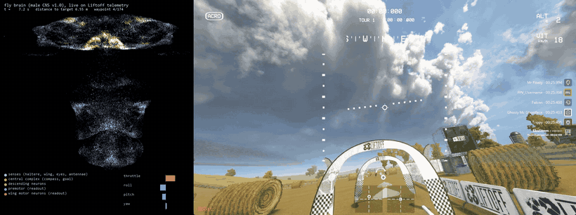
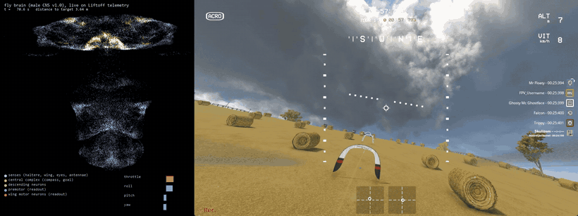
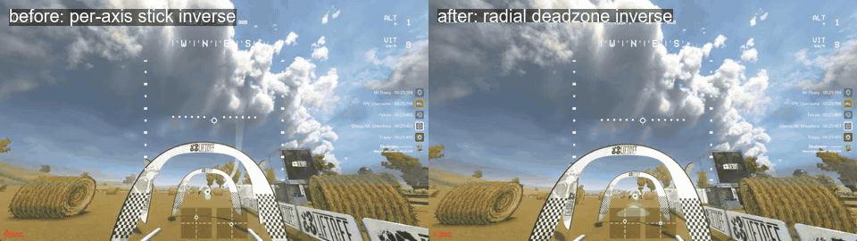

# Haltere

A fruit-fly brain, wired exactly as in the newest fly connectome, trained to fly an FPV drone in
[Liftoff](https://store.steampowered.com/app/410340/Liftoff_FPV_Drone_Racing/).



*Left: the 30,000 neurons of the flight circuit drawn at their real positions in the male CNS
(brain on top, nerve cord below), brightening as they fire, live on Liftoff's telemetry. Right:
Liftoff's own FPV view of the drone they are flying, through a virtual Xbox controller. The lap
brain on the taught Straw Bale Field Day line: gates 0 to 6 in 38 s, 4.8 m/s on average with peaks
of 8.3 m/s and no contact, where the same brain took 69 s before; the horizon's shake above 1 Hz is
0.37 degrees against 1.37 before, and the roll and pitch rate shake 2 deg/s against 26
([the stick path and the speed senses](#smooth-and-fast-the-stick-path-and-the-speed-senses)).
[Video of the whole loop](https://github.com/skulitom/haltere/releases/tag/v0.4.0).*


*The whole lap by sight, four times actual speed. Nothing here knows where the gates are: the goal
comes from a gate detector reading Liftoff's own FPV image, and the drone's telemetry is used only
for its own pose, speed and rates - what a real quad has from its IMU. Gates 0 to 6 in 64 s at
3.19 m/s, all seven flown, every arch crossed within 0.4 m of its centre, no contacts, the horizon
steady to 0.48 degrees ([the rabbit pilot](#the-rabbit-pilot---sight-rabbit)). Five laps have now
gone 7/7 with this detector and pilot; the fastest was 58 s at 3.35 m/s, at a higher speed setting
than the one shipped. The fix that bought them was in the gate labels, not the pilot.*



*An earlier flight by sight: gates 5 and 6, the last one 13 m up the hill. Six of seven gates in one
139 s run, each within 0.8 m of the arch's centre.*



*The same stretch of the lap and the same brain, before (left) and after (right) the pilot learned how
Liftoff really processes a gamepad stick.*

Earlier flights. The first one, take-off and a hover 2 m above the reset point, mean error 0.34 m
over 40 s ([video](docs/liftoff_hover.mp4), recorded with
`haltere liftoff fly artifacts/ftRobust_best.pt --record ...`), and a 3 m square pattern
([video](docs/liftoff_square.mp4)):


Freestyle patterns with the smoother brain (`artifacts/ftSmooth_best.pt`): an orbit
([video](docs/liftoff_orbit.mp4)) and a climb-and-dive ([video](docs/liftoff_climbdive.mp4)),
targets moving continuously while the brain follows.


The same brain in the training simulator, with the drone drawn in 3D:
[docs/flight.gif](docs/flight.gif) / [docs/flight.mp4](docs/flight.mp4)
(`haltere render runs/imJ_best.pt`, or `--live` for a window).

The brain is a **connectome-constrained recurrent network** built from the
[male CNS connectome v1.0](https://www.janelia.org/project-team/flyem/male-cns-connectome)
(Janelia FlyEM, Cambridge Connectomics and Google Connectomics, released June 2026; Berg et al.,
Cell, September 2026). It is hosted on [neuPrint](https://neuprint.janelia.org) as `male-cns:v1.0`
and mirrored as public bulk files in Google Cloud Storage, which is what this project downloads.

The drone's senses are written into the fly's own sensory neurons and the drone's sticks are read
out of the fly's own wing motor neurons:

| drone signal | fly neurons (male-CNS v1.0 annotations) | count |
|---|---|---|
| angular rates (gyro) | haltere afferents, dorsal metathoracic nerve | 439 |
| aerodynamic load | wing campaniform sensilla, anterior dorsal mesothoracic nerve | 218 |
| optic flow (rotation + translation) | lobula-plate tangential cells HS / VS / H / CH | 48 |
| attitude (horizon) | ocellar pathway, OCG interneurons | 22 |
| airflow | Johnston's organ wind/gravity neurons | 475 |
| heading | compass cells EPG | 50 |
| goal direction | fan-shaped body goal cells PFL3 / FC2 | 116 |
| **sticks out** | wing and haltere muscle motor neurons (b1, b2, b3, i1, i2, iii1, iii3, hg1-4, tp1, tp2, tpn, ps1, ps2, DLMn, DVMn, hi1, hi2, hDVM, ...) | 83 |

Between them sit every traced neuron that lies on a path of at most two synapses from a sense to a
motor neuron (and vice versa), plus the whole central complex and all descending neurons: 30,000
neurons and 2.77 million connections carrying 37.5 million synapses. Synaptic **structure** and
**sign** (from the connectome's neurotransmitter predictions: acetylcholine excitatory; GABA,
glutamate and histamine inhibitory; monoamines learnable) are fixed by the data. What training
changes is the per-connection gain (initialised so that weight is proportional to synapse count and
regularised towards that prior), per-neuron gains, biases and time constants, the sensory encoders,
and a small linear readout from the motor neurons to the four stick axes. This is the recipe of
Lappalainen et al. 2024 ("Connectome-constrained networks predict neural activity across the fly
visual system", Nature) applied to flight control.

Training happens in a batched, differentiable quadrotor simulator (PyTorch, thousands of drones in
parallel on the GPU) that reproduces Liftoff's control chain: Betaflight rate curves, a Betaflight-
style rate PID with the gains from your Liftoff drone configuration, the motor mixer, motor lag,
rigid-body dynamics and drag. The flight cost is back-propagated through the simulator and the brain
(truncated BPTT). The trained brain then flies the real Liftoff drone through Liftoff's UDP
telemetry stream and a virtual Xbox controller.

## Layout

```
haltere/connectome   download the flat connectome, select populations, build the graph (+ optional neuPrint path)
haltere/brain        the connectome-constrained RNN (sparse recurrent core, sensory encoders, motor readout)
haltere/sim          differentiable quadrotor, Betaflight rates + rate PID + mixer, tasks (hover / waypoints)
haltere/train        truncated-BPTT training loop, evaluation, checkpoints
haltere/liftoff      telemetry receiver, virtual gamepad, system identification, the live pilot
configs/flight.yaml  which neurons make up the brain
configs/train.yaml   task, brain, simulator and training settings
```

## Setup

Requirements: Windows (for Liftoff), an NVIDIA GPU, Python 3.11+, [uv](https://docs.astral.sh/uv/).

```bash
uv venv --python 3.13 .venv
uv pip install --python .venv/Scripts/python.exe torch --index-url https://download.pytorch.org/whl/cu128
uv pip install --python .venv/Scripts/python.exe -e ".[dev,neuprint,liftoff,vision]"
# add ,publish to mirror checkpoints to Hugging Face with `haltere publish-hf`
.venv/Scripts/python.exe -m pytest -q
```

Everything below uses the `haltere` command (`.venv/Scripts/haltere.exe`, or `python -m haltere.cli`).

## 1. Connectome

```bash
haltere fetch                 # 570 MB: neuron annotations, neurotransmitter predictions, connection weights
haltere populations           # show what each named population selects
haltere build                 # -> data/built/flight.{npz,nodes.parquet,meta.json}   (a few seconds)
```

The bulk files need no login. If you have a neuPrint token (log in at neuprint.janelia.org, Account,
copy the Auth Token into `NEUPRINT_APPLICATION_CREDENTIALS`), `haltere neuprint check` verifies it
and `haltere build --source neuprint` rebuilds the same tables through the live API
(slow for the full adjacency; useful for newer snapshots or cross-checks).

## 2. Train in the simulator

```bash
haltere train --run runs/hover            # configs/train.yaml; ~1 s per iteration on an RTX 4090
haltere eval runs/hover/best.pt           # distance to target, crash rate, ...
```

`configs/train.yaml` is where the task (hover box, waypoint hopping), the regularisation strength
that keeps weights close to the connectome, and the drone physics live. The `ctl`/`rates` sections
mirror a Liftoff drone configuration (Zetaflight P/I/D 29/34/22 etc., Rate 100 / SuperExpo 70).

### Moving targets

Hovering brains follow a moving target only at about 1 m/s: the goal vector saturates and nothing
teaches them to lead it. `configs/train_path.yaml` and `train_path2.yaml` fine-tune a hovering
brain on targets that drift along a slowly turning heading at a random speed (`path_speed` is the
ceiling; `path_static_frac` keeps a share of static targets so hover precision survives;
`pos_huber` makes the position cost linear beyond 1 m so far-behind targets do not drown the
smoothness terms). `max_gpu_temp: 78` pauses training whenever `nvidia-smi` reports the GPU above
that temperature (`haltere/train/thermal.py`), and `iter_sleep` caps the average power draw.

### Imitation first

`haltere imitate` trains the brain to reproduce a working controller's commands on that
controller's own flights (the MLP baseline is the teacher), with a growing share of flights flown
by the student itself, and evaluates the student in closed loop every 50 iterations:

```bash
haltere imitate --config configs/train_dn.yaml --imitate-config configs/imitate_long.yaml --run runs/imitate
haltere imitate ... --resume runs/imitate/last.pt      # continue
haltere train --config configs/train_dn.yaml --resume runs/imitate/best.pt --run runs/finetune   # then the flight cost
```

`configs/train_dn.yaml` also writes the goal and heading channels into the 499 descending neurons
that synapse directly onto the wing motor neurons (`dn_wing`, a population derived from the
connectivity), which is what gave the throttle channel any fidelity at all.

## 3. Fly in Liftoff

`haltere liftoff doctor` checks every prerequisite and prints the next step. Two things need you at
the keyboard once: a virtual-gamepad driver (an admin install) and Liftoff's controller wizard.

```bash
haltere liftoff doctor     # what is missing, in order
haltere liftoff setup      # writes %USERPROFILE%\AppData\LocalLow\LuGus Studios\Liftoff\TelemetryConfiguration.json
haltere liftoff listen     # start a flight in Liftoff; you should see ~100 Hz frames
```

Then, as printed by `setup`: install [ViGEmBus 1.22.0](https://github.com/nefarius/ViGEmBus/releases/tag/v1.22.0),
`set VGAMEPAD_SKIP_VIGEMBUS_INSTALL=true` and `uv pip install --python .venv/Scripts/python.exe vgamepad`,
disable Steam Input for Liftoff, and map the virtual pad in Liftoff's controller wizard. The pad
exists only while a Haltere process holds it, so run `haltere liftoff calibrate` in a terminal
*before* opening Liftoff's controller settings: Liftoff then lists an "Xbox 360 Controller", and
when the wizard asks for an axis you press Enter in the terminal to sweep it (throttle, yaw, pitch,
roll). `haltere liftoff calibrate --auto 8` sweeps the axes on a timer instead of waiting for Enter,
and `haltere liftoff pad` just keeps the controller present with neutral sticks. Give the axes a
deadband of about 0.1 in Liftoff. Your real radio stays mapped too: you fly it for `record`.

```bash
haltere liftoff record --seconds 120     # fly manually with your radio: hover, then clear single-axis inputs
haltere liftoff fit                      # -> configs/liftoff.yaml: stick/gyro sign conventions + fitted physics
```

Copy the fitted `quad`/`ctl` sections into `configs/train.yaml`, train (or fine-tune with `--resume`),
then:

```bash
haltere liftoff fly artifacts/imJ_best.pt --offset 0,0,2            # hover 2 m above the reset point
haltere liftoff fly artifacts/imJ_best.pt --waypoints "3,0,2;3,3,2;0,3,2;0,0,2" --dwell 4
haltere liftoff fly artifacts/imJ_best.pt --dry-run                  # brain runs on telemetry, no pad output
```

Reset the drone in Liftoff (with it on the ground) to re-zero the pilot's reference frame.

### Racing and freestyle, and recording the video inside Liftoff

The brain does position control: it flies to targets. A race track is a list of gate positions,
a freestyle line is any path you like, and both are taught by flying them once yourself:

```bash
haltere liftoff record --seconds 90 --out data/liftoff/track.csv      # fly the track manually, reset first
haltere liftoff waypoints --csv data/liftoff/track.csv --spacing 3 --out configs/track.yaml
haltere liftoff fly artifacts/imJ_best.pt --waypoints-file configs/track.yaml --advance-radius 1.0 \
        --record docs/liftoff_race.mp4 --show
```

Freestyle patterns need no manual flight: `--pattern orbit --radius 3 --period 12` circles the
reset point, `--pattern climbdive --radius 3 --amplitude 1.5` sweeps back and forth while climbing
and diving, `--pattern figure8` flies a figure of eight; the target moves continuously and the
brain follows it. `--stick-gain 0.7 --stick-lpf 0.12` scale and low-pass the sticks the brain
sends (Liftoff's input path adds latency the simulator did not have) and `--gyro telemetry` uses
the game's gyro instead of attitude differences.

The lap as it is flown now (the first clip above), and the same brain by sight:

```bash
haltere liftoff fly artifacts/ftPath2_best.pt --waypoints-file configs/track_strawbale.yaml \
        --path-speed 8 --lookahead 6 --z-lead 1.5 --flow-gain 0.5 --face-travel 0.8 --face-ahead 6 \
        --throttle-scale 0.8 --gyro telemetry --reset-key R --log data/liftoff/logs/lap.csv
haltere liftoff fly artifacts/ftPath2_best.pt --vision artifacts/gatenet_best.pt --camera configs/camera_seat.yaml \
        --sight rabbit --sight-speed 3.5 --sight-gate-speed 3.2 --sight-turn-gate-speed 2.8 \
        --sight-flow-min 0.6 --sight-flow-alt ground --throttle-scale 0.8 --gyro telemetry --reset-key R
haltere liftoff score data/liftoff/logs/lap.csv --gates configs/gates_strawbale.json \
        --track configs/track_strawbale.yaml
```

`--advance-radius` makes the brain move on to the next waypoint as soon as it gets within that
distance (racing); without it waypoints change on a timer. `--path-speed 1.5 --lookahead 2.0`
follows the taught lap as a continuous path instead: a carrot moves along the polyline at that
speed, 2 m ahead of the drone's progress, and slows down smoothly when the drone falls behind (a
stop/go gate here excited a 0.5 Hz pitch oscillation). Path-following brains swing the throttle
more than a hovering brain; `--throttle-scale 0.6` keeps those swings out of Liftoff's throttle
deadband, which starts only 0.08 stick below the hover point. The brain has no camera and no
heading objective (its goal is a vector in its own body frame), so left alone it flies sideways or
backwards along the path; `--face-travel 0.8` adds a yaw command that keeps the nose, and the FPV
camera, pointed at the carrot. `--stick-gain 1,0.7,1` scales roll, pitch and yaw separately. `--record` captures the Liftoff window
from the screen and composes it with a live panel of the brain's activity into an MP4, encoded in a
separate process so the 100 Hz control loop is never slowed down; `--show` opens that panel in a
window while you watch the game. `--capture-rect x,y,w,h` records a screen region instead of a window.

**The first brain to fly in Liftoff was `artifacts/ftRobust_best.pt`** (for laps and flying by sight
use `artifacts/ftPath2_best.pt`, for hover and patterns `artifacts/ftSmooth_best.pt` - see the
checkpoint table). It is the imitation brain
fine-tuned with wide domain randomization (thrust, thrust curve, motor lag, drag, yaw torque and
the per-axis controller gains all jittered by 35 to 40%, `configs/train_premotor_robust.yaml`). On
the stand-in, whose physics were never fitted, it holds 0.6 m from the target without crashing,
where the plain imitation brain drifts 1.4 to 1.7 m and a brain fine-tuned on an *imprecisely*
fitted model did worse still. Fitting the physics (`haltere liftoff fit`) is still useful for the
sign conventions, which the pilot needs, and for reading off how far Liftoff's drone is from the
randomization range; if it is far outside, put the fitted values into the robust config's `quad`
section and fine-tune again.

### Flying by sight: the gate detector

Everything above steers by coordinates taught from a manual lap; the brain never sees a gate. The
vision pipeline (`haltere/vision/`) replaces the telemetry goal with one that comes from the FPV
image, so the fly flies toward what it sees:

```bash
haltere liftoff fly artifacts/ftPath2_best.pt --waypoints-file configs/track_strawbale.yaml --path-speed 1.5     --face-travel 0.8 --face-ahead 6 --face-wobble 35 --seconds 280 --dataset data/vision/run11   # lap frames + pose, camera sweeping
haltere vision calibrate data/vision/run11 --tilts 20,25,30,35 --out configs/camera_seat.yaml    # focal length and tilt of the FPV camera
haltere vision gates-from-frames data/vision/run2 --frames 105,240,338,468,578,700,805    # passage frames -> gate list
haltere vision label data/vision/run11 --camera configs/camera_seat.yaml   # project the next gate into every frame
haltere vision train data/vision/run9 data/vision/run10 data/vision/run11 --out runs/gatenet --max-gpu-temp 70
haltere vision eval runs/gatenet/best.pt data/vision/run10       # accuracy, false positives, centre/range bias per distance
haltere vision inspect data/vision/run10 --ckpt runs/gatenet/best.pt     # labels (green) and predictions (red) on frames
haltere liftoff fly artifacts/ftPath2_best.pt --vision runs/gatenet/best.pt --camera configs/camera_seat.yaml     --face-travel 0.8 --dataset data/vision/run12   # fly by sight, recording the frames for the next round
haltere vision passes data/vision/run12                          # which gates that flight went through
```

How the pieces work. Liftoff stores neither the track layout nor the camera's field of view, so
both are recovered from flights: the focal length by matching features between consecutive frames
and asking which pinhole model makes the telemetry rotation explain their motion (345 px at
640 wide, an 86 degree horizontal field; the 30 degree camera tilt comes from the drone file), and
the gates by noting the frames in which the drone passes through one (read off thumbnail sheets)
and snapping the drone's position at that moment to the taught path, which the human flew through
the gate centres. Two passes over the course agreed within 6 m for every gate. With the gates known
the next gate along the course is projected into each frame with the drone's attitude, which
labels thousands of frames for free. GateNet is a small convolutional network (5 M parameters,
320 x 180 input) that outputs whether a gate is in view, its centre and its apparent width; the
pilot unprojects the centre into a body-frame direction, turns the width into a distance through
the nominal gate size, and feeds that goal vector to the brain in place of the telemetry one,
remembering the last gate briefly when it leaves the view and hovering when nothing is in sight.
The drone's own senses (gyro, gravity, velocity, motor load) still come from telemetry, as a fly's
would from its halteres and wings.


*Flight by sight: the detector picks the arch out of the view, the pilot turns its centre and
width into a goal, the brain flies through it (gate 2 of the Straw Bale lap, flight 4, which went
through the first three gates in sequence).*

Where it stands. The detector is only as good as the viewpoints it has seen. Trained on lap
frames alone, where the camera always looked along the course and every gate sat near the middle
of the image, it put off-centre gates far too close to the centre (up to 84 px) and read them as
twice too wide, so the first flight by sight aimed 3 m to the right of the first gate and missed
it, flew through the second (1.2 m from its centre) and then lost the course chasing phantoms.
Two fixes followed: the path pilot now sweeps its camera 35 degrees either way while it records
frames (`--face-wobble`), and the range from the apparent width accounts for the stretch of a
wide-angle image away from its centre (a 116 degree camera shows a gate at the edge 2.5 times
wider than at the centre). Retrained on the flights' own frames plus a sweeping lap (three rounds so far, 17k frames), the
detector of that round agreed with the projected labels on 98% of a held-out tenth of the frames
(centre error 4 px at 320 wide) - a number that could not fall, because that split took single frames
out of the same flights, and frames 130 ms apart are the same picture. Measured on whole flights
recorded after it was trained, the detector that ships now holds 85.6% recall at 2.9 px, and still
fires on 11.6% of gate-less frames - false positives the tracker has to absorb. It places the
gates within 8 px on their frames. Every flight by sight records its frames with
the pose, and the gate list labels them, so each round of flying adds exactly the views the last
round got wrong. The detector is no longer the weak part; the pilot's habits are. The flights
exposed two of them: the leg flown straight on after a gate was computed along the world's x axis
rather than the nose (every turn sent the drone east), and after passing an arch the search sweep
would find the same arch from behind and fly back into it (an arch looks the same from both sides,
so passed gates are now remembered for a minute). The pilot's estimate was then rebuilt around what a
detection is good at: its bearing is exact, its range is rough. The remembered gate sits on the latest
sighting ray at a range smoothed over sightings (and by parallax when the drone's own motion has
opened enough of it); sightings agree in metres, not degrees; when two arches line up the wider one
wins; passing is judged by the arch filling the view and vanishing rather than by the range; after a
gate the drone flies on, then creeps along the course direction (last gate to this one) sweeping its
view, and enters the next gate square-on along that direction; its height follows the last gate it
passed and climbs only on close sightings. The best flight since then went through gates 1, 2, 5
and 7 of the lap, including the last one 13 m up its hill, missing gates 3, 4 and 6 by 3, 12 and
3 m, in 74 s from the start; another went through the first three in sequence at 15, 31 and 42 s.
Flight to flight the outcome still varies, and the gate on the sharp turn (gate 3, seen obliquely on
the approach) is missed most often: a clean lap by sight is the open problem, now a matter of the
approach to obliquely seen arches rather than of perception.

Since then the pilot by sight has been rebuilt twice over, once from the game's side (the stick
path, below) and once from the pilot's: flight logs showed the old pilot handing the brain carrots up
to 25 m away (it sprinted and climbed), jumping its goal 25 times a minute, aiming its nose at a point
2 m ahead (the yaw stick sat at its limit for 16-45% of the approach time) and spending up to 43% of
its airborne time flying on, creeping or hovering after gates. The [rabbit pilot](#the-rabbit-pilot---sight-rabbit)
replaces it: tracked arches, a virtual lead vehicle with bounded speed and curvature, and a nose
that follows the lead's heading. In the game, on the same lap (`haltere liftoff score` on
`fly --log`; lateral = distance from the arch's centre where the drone crossed its plane):

| pilot, flight | gates through | laterals (m) | gate 0 to last | horizon / roll-pitch-rate shake | contacts |
|---|---|---|---|---|---|
| old pilot, radial sticks (w6, best attempt) | 1, 2 | 1.7, 1.5 | - | 1.4 deg / 11 deg/s | 1 |
| rabbit, 2.5 m/s (w17) | 0, 1, 2, 5 | 0.2, 0.4, 1.2, 0.6 | 75 s to gate 5 | 0.70 deg / 5.1 deg/s | 4 |
| rabbit, 3.5 m/s (w18, attempt 2) | 0, 1, 2, 3, 4, 5 | 0.2, 0.4, 0.0, 0.2, 0.2, 2.0 | 54 s to gate 5 | 0.56 deg / 3.4 deg/s | 1 |
| rabbit, 3.5 m/s, flow height above ground (w19) | 0, 1, 2, 4, 5, 6 | 0.1, 0.6, 0.5, 0.8, 0.7, 0.5 | 72 s to gate 6 | 0.49 deg / 6.3 deg/s | 1 |

Gate 2, the obliquely seen turn most earlier flights by sight missed, has been passed in every rabbit
flight, within about half a metre (0.53 m at most) in both flights at 3.5 m/s. Two lessons came from the game rather than
the rehearsal. Aiming 0.3 m above the passage point plus an upward bias put the drone into gate 4's
round top, so the pilot now aims at the passage height. And on the hill the brain speeds up by
itself: its optic-flow sense is speed over height, and the height it is given is above the start, so
6 m up the slope that sense reads about a fifth of what it would over flat ground (the airflow sense is
unchanged), and it flew into gate 5 at 5.4 m/s instead of 3.2;
`--sight-flow-alt ground` measures that height above the ground under the pilot's altitude
reference, and gates 5 and 6 followed. Open: gates 3 and 4 are sometimes seen as several arches at
once, the tracker splits them, and the drone passes wide.

The flights run inside an [Anode](https://github.com/skulitom/Anode) seat, a second Windows
session with its own screen and input, so the desktop stays free while the fly practises. The
sandboxed game there keeps its own video settings, hence the second camera file next to the
desktop's: 200 px focal length and a 116 degree field at 640 wide (`configs/camera_seat.yaml`)
against 345 px and 86 degrees (`configs/camera.yaml`). Pass the one that matches the game you
capture; the detector itself is shared.

### Rehearsing without the game

`haltere liftoff fake` is a stand-in for Liftoff: it simulates a drone with deliberately different
physics and sign conventions, streams telemetry in Liftoff's exact binary format, accepts stick
commands over UDP, and flies itself (with excitation) when nobody is sending sticks. The whole
workflow can be rehearsed against it:

```bash
haltere liftoff fake --seconds 120 &                     # terminal 1
haltere liftoff record --seconds 30 --out data/liftoff/fake.csv
haltere liftoff fit --csv data/liftoff/fake.csv --out configs/liftoff_fake.yaml
haltere liftoff fly runs/hover/best.pt --udp-out 127.0.0.1:9002 --liftoff-config configs/liftoff_fake.yaml --seconds 30
```

`fit` should report `stick_sign (1, -1, -1)` and `gyro_axis (1, 0, 2)` with `gyro_sign (-1, 1, 1)`
for the fake, which is how it was built.

The by-sight pilot has its own rehearsal, entirely inside the simulator and faster than real time:

```bash
haltere vision rehearse artifacts/ftPath2_best.pt --camera configs/camera_seat.yaml \
    --gates configs/gates_strawbale.json --seconds 120 --log data/rehearse/sight.csv
haltere vision rehearse artifacts/ftPath2_best.pt --set vision_speed=3 --seed 1   # a pilot change, another noise draw
haltere vision rehearse artifacts/ftPath2_best.pt --sight rabbit --clutter --tracks   # with false positives that stick
```

The brain flies the simulated drone (its training physics and 60 ms latency) through the real
`TelemetryPilot` on a simulated clock, and GateNet is replaced by a synthetic detector that projects
the course's arches into the FPV camera with the drone's attitude and reports what the network
would: the widest arch in view, 15 Hz and 80 ms late, with the misses (more for arches seen at an
angle or far away), range-dependent width bias, flips between two arches in view and phantoms that
`haltere.vision.rehearse.DetectorModel` measured for gatenet8 on recorded flights (`--clean` for
a perfect detector). The log has the `fly --log` columns, so `haltere liftoff score` rates it like a
game flight; the rehearsal adds time spent slow, goal jumps, time in each pilot mode, the error of
the pilot's gate estimate, what it believed it passed, and how long the goal sat beyond 8 m (a far
goal ahead of a pitched-down drone points up in its body frame, and the brain climbs). The ground
is flat and only the arch posts and top bars are solid. Detections are stamped with the moment their
frame was grabbed, as the live detector stamps them.

`--clutter` adds the failure that matters most and was missing: objects standing beside the course
that the detector fires on repeatedly, so its false positives triangulate, confirm as tracks and can
become the target. The `false_pos` phantom it already had is an independent box at a random place in
each frame; no two of them can meet in the tracker's association gate, so it never confirms and never
reaches a pilot decision, which is why this bench could not see the 2026-09-17 regression.
`haltere.vision.rehearse.ClutterModel` carries the rates, measured by replaying the six game flights.
It is off by default, so every bench number taken without it stays comparable. `--tracks` then reports
which tracks sat on no arch, with `liftoff replay-sight`'s own definition of a phantom.

### The rabbit pilot (`--sight rabbit`)

`haltere/liftoff/sightpilot.py` is a second by-sight pilot, selected with `--sight rabbit` on both
`liftoff fly` and `vision rehearse` (`--sight legacy`, the default, keeps the one above). It splits
what a detection is good for from what the brain needs:

- **Perception.** Each detector frame is used once and placed with the pose at its screen grab
  (`TelemetryPilot.pose_at` interpolates the last second of telemetry). A sighting updates one of
  several per-arch Kalman filters, tight across the ray and loose along it (looser still when the arch
  is cropped by the image edge); association is in metres across the ray and in log-range along it, so
  two arches lined up on one bearing stay two tracks. An arch confirms after three sightings at a
  plausible height (bale-height phantoms do not), an estimate the camera should see but does not
  for 2 s while frames arrive is dropped, passed arches absorb their sightings, and a pass can be
  undone within 1.5 s if the arch is still seen ahead. With no fresh detector frame for 1 s (a dead
  capture thread, a hidden window, inference slower than 0.35 s) the detector counts as stalled: a
  remembered target is flown at 2 m/s, and without one the rabbit parks and the drone holds.
- **Guidance.** A virtual lead vehicle, the rabbit, flies a world-frame course with bounded speed,
  acceleration, curvature and curvature rate: onto the target gate's approach axis (along the course,
  turned toward the next gate when it is known, pivoting onto the exact bearing close up), through the
  gate, straight on for 8 m, and around a search circle when nothing is in sight. It waits for the
  drone, 3 m ahead along its own trail. The brain's goal is the rabbit (clipped to 5 m horizontally and
  1.2 m vertically); a new target or a moved estimate only bends the rabbit, so the goal cannot jump.
- **Heading and speed.** The yaw stick follows the rabbit's heading, with a lead onto the target so the
  arch stays near the optical axis, a feed-forward of the rabbit's turn rate and a phase lead from the
  measured heading rate. The speed sense is scheduled as `flow_ref / speed` with a slow trim on the
  measured speed, between `--sight-flow-min` and `--flow-gain`: `--sight-speed 4` gives a gain of about
  0.6, since the brain holds about 2.45 m/s of sensed speed in the game.

#### What the first six game flights changed

Replaying the tracker on all six (`liftoff replay-sight`, below) said the controller was not the
problem — on clean crossings the estimate sits 0.26 m from the arch and the yaw stick never saturates —
and that 14 of 17 bad crossings were perception or bookkeeping. Six things were fixed; each is a
`SightParams` field, and the values in brackets restore the old behaviour exactly.

> **These switches are OFF in the shipping build, and this section describes what they do when on.**
> With them on alongside the course-order change (since reverted), the first game flight went 3/7 at
> 21 deg/s of yaw shake; reverting course order alone gave 5/7 at 18 deg/s, and switching these off
> too gave 7/7 at 2.4 deg/s - same command, camera and detector. The bisection is in
> `docs/flight_cards/2026-09-17_strawbale_1..3.md`. They were measured by replaying recorded flights
> and by the rehearsal, and neither could produce the loop that broke it - a replay cannot steer the
> drone onto a phantom, and the rehearsal's synthetic detector had only independent per-frame phantoms,
> which never accumulate into a track. `vision rehearse --clutter` now gives it false positives that
> do confirm, and they capture the target and get declared as passes; it still does not reproduce what
> these switches did (3.75 gates with them off against 4.75 with them on, four seeds each - the wrong
> way round and inside the noise), so this remains a question only the game answers. The code and every
> switch remain, because the faults they fix are real and measured. Turn them on
> with `--sight-set ghost_evidence=other --sight-set ghost_keep_d=12 --sight-set target_life=20
> --sight-set orphan_d=8 --sight-set frag_gap=15 --sight-set offaxis_max=40 --sight-set
> offaxis_sig_deg=15 --sight-set look_free=10`. Those eight fields are exactly what is off; anything
> else the bullets below describe is live.

- **A neighbour no longer deletes the gate being flown at.** The detector reports at most *one* arch per
  frame, but "seen by the camera and not detected for 2 s" was charged to the nearest arch in view on
  every frame — so with two arches in view the one being flown at was deleted (79 times over the six
  flights, 47 of them inside 12 m, once 2 s before its gate with 88 sightings behind it). The timer now
  only runs on a frame whose arch is somewhere else in the image (`ghost_evidence`, `ghost_other_deg`),
  never deletes the current target inside 12 m (`ghost_keep_d`), and is longer for a well-seen estimate
  (`ghost_s_hits`, `ghost_s_max`). Because that timer cannot run beyond `ghost_range` and `ghost_keep_d` resets it,
  nothing then retired a target that was simply never seen again — in replay the pilot flew at one for 45 s — so a
  confirmed target unseen for `target_life` (20 s, against a longest honest gap of 15 s over the six flights) is
  dropped; time while the detector is stalled does not count, since flying a remembered gate blind is the point.
  *Legacy: `ghost_evidence=any ghost_keep_d=0 ghost_s_hits=0 target_life=0`.*
- **A gate that is dropped is still passed.** Only `_pass` wrote `last_pass`, so a deleted target left the
  course reference behind: in w19 the reference stayed at gate 2 from 31 s to 75 s, giving gate 5 a
  +40 deg approach axis. A confirmed estimate the drone came within 8 m of leaves an *orphan*, and flying
  past it books a `travel` pass, which moves the course reference, the height ladder and the search side
  on without touching the gate now being flown at (`orphan_*`). One arch can leave two estimates, so a
  second pass within `orphan_dedup_d` of the one on the books — or booked before the drone has flown that
  far from it — is the same gate whichever path booked it: the pass declared from closer in is kept and the
  gate is counted once, so `n_passes` (which indexes `--sight-turn-hints`) and the height ladder are not
  fed twice from a badly ranged estimate. When the last pass is older than 10 s or
  more than 25 m behind, the approach course is the drone's own chord over the last 3-5 s instead
  (`course_age_s`, `course_back_m`, `course_win`). Neither of those outlasts a leg of this course (24-35 m,
  10-17 s), so the reference expires *before* the gate on 40-60 % of the rows 3-12 m out and takes the turn
  rotation with it. Raising them to 30 s / 50 m puts the reference back, but what that buys is small and
  inconsistent — replayed, the mean approach-axis error against the arch's own heading 3-12 m out goes
  17.4 → 11.3 deg on w21's second lap and 12.8 → 12.0 on w20's first, against 7.7 → 9.4 on w20's second and
  no change on w19 — while it turns the bisector rotation back on over the 35 m leg into gate 1, and the
  drone then flies an angled approach and a turning exit that peaks at 20.4 m/s² a metre past the arch
  (11.8 at the 99th percentile over the rest of the flight): the rehearsal scores gate 1 a hit on three
  seeds of four. Left as it is for that reason; `--sight-set course_age_s=30
  --sight-set course_back_m=50` tries it. *Legacy: `orphan_d=0 course_age_s=60 course_min_m=0`.*
- **A fragment is not the next gate.** A displaced sighting spawns a second confirmed track 5-10 m beyond
  the target on the same bearing; it used to win the target or set the bisector. A confirmed track ahead
  of the target within the course's own measured gate spacing (24-35 m here; `frag_gap`, `frag_gap_frac`)
  and close to its ray is now folded into it, and a next-gate candidate must be at least 18 m away
  (`next_min_sep`). *Legacy: `frag_gap=0 frag_absorb=false next_min_sep=3`.*
- **Off the optical axis the detector is a different instrument.** Sightings more than 40 deg off the
  camera axis are refused and the rest are weighted by how far off they are (`offaxis_max`,
  `offaxis_sig_deg`). The angle is the box's image radius, `atan(hypot(u - cx, v - cy) / f)`. Because the
  camera is tilted up 30 deg, the *median* real detection is already
  24-26 deg off-axis (p95 32-37), so the first cut at 35 deg sliced the body of that distribution — 23 % of
  every sighting taken in search mode, and in replay of w16 the pilot sat on an unseen estimate for 45 s.
  At 40 deg (84 px of the 184 to the corner) the loss is 11 % in search and 2 % with a target, and the w16
  fixation comes down to 10 s. Opening it further to 45 deg (6 % / 0.8 %) is no better on the game logs and
  the rehearsal likes it less, since its synthetic detector has no off-axis degradation at all.
  What varies is the horizontal part, and that is what predicts quality: pooled over
  the six flights, 91-100 % of sightings within 5 deg of the nose saw a real arch, against 55-88 % beyond
  20 deg. So the nose now follows the target from 10 deg of bearing instead of 35 (`look_free`,
  `look_max`, `look_kappa`) — extra yaw is free, since the brain flies a body-frame goal.
  *Legacy: `offaxis_max=0 offaxis_sig_deg=0 look_free=35 look_max=25 look_kappa=0.04`.*
- **The axis is not tilted further than the range is worth.** Range along the ray is the least reliable
  number, and any tilt of the approach axis turns it into lateral error at the gate plane (w19 gate 3:
  +7.9 m along the ray and 13.6 deg of tilt made the whole -1.9 m miss). The tilt is now capped at
  `atan(axis_sigma_cap / along-range sigma)`, the pivot onto the exact bearing starts at 18 m instead of
  12, and the terminal snap starts at 12 m and may move the goal 2 m. *Legacy: `axis_sigma_cap=0
  pivot_d=[3,12] pivot_max=60 --sight-snap-start 9 --sight-set snap_max=1.5`.*
- **Height is capped by the grade line.** `z_ref = z_aim_last + grade_last * min(s - last_pass.s, grade_len)`
  is the *ceiling* on the target height (`z_ref + z_window[1]`, `z_window_ref`); the floor stays where it
  was, on the last passage height (`z_aim_last - z_window[0]`). Only the ceiling rides the grade line: a
  floor that climbed with it is always at least 1.5 m above the old one and lifted the approach by up to
  1.9 m on w21 — the very failure the net was written against. The measured limit of the ceiling: a +2.5 m
  one clips the real 4.9 m and 6.4 m climbs into gates 5 and 6 of this course by
  1.2-1.7 m, which is a crash, so the ceiling is 6 m — enough to catch a gross lift, not enough to fix the
  +1.3 m estimate errors that actually happen. Those are fixed by the pass bookkeeping keeping the ladder
  rolling instead. *Legacy: `z_window_ref=false z_window=[3,12]`.*

Speed: a saturated curvature used to collapse the rabbit to `sqrt(a_lat / kappa_max)` = 2.19 m/s for
whole legs; `a_lat` 2.0 with `kappa_max` 0.30 makes that floor 2.58, the launch leg runs at 3.5 m/s and
the straight-on after a gate is 8 m (`v_launch`, `d_on`).

```bash
haltere vision rehearse artifacts/ftPath2_best.pt --sight rabbit --seed 1 --log data/rehearse/rabbit.csv
haltere liftoff fly artifacts/ftPath2_best.pt --vision artifacts/gatenet_best.pt --camera configs/camera_seat.yaml \
    --sight rabbit --sight-speed 2.5 --log data/liftoff/logs/rabbit1.csv ...
```

`fly --log` and the rehearsal log add the rabbit's numeric columns: the detection (`det_u`, `det_v`,
`det_t`), the rabbit (`rb_*`), the heading reference (`look`, `yaw_ref`, `sight_yaw`), the target
(`tgt_*`, `axis_deg`, `next_id`), `mode` (0 ground, 1 flying on, 2 target, 3 search, 4 hold with the
detector stalled), `det_gap` (seconds since the last fresh detector frame), `n_passes`,
`pass_kind` (1 crossed, 2 travelled through, 3 beside, 4 ghost, 5 un-pass), `flow_gain` and the
tracker's counters (`ghosts`, `orphans` — passes booked for a dropped gate the drone flew past —
`rej_offaxis`, `absorbed`, `low`, `behind`, `unpasses`, `reseeds`, `goal_clips`, `sight_errors`);
`liftoff score` reads them as before. Every tunable is a `SightParams` field
(`--sight-set name=value`); values the pilot cannot fly with (a zero it divides by, a wrong type, an
unsorted range table) are refused at startup, after a short smoke flight on a stand-in drone.

Rehearsed with `runs/ftPath2/best.pt`, 150 s per run at the game's speed settings (`--sight-speed 3.5
--sight-gate-speed 3.2 --sight-turn-gate-speed 2.8`). The stress detector misses 40% of frames, reports
the second arch 35% of the time and puts 8% phantoms, 8 px centre noise and 25% width noise into frames
(`--miss 0.4 --flip 0.35 --false-pos 0.08 --burst-rate 0.05 --centre-px 8 --width-frac 0.25`). "Largest
lateral" is over the gates flown through; "hits" are impacts (velocity changing faster than 20 m/s²
while airborne). Yaw flips are reversals of the yaw stick beyond ±0.02 per airborne minute, including
the search sweep after the last gate. "before" is the same build with the legacy switches above.

| run | gates through | largest lateral | gate 0 → 6 | goal steps > 0.5 m | yaw flips/min | hits |
|---|---|---|---|---|---|---|
| seed 0, before / after | 7/7, 7/7 | 0.42 / 0.67 m | 110 / 107 s | 0 / 0 | 12 / 19 | 4 / **0** |
| seed 1, before / after | 7/7, 7/7 | 0.40 / 0.55 m | 110 / 108 s | 0 / 0 | 13 / 22 | 4 / **0** |
| seed 2, before / after | 7/7, 7/7 | 0.50 / 0.68 m | 109 / 108 s | 0 / 0 | 15 / 17 | 5 / **0** |
| seed 3, before / after | 7/7, 7/7 | 0.74 / 0.59 m | 106 / 108 s | 0 / 0 | 13 / 19 | 5 / **0** |
| stress detector, before / after | 3/7, **6/7** | 0.80 / 0.65 m | - | 0 / 0 | 13 / 22 | 1 / **0** |
| after, `--sight-speed 4` | 7/7 | 0.71 m | 105 s | 0 | 24 | 0 |
| legacy pilot (`--sight legacy`), seed 0 | 0/7 | - | - | 113 | 79.3 | - |

The simulator brain cruises at about 1.9 m/s whatever the speed sense says, so the lap times barely
move; what the rehearsal does say is that the changes cost no goal jumps, cost no gates, and removed
every impact. The nose now follows the target, so the yaw stick reverses more often (the flips are
small; the goal never jumps). The stress run ran out of its 150 s after gate 5, having flown six.

These runs say nothing about higher speeds or the flow-gain schedule; the game does. Two things were
measured rather than assumed. The simulated yaw-rate response lags about 0.3 s and overshoots, and a heading
gain of 2.5/s limit-cycled against it at 0.85 Hz (33 flips/min), hence gain 1.5 with a 0.15 s lead.
The width-to-range correction comes from 2036 real GateNet detections matched to the arches: ranges
read 23% long at 6 m, correct at 13 m and 7-9% short beyond 18 m. Replaying the tracker on those
flights (runs 17-21), its estimate lies 0.65 m (median) across the gate's axis from the arch 3 to
12 m out, with no bias along it.

### Replaying the tracker from a flight log (`liftoff replay-sight`)

A `fly --log` holds every telemetry frame the pilot stepped on and the detector's latest output at each
of them, so the tracker can be run again offline, without the game:

```bash
haltere liftoff replay-sight data/liftoff/logs/w17_rabbit_a2.csv --preset w17 \
    --camera configs/camera_seat.yaml --gates configs/gates_strawbale.json --json data/replay/w17.json
```

`haltere/liftoff/sightreplay.py` rebuilds a `Detection` for every new detector frame (a change of
`det_t`, the grab time) out of `det_u`, `det_v`, `det_w` and `det_p` with the live geometry
(`vision.runtime.detection_geometry` on the camera scaled to the network's input), rebuilds the pose
history from the logged frames and steps a real `SightPilot` row by row through a host that looks like
`TelemetryPilot` to it. The flight's own trajectory is played back (open loop), so what the replay
shows is perception and the choices that follow from it: tracks, target, approach axis, passes and the
rabbit that would have been flown. Every parameter is a `SightParams` field (`--set name=value`, the
`--sight-*` flags), so a fix can be A/B tested on a real flight before the next one.

Which step a detection reached the pilot in is in the log: the logger reads the detector *after* the
step, so a frame first seen in row k was used in step k or k+1, and the step that consumed a fresh
frame is the one whose `det_gap` is exactly 0 (`--sync log`, the default; `first` and `next` are the
two naive alternatives). The flags of the four game flights of 15 Sep 2026 are `--preset w16 … w19`:

| flight | flags |
|---|---|
| `w16_rabbit_a1` | `--sight-speed 2.5 --sight-z-aim 0.3 --set up_bias=0.5 --set next_min_hits=0` (the defaults it flew on) |
| `w17_rabbit_a2` | `--sight-speed 2.5 --sight-z-aim 0 --set up_bias=0 --set next_min_hits=10 --set bisector_cap=35` |
| `w18_rabbit_b1` | `--sight-speed 3.5 --sight-gate-speed 3.2 --sight-turn-gate-speed 2.8 --sight-flow-min 0.6` |
| `w19_rabbit_b2_ground` | the w18 flags and `--sight-flow-alt ground` |
| `w20_rabbit_rep1`, `w21_rabbit_rep2` (15 Sep) | the w19 flags (`--preset w20`, `--preset w21`) |

Every flight was flown on the defaults of its day, so a flight is replayed under the pilot that flew it
by adding that day's `--set` values (the legacy switches listed above).

Replayed against the logs those flights wrote, the target id agrees on 100.0% (w16), 87.1% (w17),
99.9% (w18) and 100.0% (w19) of rows, the target's estimate to 4-7 mm (median), and every pass is
declared within five rows of the logged one (10, 7, 13 and 5 of them). The tracker has no random
draws; what is left is knife-edge decisions under the log's own rounding (the detector's width is
logged to 0.1 px, positions to 0.1 mm) and the sub-millisecond difference between the logged wall
stamp and the pilot's own clock: shifting the replay clock by -1 ms, well inside the loop's own
jitter, takes w17 to 97.0% and costs w18 2 points, which is how tight those decisions are. In w17 one
confirmation at 75 s falls on the other side of the height-plausibility test, and the two tracks it
makes of gate 6 swap places from there on.

Scored against the true arches (`--gates`, whose visual centre is 1.5 m above the passage point), the
replay prints a line per approach — the fragments, the target's estimate error across and along the
arch's own axis by range, the approach-axis error 3-12 m out, the target switches and the pass the
tracker declared — then what each arch's tracks were, and the confirmed phantoms. A track belongs to
an arch by position (within `--assoc-m`), failing that by what its sightings actually saw (the arches
are projected into the frame each sighting was grabbed in) or by sharing an arch's bearing
(`--ray-deg`): the bearing is the accurate part of a sighting, so a track on an arch's bearing at a
third of its range is that arch badly placed, not a phantom. The replay also measures the detector
itself, since it knows which arch each sighting really saw: on these four flights a sighting's bearing
is good to 1-4 degrees at every range, and the range it is placed at runs x1.1-1.5 inside 5 m, x1.0-1.2
out to 30 m and **x0.41-0.61 beyond 30 m** — a far arch is reported far too wide, so its first sightings
land at about half its true range.

That is the recurring failure. Inside 10 m the estimate is worth flying at (0.2-0.6 m across the arch's
axis, 0.2-2 m along it), but an arch first seen at 30-40 m collects two to six confirmed tracks strung
out along its bearing before one of them settles on it, and where two arches line up — gates 3 and 4 of
this course — a track's sightings mix the two and its estimate settles between them. That is how w19
missed gate 3 by 2 m while flying at an estimate 8 m past it, and how w17 lost gate 4: after gate 3 its
target was mostly badly-ranged estimates of gate 5 sitting where gate 4 should have been.

Replayed over all six game flights (`w16`-`w21`, 63 crossings of an arch's plane), the fixes above
against the same flights with the legacy switches:

| | ghost-deleted targets | ... inside 12 m | target switches | crossings with a pass | estimate across the axis, 5-20 m | approach-axis error | altitude reference vs the true passage height |
|---|---|---|---|---|---|---|---|
| before | 68 | 47 | 154 | 51/63 | 0.74 m | 10 deg (max 47) | +0.25 m (max 3.48) |
| after | **3** | **0** | **106** | **54/63** | **0.59 m** | **8 deg** (max 38 off a lost lap) | +0.16 m (max 3.51) |

The replay is open loop — the trajectory is the flight's — so it tests the tracker and the bookkeeping,
not the flying: read the first four columns, not the lateral misses. Setting every new field to its
legacy value reproduces each of the six flights exactly, number for number, which is how each change was
isolated. The height bound is the one change that measures as inert: with the pass bookkeeping working,
the clip never binds on any of the six flights, and w19's gate 4 (crossed 1.96 m high) comes down to
+0.93 m of altitude reference because gate 3 now registers a pass, not because the ceiling caught it.

### Baseline

`brain.model: mlp` in the training config swaps the connectome for a small MLP on the same
observations (`configs/train_mlp.yaml`). It is the control experiment: if the MLP learns to hover
and the connectome brain does not, the problem is the brain's parameterisation, not the task.

## How the pieces fit

- `haltere/liftoff/telemetry.py` decodes Liftoff's header-less little-endian UDP frames
  (Timestamp, Position, Attitude, Velocity, Gyro, Input, Battery, MotorRPM) and writes the config file.
- `haltere/liftoff/frames.py` converts Unity's left-handed, y-up frame to the simulator's right-handed,
  z-up frame through rotation matrices, so quaternions survive the handedness flip exactly.
- `haltere/liftoff/sysid.py` learns which way each stick and gyro axis goes by correlation, then fits
  thrust-to-weight, thrust curve, motor lag, drag and per-axis controller gains by gradient descent
  through the simulator on windows of your recording.
- `haltere/sim/tasks.py::observe_from_sensors` is the single place that turns physical quantities into
  the brain's sensory channels; both the simulator and the live pilot go through it.
- `haltere/liftoff/stickcal.py::RadialSticks` models and inverts Liftoff's per-stick radial deadzone;
  `haltere/liftoff/flightlog.py` scores `fly --log` CSVs (gates, contacts, speed, path error, shake).
- `haltere/liftoff/pathfollow.py` is the speed-profiled path follower with the tangent control frame;
  `haltere/liftoff/sightpilot.py` is the rabbit pilot by sight, `haltere/vision/rehearse.py` its
  closed-loop rehearsal in the simulator, and `haltere/liftoff/sightreplay.py` its offline replay from
  a flight log (the tracker run again, and scored against the true arches).

## Trained brains and where to get them

`artifacts/` holds slim inference checkpoints (parameters only, 12 MB each; the gate detector 20 MB) that work with the
committed flight graph in `data/built/`; the GitHub releases
([v0.1.0](https://github.com/skulitom/haltere/releases/tag/v0.1.0): hover, patterns;
[v0.2.0](https://github.com/skulitom/haltere/releases/tag/v0.2.0): the lap brain, the race video and
the taught track; [v0.3.0](https://github.com/skulitom/haltere/releases/tag/v0.3.0): the gate detector;
[v0.4.0](https://github.com/skulitom/haltere/releases/tag/v0.4.0): the smooth and fast lap, the rabbit
pilot by sight, and their videos; [v0.5.0](https://github.com/skulitom/haltere/releases/tag/v0.5.0): the whole lap by sight,
five clean times, and its video) add the full checkpoints with optimizer state and the videos, and the same
artifacts with a model card are on Hugging Face:
[huggingface.co/Skulitom/haltere](https://huggingface.co/Skulitom/haltere) (`haltere publish-hf` mirrors them).

| checkpoint | trained by | pick it when |
|---|---|---|
| `artifacts/ftPath2_best.pt` | the smooth brain fine-tuned on moving targets (two stages: speed, then smoothness back) | following a lap in Liftoff (`--path-speed 8 --lookahead 6 --z-lead 1.5 --flow-gain 0.5 --face-travel 0.8 --face-ahead 6`), and flying by sight (`--sight rabbit`) |
| `artifacts/ftSmooth_best.pt` | imitation, then flight cost with 50 ms extra latency and a smoothness penalty | hovering and patterns in Liftoff |
| `artifacts/ftRobust_best.pt` | imitation, then flight cost with wide domain randomization | the first brain that flew in Liftoff |
| `artifacts/imJ_best.pt` | imitation of the MLP with the premotor readout | best simulator accuracy |
| `artifacts/mlp_baseline.pt` | the MLP teacher, no connectome | control experiment |
| `artifacts/gatenet_best.pt` | GateNet, 5 M parameters, on 42k labelled frames from lap, speed and by-sight flights in both camera setups, relabelled so the NEAREST arch actually in view is labelled - including one already flown through - rather than only the next gate along the course | flying by sight (`--vision artifacts/gatenet_best.pt --camera configs/camera_seat.yaml`) — five clean 7/7 laps |
| `artifacts/gatenet_colourblind.pt` | the same flights, three of them held out whole, trained with hue, saturation, gamma, sharpness, noise and scale augmentation, validated on whole held-out flights | studying generalisation, **not** for flying: it holds 77-80% recall through the whole colour battery where the shipped one drops to 43%, and costs 7 points of recall at home. On an unseen map both are blind |

## Prior art

- Lappalainen et al. 2024, Nature, connectome-constrained visual-system model (flyvis).
- Shiu et al. 2024, Nature, leaky integrate-and-fire whole-brain FlyWire model.
- Vaxenburg et al. 2025, Nature, whole-body fly simulation with learned flight controllers (flybody).
- Jin et al. 2026, FlyGM: a whole-brain connectomic graph model controlling flybody locomotion.
- Pugliese et al. 2026, connectome simulations of the male CNS identify a walking CPG.

## What the first experiments taught

- The training loop and task are learnable: the MLP baseline hovers within about 10 cm after
  70 iterations (a few minutes).
- The connectome brain learned nothing with its first parameterisation, and the reason was not
  saturation but silence: with unit-range sigmoid units, row-normalised synapse counts and weak
  sensory currents, a large roll rate changed the wing-motor-neuron rates by less than 0.2%, so
  the readout saw a constant signal. Three changes fix the transmission by more than an order of
  magnitude (`haltere/brain/model.py`, `encoders.py`): rates are `rate_max * sigmoid(v)` with
  `rate_max` 4 (unit slope at the operating point), sensory currents are 12 per unit input, and
  neurons of one cell type and body side share a tuning direction so that their common downstream
  targets receive a coherent signal instead of a cancelling mixture. Haltere afferents make 1,017
  direct synapses onto 58 of the 83 wing motor neurons, so the reflex path exists; the compass and
  goal cells reach the motor neurons only through the central complex and descending neurons.
- System identification on the stand-in recovers every sign convention exactly and moves the
  physics towards the truth, but thrust-to-weight, thrust exponent, motor lag and controller gains
  trade off against each other on hover-dominated data; treat the fitted numbers as a starting
  point and record flights with clear single-axis inputs.
- After the transmission fixes the connectome brain still does not learn to hover (runs `cx3`
  to `cx8` in `runs/`, about 100-150 iterations each). What was ruled out, in order: output
  saturation; baseline drift of the motor population (fixed by whitening every motor neuron with
  slowly tracked running statistics; normalising with the current batch's statistics is wrong
  inside a control loop because it subtracts the control signal); exploding gradients (pre-clip
  norms are 3-15); joint optimisation of the 2.8 M internal parameters (reservoir mode with
  3,072 trainable parameters fails the same way). The remaining evidence points at the features
  themselves: a linear readout of the whitened motor-neuron rates reproduces the MLP's smoothed
  actions offline with R² 0.96, but only R² 0.4 for the raw commands, and the fitted readout does
  not stabilise the drone in closed loop. The motor neurons are a lagged, low-dimensional view of
  the state.
- Imitation experiments (runs `imA` to `imJ`): a clean offline analysis put the linear ceiling of
  the whitened wing-motor-neuron features at R² 0.4-0.5 for roll/pitch/throttle and 0.75 for
  yaw against the teacher's commands, rising to 0.7 when the command is lagged by 50 ms (the
  features are late). The network's activity is low-dimensional everywhere (participation ratio
  about 3), and pruning to each neuron's strongest inputs changes nothing. Online imitation is
  stable only with small learning rates (readout 1e-4 to 3e-4, internals 1e-4); faster rates
  oscillate. Learnable tuning directions did not help; writing goal and heading into the
  wing-driving descending neurons gave the throttle channel some fidelity but hurt the rest.
- **What worked: reading the sticks out of the premotor population as well.** The 3,830 neurons
  that synapse directly onto the wing motor neurons (VNC interneurons, descending and ascending
  neurons, derived from the connectivity) decode the teacher's commands at R² 0.7-0.8, against
  0.4-0.5 for the 83 motor neurons alone. With `motor: [wing_mn, premotor]` and the slow recipe
  (`configs/imitate_premotor.yaml`), run `imJ` went from 94% crashes to holding position in 450
  iterations. Interpretation: the wing motor neurons are the last, most compressed stage; the
  premotor layer is where the fly's flight commands are still separable.

## Results

| controller | simulator, difficulty 1.0 (mean distance, within 0.5 m, crashed) | stand-in "Liftoff" hover, 26 s (mean distance, crashed) |
|---|---|---|
| MLP baseline (`runs/mlp300/best.pt`) | 0.05 m, 100%, 0% | not tested |
| **connectome brain**, imitation, premotor readout (`runs/imJ_best.pt`) | 0.22 m, 95%, 0% | 1.4 m, no crashes |
| **connectome brain**, + wide domain randomization (`runs/ftRobust_best.pt`) | 0.20 m, 99.6%, 0% (physics jittered 35%) | **0.55 m, no crashes**; in Liftoff: 0.34 m hover |
| **connectome brain**, + latency and smoothness fine-tune (`runs/ftSmooth_best.pt`) | 0.30 m, 95%, 0% (50 ms delay) | in Liftoff: 0.35 m hover with a quarter of the stick jitter; orbit and climb-and-dive; follows the taught lap at 1.2 m/s with 0.9-1.0 m error |
| **connectome brain**, + moving-target fine-tune (`runs/ftPath2_best.pt`) | 0.37 m, 80%, 2% static; 0.76 m at 1 m/s, 3.1 m at 2 m/s | in Liftoff: follows the taught lap at 1.5 m/s with 0.67 m mean error, 46% of the time within 0.5 m, nose along the path |
| connectome brain, wing-motor-neuron readout only (`runs/imD2`) | 2.4 m, 0%, 1% | not tested |

Difficulty 1.0 means every drone starts with up to 25 degrees of tilt, 90 deg/s of rotation,
1 m/s of velocity and 1 m of offset from a target placed anywhere in a 6 x 6 x 2 m box.
`runs/imJ_flight.png` shows one evaluation flight. Against the Liftoff stand-in, whose physics and
sign conventions differ from training, the un-adapted brain stays airborne at the right altitude
with a lateral offset of about 1.4 m; fine-tuning on the identified physics is the intended remedy
(`configs/train_premotor_fakefit.yaml`, run `ftFake`).

### Smooth and fast: the stick path and the speed senses

**The wobble was in the stick path.** A 100 Hz flight log (`fly --log`: pose, body rates, the
processed input the game applied, the brain's output and the raw sticks sent, every telemetry frame)
showed one oscillation at 2.4 Hz on every axis at once, throttle, roll, pitch and yaw, already in
the brain's output. A ground test (`haltere liftoff sticktest`: stick combinations held through the
pad bridge while the telemetry reports what the game made of them) found why. Liftoff (its
Rewired profile) applies the 0.25 deadzone to each stick's two-axis vector, not to each axis:
`processed = raw / |raw| * clip((|raw| - 0.25) / 0.75, 0, 1)`, then clamps to the unit circle
(fit error 0.002 over 4961 samples; `stick_model` in `configs/liftoff.yaml`). The pilot inverted
the axes one at a time, which is exact only when the other axis of the stick is at rest. During a
0.3 pitch cruise a zero roll arrived as 0.14, a 0.05 roll correction one way as 0.21 and the other way
with its sign flipped, and any yaw lifted the throttle: near the centre the brain's small corrections
were distorted many times over. `LiftoffMapping.to_raw` now inverts each stick as one vector. On the same lap with the same
brain the roll and pitch input chatter fell from 0.026 to 0.002 per frame (take-off to gate 6, w1
against w7; throttle 0.026 to 0.006) and the 2.4 Hz peak vanished.
The old finding below that 1.6 times the brain's roll and pitch helps was a symptom of this mapping;
with the exact inverse the brain flies at gain 1.

**Speed comes from the brain's own speed senses.** With its goal saturated the brain cruises at the
speed it senses, about 2.45 m/s: a longer carrot changes nothing (6 m/s and a 6 m lead flew the lap
at 2.5 m/s). It senses speed through two channels, the lobula plate tangential cells (optic flow,
body velocity over height) and Johnston's organ (airflow). `--flow-gain K` writes K times the
horizontal velocity into both, and the brain flies faster, somewhat less than 1/K times (1.4 times at
0.7, 1.8 at 0.5, 2.2 at 0.4), the way a fly in a flight arena speeds up when its visual feedback gain
is turned down. `--z-lead` takes the carrot's height
from just ahead of the drone, so a carrot 6 m up a climbing line no longer lifts it into the top of a
round arch. On the lap (`liftoff score`, from take-off to 2 s after gate 6; the rate shake is of the
roll and pitch rates):

| stick path, speed setting (flight) | median speed | gate 0 to 6 | gates, contacts | rate shake | horizon shake |
|---|---|---|---|---|---|
| per-axis inverse, gain 1.6, path speed 4 / lookahead 4.5 (w1, the published setting) | 2.4 m/s | 69 s | 7/7, none | 26 deg/s | 1.37 deg |
| radial inverse, gain 1, path speed 6 / lookahead 6 (w7) | 2.4 m/s | 69 s | 6/7, gate 5 clipped | 7 deg/s | 0.38 deg |
| radial, path speed 6 / lookahead 6, flow gain 0.7 (w8) | 3.3 m/s | 51 s | 6/7, gate 5 clipped | 18 deg/s | 0.80 deg |
| radial, path speed 8 / lookahead 6, flow gain 0.5, `--z-lead 1.5` (w12, the first clip) | 4.4 m/s | 38 s | 7/7, none | 2 deg/s | 0.37 deg |
| radial, path speed 10 / lookahead 6, flow gain 0.4, `--z-lead 1.5` (w11) | 5.4 m/s | 32 s | 7/7, none | 3 deg/s | 0.50 deg |

Flow gain 0.5 is the setting: the lap brain flies the seven gates 1.8 times faster than before and
steadier than it ever hovered, and keeps a median 5.7 m/s over the whole loop (w12, take-off back to
gate 0), though it struck obstacles twice beyond gate 6. Flow gain 0.4 is faster still to gate 6, but
at 10 m/s on the hill beyond it the drone strayed 1.7 m from the line into an obstacle; at 0.5 the
drone also struck an obstacle on that hill at 8.8 m/s (w12, 4 s after gate 6), and the first flight
at 0.5 (w10) clipped gate 5. `fly --follow` goes one step further (`haltere/liftoff/pathfollow.py`): progress by projecting
the drone onto the line, a speed profile from the line's curvature commanded through the flow gain,
and the line's tangent as the brain's control frame (its horizontal senses rotated into it, its roll
and pitch rotated back), because with the nose looking into a bend the brain reads the carrot as lying
on the outside and drifts wide. It crossed the gates within 0.45 m of their centres (w13) at 4.3 m/s
with 3.7 deg/s of roll and pitch rate shake, but a thin obstacle beside gate 2 still caught it, and bending the line away
from learned impact points made things worse, so the lap setting above stays. The taught lap also
turned out to run 33 m past its own start; the follower closes the loop where it passes the start
instead of reversing. `liftoff score` counts a crossing with a contact (a 3-frame acceleration above
20 m/s^2 within a second and 5 m) as a hit, not a pass. A quad makes 3 g of its own, so the size of the
acceleration alone does not make it a contact: the score keeps only what the drone's own thrust cannot
account for, the part of the specific force that does not lie along its up axis.

### Lap speed

The lap brain was trained on targets moving at 2.5 m/s, and the path pilot only advances its carrot
as fast as the drone keeps up, so the speed setting is a cap, not a command. Pushing the cap and
the carrot's lead on the Straw Bale Field Day lap (seven gates in the first 250 m; each row one
flight, scored by `haltere vision passes` and the distance to the taught line; all of these used the
per-axis stick inverse, before the fix above, and the bold rows were the lap setting then):

| `--path-speed` / `--lookahead` | speed flown (median) | mean path error (90th pct) | gates flown through | time to gate 7 |
|---|---|---|---|---|
| 1.5 / 2.0 | 1.6 m/s | 0.59 m (1.19) | 7/7 | 142 s |
| 2.0 / 2.5 | 1.9 m/s | 0.60 m (1.05) | 7/7 | 112 s |
| 2.5 / 3.0 | 2.2 m/s | 0.63 m (1.18) | 7/7 | 99 s |
| 3.0 / 3.5 | 2.4 m/s | 0.58 m (1.00) | 7/7 | 92 s |
| **4.0 / 4.5** | **2.9 m/s** | **0.65 m (1.15)** | **7/7** | **87 s** |
| 6.0 / 6.0 | about 3 m/s | 0.83 m (1.79) | 4, then flew into gate 5 | crashed at 71 s |
| 4.0 / 4.5, `--stick-gain 1.3,1.3,1` | 2.7 m/s | 0.58 m (1.13) | 7/7 | 84 s |
| **4.0 / 4.5, `--stick-gain 1.6,1.6,1`** | **2.7 m/s** | **0.48 m (0.94)** | **7/7** | **82 s** |
| 4.0 / 4.5, `--stick-gain 2,2,1` | 5.2 m/s, overshooting everything | 5.1 m (9.7) | 4/7 | never |
| 5.0 / 5.5, `--stick-gain 1.6,1.6,1` | 2.3 m/s | 0.61 m (1.63) | missed gate 3 by 2 m, crashed at 43 s | never |

Up to a 4.5 m carrot the brain simply flies faster with the same accuracy, 1.6 times quicker than
the 1.5 m/s setting the lap was first flown at; the goal channel saturates (tanh of the offset over
2 m), so a longer lead does not change what the brain sees, and its own top speed of about 3 m/s
is the ceiling. Past that the line gets rough and the drone clips gates. Two things were tried
against that ceiling. A fine-tune in the simulator on 3.5 m/s targets with the tilt and effort
penalties halved (`configs/train_speed.yaml`, 1200 iterations from the lap brain) did track faster
targets in the simulator (1.9 m against 2.5 m) but did not transfer: in the game it flew the line
more precisely (0.50 m) yet slower (2.1 m/s average against 2.5 m/s) and crashed on the climb to the
13 m gate in both runs, so the lap brain stays. Scaling the brain's roll and pitch commands
(`--stick-gain`) seemed to work: 1.6 times its roll and pitch made it both quicker and more
accurate, while 2 times sent it overshooting. That was the stick-path bug talking (see above). The
speed fine-tune and the third path stage were retested with the exact inverse and are still worse
than the lap brain.

## In Liftoff: what actually happened

- Liftoff's Xbox 360 profile mapped the virtual pad by itself. Its input processing, measured with
  `haltere liftoff stickcal` (ramps on the ground) and `haltere liftoff autotest` (an automated
  lift-off, altitude hold, six pulses and landing), read at first as a 0.25 centre deadband on
  each axis, and corrected later by `haltere liftoff sticktest`: the deadzone is radial, applied to
  each stick's two-axis vector, with a linear rescale beyond it, roll inverted and the unit-circle
  clamp. Above the deadzone, Liftoff's processed input maps to angular rate exactly as the
  Betaflight formula the simulator uses (a 0.13 input gave 27 deg/s; the formula says 29). The
  pilot inverts the radial model (`stick_model` in `configs/liftoff.yaml`) and remaps the throttle
  around the measured hover point (raw stick +0.33, processed +0.11).
- With no controller connected, Liftoff's throttle sits at mid-stick and the drone climbs, so a
  pad process must stay alive: `haltere liftoff pad --udp-in 9003 --control-file ... --log ...` is
  the persistent bridge and `fly --udp-out 127.0.0.1:9003` sends sticks through it. Liftoff also
  arms only after the throttle has been low, so `fly` holds the throttle low for 0.8 s after every
  reset and ramps the brain's sticks in over 1.2 s.
- `runs/ftRobust_best.pt`, never fine-tuned on Liftoff's physics, hovered 2 m above the reset point
  for 40 s with 0.34 m mean error and flew a 3 m square pattern gate to gate on the first attempt.
- Smoothness: the first flights alternated the sticks at about 1 Hz. An output low-pass made it
  worse (any added lag on top of Liftoff's input latency turns into a runaway), lower stick gain
  only weakened the corrections, but a brain fine-tuned with 50 ms of extra latency and a stronger
  smoothness cost (`configs/train_premotor_smooth.yaml`, `artifacts/ftSmooth_best.pt`) cut the
  throttle jitter four-fold in the game. One bias mattered as much: the motor-load sense scales the
  motor RPM by `max_rpm`, and taking that from the RPM peak of the test climb instead of the true
  maximum told the brain it was climbing at hover; mapping the measured hover RPM to the
  simulator's hover command (`max_rpm: 38900` in `configs/liftoff.yaml`) removed a 0.5-1 m offset.
- Moving targets: orbit at 0.8 m/s tracked with 0.75 m mean error, climb-and-dive at about 1 m/s
  with 1.1 m; an orbit at 1.35 m/s was too fast (the brain fell behind and crashed). After a crash
  Liftoff needs a reset before it arms again: `fly --reset-key R` sends the key to the game window.
- Liftoff binds to the last controller profile that was used: after one manual lap with a radio the
  virtual pad was ignored until it was re-selected (main menu, Options, Contrôles, Manette,
  Selectionner, "XInput Gamepad 1", Sauvegarder; the in-race pause menu has no controller page).
  The game also ignores all input while its window is unfocused and minimises itself whenever it
  loses focus, so `fly` now restores and focuses the window at start and before every keystroke.
  Beware that the pad's throttle-low stick scrolls Liftoff's menus down to "Quitter". The binding
  can also drop silently in the middle of a session (the game then reports mid throttle whatever the
  pad sends); unplugging and re-plugging the virtual pad brings it back, so the pilot now detects
  the symptom while holding the throttle low to arm and asks the bridge to re-plug the pad.
- Racing: a lap of the "Field Day" infinite race on Straw Bale was flown once by hand, turned into
  174 waypoints 3 m apart (`configs/track_strawbale.yaml`, a 601 m loop) and followed as a path.
  The smooth brain keeps to the line within 0.9-1.0 m at 1.2 m/s but falls behind anything faster.
  The moving-target fine-tune (`runs/ftPath`, stage 1) tracks 2 m/s targets in the simulator with
  1.2 m error where the smooth brain lost them (4.8 m), but thrashed the throttle in the game (raw
  stick std 0.40 against 0.01); stage 2 (`configs/train_path2.yaml`: 30% static targets, Huber
  position cost, smoothness weight 3) brought the jitter back to the smooth brain's level and kept
  hover at 0.37 m, giving up most of the speed (3.1 m at 2 m/s in the simulator). In the game the
  decisive change was not the brain but the heading: with `--face-travel 0.8` the same stage-2
  brain went from 1.30 m to **0.67 m mean error at 1.5 m/s** (46% of the time within 0.5 m, 3% of
  the time more than 2 m off), flying through the gates nose first (`docs/liftoff_race.mp4`). At
  2 m/s it still keeps up, with 1.5 m mean error; the human lap on this track runs at 14 m/s. A
  third stage with moderate smoothing (`configs/train_path3.yaml`, run `ftPath3`) scored better
  than stage 2 in the simulator on every count (hover 0.29 m, 0.61 m at 1 m/s, 2.3 m at 2 m/s,
  same jitter) yet flew slightly worse in the game on the same lap segment (0.70 m against
  0.59 m, with more stick movement): the simulator ranking does not transfer at this level of
  detail, so the game decides which brain ships.

## Status

The next milestone is repeatable second-course flight. See the
[collection workflow, bot-data findings and acceptance plan](docs/second_course.md).
Human recordings now have a [sequence preparation workflow](docs/human_demonstrations.md)
with observed controls, future flight paths and a whole-course holdout.
`haltere liftoff capture` now records manual FPV flights with telemetry without running
the pilot, and `haltere vision audit` checks labelled flights and train/holdout overlap.
`haltere liftoff bot-route` can now extract a route from the installed bot recording pool;
[Pine Valley findings and reproduction](docs/bot_routes.md) explain why its sparse arches
make navigation between gates a separate problem from detector training.

Working end to end on this machine: connectome download and graph construction on the real data,
the simulator, the brain model (custom sparse backward, sign constraints), imitation and flight-cost
training, the Liftoff telemetry and virtual-pad loop, automated calibration, and connectome brains
that hover, fly patterns, race a taught lap and fly by sight inside Liftoff. The lap brain flies the
Straw Bale gates at 4.8 m/s (gate 0 to 6 in 38 s, peaks of 8.3 m/s) with a steady horizon, now that the
pilot inverts Liftoff's radial stick deadzone exactly and commands speed through the brain's own
speed senses; a human lap on the same track runs at 14 m/s.

**By sight the lap is clean, and repeatably so.** Five flights with the shipped detector have gone
7/7 between gates 0 and 6: w22, w23 and w24 on the pilot build of 16 September, w29 and w30 on the one
that ships. The two flights on this detector that did not were flying the two pilot changes this
release reverts. The footage above is gate 0 to 6 in 64 s at 3.19 m/s on the
shipped defaults, every arch crossed within 0.4 m of its centre, no contacts, horizon steady to
0.48 degrees; the fastest clean lap is w24 at 58 s and 3.35 m/s with `--sight-speed 4.5`.

The fix that bought this was not in the pilot: the gate LABELS were wrong, marking an arch already
flown through, or a second one in view, as "nothing". Relabelling so the nearest arch actually in
view is labelled is worth about 1.5 gates against the previous detector's six-flight mean — and, more
to the point, all the difference in repeatability: every flight on the new detector with a working pilot went
clean, five of five, against one of six before (the earlier detector did fly one clean lap, w20, in six tries).

Open, and measured rather than guessed:

- **Another environment.** On Pine Valley the shipped detector fires on 3.0% of frames (pine1) and
  6.2% (pine2), below its own 11.6% false-positive rate on gate-less frames at home, and its most
  confident detections there are tree trunks and foliage. Strong colour augmentation removed the
  palette dependence completely (51% -> 79% recall under a 180 degree hue rotation, 43% -> 80% in
  grayscale) and changed nothing on the unseen map: a detector that has seen one gate *type*
  does not recognise another. It needs a second gate type in training, which needs a flight that
  completes a course it cannot yet see. `haltere vision beacon` is the way out of that circle.
- **Course shapes the pilot has never met.** An offline bench (`haltere vision oddcourse`) flies ten
  synthetic courses that each break one Straw Bale assumption. It is clean on home, clockwise, gate
  pairs, an off-axis start and a descent, and it still loses a hairpin course, gates 1.5 m or 8 m
  wide, and legs 90 m long.
- **Speed by sight**: about 3.2 m/s against the taught lap's 4.8.

One methodological result is worth more than any of the numbers above. Two pilot changes that the
replay harness and the rehearsal both said were improvements cost four gates (3/7 against 7/7) and ten
times the yaw shake the first time they met the game, and a third that the bench liked cost one
course two gates on one seed and was reverted twice.
A replay is open loop, so a target sitting on a phantom cannot steer the drone; the rehearsal's
synthetic detector emitted only independent per-frame phantoms, no two of which can meet in the
tracker's association gate, so none ever confirmed and none could start one. Neither could show the
loop the game shows — phantom, target switch, nose swing, smeared detection, next phantom. Offline
harnesses here are filters, not verdicts, and the flight cards in `docs/flight_cards/` record which is
which.

`vision rehearse --clutter` (2026-09-18) closes part of that gap and measures the rest. Its false
positives come from objects standing beside the course, calibrated off the six game flights on rate,
coherence, image placement and confirmed-phantom count, and they behave like the game's: confirmed
phantoms at 1.2-1.5 per 100 m flown (games 1.19-2.19), taking the target, and 2 to 4 of every 7 to 12
declared passes at no arch (w27: 7 of 11). What it still cannot do is rank the tracker switches the way
the game ranked them, for two measured reasons. The rehearsal flies the lap at 1.9 m/s against the
game's 3.3 and takes 121 s against 62, so its pilot meets roughly twice the false sightings per metre
and its baseline loses gates the game's baseline does not. And the synthetic detector reports an
object's exact bearing however fast the nose is swinging, so the third link — detections smearing
across bearings — has no mechanism here. A detector whose bearing error grows with yaw rate is the
next thing this bench needs.
