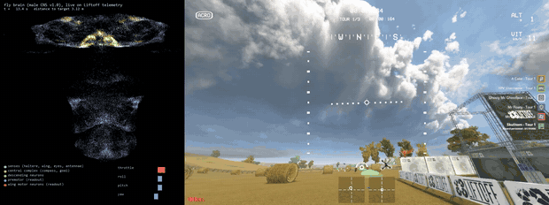

# Haltere

A connectome-constrained fruit-fly brain controlling an FPV drone in
[Liftoff](https://store.steampowered.com/app/410340/Liftoff_FPV_Drone_Racing/).
The goal is a system that can complete **unfamiliar races and freestyle tasks**.
Visual pilot assistance and learned navigation are welcome when they improve
that goal; the fly brain remains a meaningful motor controller.

[Quickstart](#quickstart) · [Current status](#current-status) ·
[Models](#models-and-data) · [Game setup](docs/liftoff_setup.md) ·
[Training](#training) · [For agents and contributors](#for-agents-and-contributors)



*Historical v0.5.0 recording, shown at 4× speed: the published motor brain with
GateNet and the Rabbit visual pilot. The reported seven-gate segment took 64 s.
This is an assisted system result on a seen course, not a recording of the newest
experimental brain or evidence of arbitrary-course flight.*
[Release and videos](https://github.com/skulitom/haltere/releases/tag/v0.5.0).

## Current status

**Reviewed against the code and tracked evidence on 2026-09-22.**
The automated suite and targeted scorer regression checks passed. The CPU
quickstart executed, and the newest local scene brain passed headless checks in both
assisted and unassisted modes. Command examples and local links were checked.
The Rabbit baseline recordings cover Straw Bale, Minus Two and three unchanged
attempts on the project-unseen Hangar C03 track. **No attempt completed a lap;
all five race attempts stopped on impact.** The newest brain and restored pilot
run together, but race generalization remains unsolved. See the
[recordings and flight evidence](docs/flight_cards/README.md#2026-09-22-assisted-scene-brain).
A fresh installation has not been revalidated.
An explicit [race-cue experiment](docs/race_cue_assistance.md) now reads the
game's visible checkpoint marker alongside the frozen learned scene features.
After fixing flag clearance and downhill recovery, it completed all three
Straw Bale laps in **14:05.703**, with no detected contact or flight intervention.
[Straw Bale evidence](docs/flight_cards/2026-09-22_strawbale_cue_04.md).
The unchanged controller then finished all three Minus Two laps in **09:27.415**,
also without detected contact or intervention.
[Minus Two evidence](docs/flight_cards/2026-09-22_minustwo_cue_01.md).
Both are seen courses; unseen completion remains unproven.
The race-cue stack finished **0/5 first-exposure courses** across successive
development revisions. The [next development sequence](docs/generalization_program.md)
uses code-generated and Workshop course pools, frozen evaluation batches, a
matched motor-controller comparison, and camera-based free-space planning.
An edited Workshop copy and a fully generated course both loaded successfully.
The generated loop has now completed a full race; the geometry layer is still pending.
Manual map design is not part of this workflow.
A [matched motor comparison](docs/motor_tracking.md) now covers three development
courses. The conventional baseline ran faster at the same nominal speed setting,
but one indoor attempt stopped on a control deadline. Faster brain motor-readout
training is experimental; simulation gains alone do not qualify new weights.
The [motor10 candidate05 bundle](docs/motor_brain_10_release.md), reviewed on
2026-09-23, improves simulated braking and uses optional GPU vision. Its first
frozen development batch finished 0/3; a separate generated-loop repeat finished
in **3:01.576** at a **2.31 m/s** median, without detected contact or intervention.
It remains experimental: the flag and pillar collisions are unresolved, and
the open generated loop does not establish unseen-race or freestyle capability.
Subsequent held-out attempts exposed descent, camera-timing, high-checkpoint
and obstacle-planning failures. Generic recovery fixes are tracked alongside
every failed attempt in the [flight index](docs/flight_cards/README.md).
The full suite passed 342 automated tests; earlier race finishes
do not substitute for full-race checks of later controller revisions.
These cues do not supply a freestyle planner.
The [project direction](docs/project_direction.md) records the current goal,
allowed helpers and evaluation criteria. It supersedes the earlier restriction
that the navigation predictor must be training-only.

| Area | What exists | What the evidence establishes |
|---|---|---|
| Published controllers | `ftSmooth` for hover/patterns; `ftPath2` for guided flight | Recorded Liftoff flight on specific setups. Route and visual-pilot assistance contribute to the results. |
| New visual brain | Human, gate and scene training; a separate visual runtime | Experimental progress, including partial course traversal. No qualified general race/freestyle controller. |
| Restored pilot assistance | Optional Rabbit guidance, speed and yaw around the visual brain | Live integration verified on three maps; zero completed laps in five race attempts. [Usage and limits](docs/visual_pilot_assistance.md). |
| Visible race cues | Experimental checkpoint-ring guidance with flag clearance and downhill recovery | Full three-lap finishes on Straw Bale and Minus Two with identical controller settings. [Inputs and limits](docs/race_cue_assistance.md). |
| Navigation predictor | Causal 0.25–1 s path forecasts; offline evaluation and distillation | Runtime use is allowed, but no current live runner loads it. Prediction error is not flight success. |
| Generalization | Whole-flight splits, race flight cards and synthetic stress tests | Unseen race and freestyle completion remain open goals. |

The newest completed scene candidate reviewed here is
`runs/scene-brain-09-navigation/last.pt`. It learns visual currents into the
brain's goal neurons while preserving the parent's original weights. It is not
the separate path predictor. Its [experimental inference bundle](docs/scene_brain_09_release.md)
is available on GitHub and Hugging Face with the exact matching detector and
mapping. It does not replace `ftPath2`: it failed the Rabbit baseline and
completed two seen races with visible-cue assistance. See
[the training record](docs/human_brain_training.md) and
[assisted-run guide](docs/visual_pilot_assistance.md).

## Quickstart

The commands below are **PowerShell, run from the repository root**. Python
3.11+ is declared in [pyproject.toml](pyproject.toml); this checkout was checked
with Python 3.13.2 and PyTorch 2.11.0+cu128 on Windows with an RTX 4090.
Install [uv](https://docs.astral.sh/uv/) and Git first.

```powershell
git clone https://github.com/skulitom/haltere.git
Set-Location haltere
uv venv --python 3.13 .venv
uv pip install --python .venv/Scripts/python.exe "torch==2.11.0" --index-url https://download.pytorch.org/whl/cu128
uv pip install --python .venv/Scripts/python.exe -e ".[dev,vision]"
.venv/Scripts/python.exe -m haltere.cli --help
.venv/Scripts/python.exe -m haltere.cli eval artifacts/ftSmooth_best.pt --device cpu --batch 1 --steps 30
```

The last command is a short **loading and simulator smoke check** and prints
JSON metrics. It needs no game, gamepad or raw connectome download. It is too
short to assess flight quality. The graph and published inference checkpoints
are already tracked in this repository.

PyTorch is installed separately so you can select the build for your machine;
use the [official installer selector](https://pytorch.org/get-started/locally/)
for a different CUDA or CPU setup. Training is designed for an NVIDIA GPU.
The live game/capture/controller workflow is Windows-specific; other platforms
have not been verified in this update.

All examples use the environment's Python directly, so activation is optional.
With that environment activated, `haltere` is shorthand for
`python -m haltere.cli`. Optional extras are `liftoff` (virtual pad),
`fast-capture` (Windows DXGI), `neuprint`, `replays` and `publish`.
Install the gamepad driver before adding `liftoff`; see [game setup](docs/liftoff_setup.md).

## Models and data

| Checkpoint | Role |
|---|---|
| [Motor10 candidate05 bundle](docs/motor_brain_10_release.md) | New experimental motor-readout weights with recorded-scene robustness training. One development-loop finish; obstacle races failed. Download separately; not promoted over scene09. |
| [Scene09 bundle](docs/scene_brain_09_release.md) | Published learned-scene reference with its exact detector and original-drone mapping. Download separately; evaluated with explicit visual assistance. |
| `artifacts/ftSmooth_best.pt` | Published connectome controller for hover and movement patterns. |
| `artifacts/ftPath2_best.pt` | Published connectome controller for taught paths and the older visual-pilot stack. |
| `artifacts/ftRobust_best.pt` | Earlier controller trained with broad physics randomization. |
| `artifacts/imJ_best.pt` | Imitation-trained connectome controller; simulator reference. |
| `artifacts/mlp_baseline.pt` | Non-connectome motor teacher/control baseline. |
| `artifacts/gatenet_best.pt` | Published gate detector for the older visual stack. |
| `artifacts/gatenet_colourblind.pt` | Detector augmentation experiment; not a demonstrated transfer improvement. |
| `artifacts/experimental/navigation_*.pt` | Offline path predictors; [versions and limits](artifacts/experimental/README.md). |

Published assets are also available on
[GitHub Releases](https://github.com/skulitom/haltere/releases) and
[Hugging Face](https://huggingface.co/Skulitom/haltere).
Inference checkpoints omit optimizer state and depend on the matching
`data/built/flight.npz`, `flight.nodes.parquet` and `flight.meta.json`.
Use full training checkpoints from a run for `train --resume` / `imitate --resume`.

`runs/`, raw connectome tables and recordings under `data/vision/` and
`data/liftoff/` are local and ignored by Git. Research guides refer to those
local experiments; those paths will not exist in a fresh clone. Dataset plans
pin particular source takes, not downloadable public training data.

## How it works

The checked-in graph selects **30,000 neurons and 2,767,698 directed edges**
from the male CNS v1.0 connectome. It is a rate-network abstraction of a selected
subgraph, not the entire biological fly. Graph selection and transmitter-sign
rules are in [configs/flight.yaml](configs/flight.yaml); actual graph counts
are in [flight.meta.json](data/built/flight.meta.json).

Telemetry is converted into gyro, load, flow, attitude and other sensory
channels. Encoders drive selected fly populations; the recurrent network
produces motor activity. Published working brains read from wing motor **and
premotor** populations. Visual variants add image or frozen scene features;
the checkpoint specifies the exact sensory encoding and detector calibration.

The deployed arrangement can include a visual pilot or learned planner before
the brain's goal inputs, and explicit heading assistance after its output.
The [assisted visual mode](docs/visual_pilot_assistance.md) records which commands
come from each component. Teacher models and known routes can also supply
training labels. Distinguish training-only labels from the declared runtime inputs.

| Location | Responsibility |
|---|---|
| `haltere/connectome/` | Source tables, population selection and graph construction. |
| `haltere/brain/` | Sparse recurrent network, sensory encoders and motor readout. |
| `haltere/sim/` | Differentiable quadrotor, rates, PID, mixer and training tasks. |
| `haltere/train/` | Motor imitation, flight-cost training, human/gate/scene learning and evaluation. |
| `haltere/vision/` | Gate detection, datasets, scene features and path-prediction experiments. |
| `haltere/liftoff/` | Telemetry, control mapping, capture, pilots, recording and scoring. |
| `configs/`, `tests/`, `docs/` | Configurations, automated checks and evidence/workflow guides. |

## Training

Start motor imitation with the included MLP teacher and the premotor readout:

```powershell
.venv/Scripts/python.exe -m haltere.cli imitate --config configs/train_premotor.yaml --imitate-config configs/imitate_premotor.yaml --teacher artifacts/mlp_baseline.pt --run runs/imitate-new
.venv/Scripts/python.exe -m haltere.cli eval runs/imitate-new/best.pt --batch 8 --steps 400
```

The explicit teacher path avoids the configuration's historical
`runs/mlp300/best.pt` dependency. Use a new run directory. This is a full training
job, not part of the quickstart. Flight-cost fine-tuning uses `haltere train`;
`configs/train_premotor_smooth.yaml` and `configs/train_path2.yaml` describe
smoothing and moving-target curricula. Basic `configs/train.yaml` is an
experimental starting configuration, not a recipe that reproduces the shipped brain.

| Task | Guide / entry point |
|---|---|
| Record and prepare human demonstrations | [Human recordings](docs/human_demonstrations.md). |
| Train the actual fly brain from recordings | [Human, gate and scene learning](docs/human_brain_training.md). |
| Train/evaluate the separate predictor | [Navigation training](docs/navigation_training.md), [v2 evidence](docs/navigation_release_v02.md). |
| Collect oracle-guided demonstrations | [Route collection](docs/route_collection.md), [bot-route extraction](docs/bot_routes.md). |
| Test unfamiliar courses and tasks | [Project acceptance criteria](docs/project_direction.md), [race protocol](docs/generalisation.md). |

Training a predictor alone does not update the fly brain. Report the actual
changed parameters for every brain-training claim. Evaluate the intended full
stack, and use no-predictor/no-assistance comparisons to attribute changes.
Preserve raw recordings and whole-take/course holdouts.

To rebuild a graph, download the public tables and write to a new output stem:

```powershell
.venv/Scripts/python.exe -m haltere.cli fetch
.venv/Scripts/python.exe -m haltere.cli populations
.venv/Scripts/python.exe -m haltere.cli build --out runs/flight-rebuilt
```

The raw download is approximately 570 MB and needs no login. A rebuilt or
modified graph must not silently replace the graph used by an existing model.
Optional neuPrint access requires the `neuprint` extra and
`NEUPRINT_APPLICATION_CREDENTIALS`; `haltere neuprint check` checks access.

## Flying and recording

Follow [Liftoff setup](docs/liftoff_setup.md) for telemetry, driver installation,
calibration and the persistent pad bridge. Run the game and its capture/controller
processes in **Anode**, with the viewer hidden unless requested. Retain the original
`[Copy] New Drone`, verify throttle-low and the game's processed controls, pause
before disconnecting the pad, and keep Liftoff open between tests.

- Published motor checkpoints use `haltere liftoff fly`.
- New visual checkpoints use `python -m haltere.liftoff.visual_brain` and their
  recorded detector/mapping contract. The legacy `fly` command rejects these.
- Add `--pilot-assistance rabbit` for the new [assisted visual mode](docs/visual_pilot_assistance.md).
- `--record PATH.mp4` produces the standard brain-activity panel beside gameplay.
  Use fresh log/video paths and label shadow footage as shadow.

The [flight cards](docs/flight_cards/README.md) record predictions, complete
commands, model provenance and observed outcomes. Verify race completion from
the game, not just the pilot's estimated gate count. Scripted patterns and
known-route demonstrations are useful tracking tests, but do not establish
unseen freestyle or race navigation.

## For agents and contributors

Read [AGENTS.md](AGENTS.md) and [project_direction.md](docs/project_direction.md)
first. Inspect the working tree before editing and preserve unrelated changes.
Use the current command help and checkpoint metadata as the implementation
reference; historical guides document particular experiments, not universal defaults.

```powershell
.venv/Scripts/python.exe -m pytest -q
.venv/Scripts/python.exe -m haltere.cli liftoff fly --help
.venv/Scripts/python.exe -m haltere.liftoff.visual_brain --help
```

For changes to live control, verify the actual processed input and record the
whole stack's assistance mode, checkpoint hashes, code revision, camera/mapping
and outcome. Publish completed, verified code to GitHub. Publish new weights
only with accurate provenance and evaluation limits; offline and synthetic
checks alone do not qualify an improved flight controller.

The previous long experiment narrative remains in the
[historical README at 6e86b8b](https://github.com/skulitom/haltere/blob/6e86b8b82f77228ec71919a5c50583ad83258d2b/README.md).
Its dates, recommendations and training-only policy are historical.

## Attribution

Project code is [MIT licensed](LICENSE). The source connectome is the
[Janelia male CNS dataset](https://www.janelia.org/project-team/flyem/male-cns-connectome),
created by Janelia FlyEM, Cambridge Connectomics and Google collaborators and
released under CC BY. The included flight graph is derived data; retain source
attribution. The full raw tables are downloaded separately.
