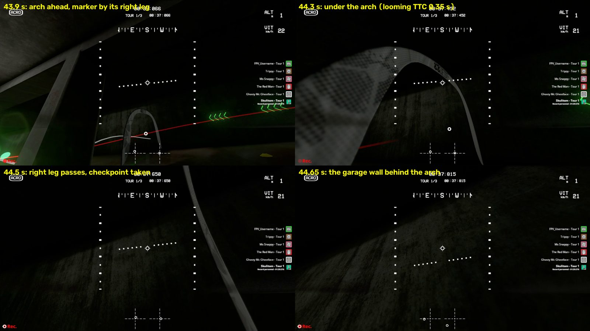
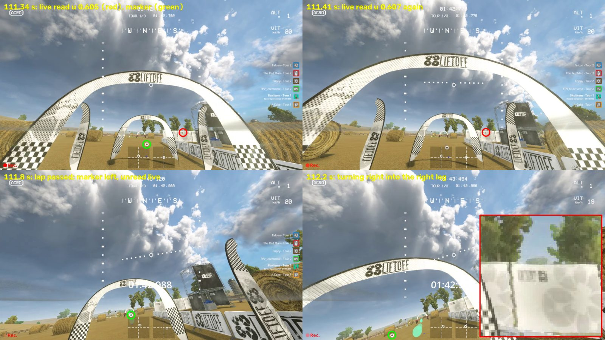

# Arches (round 5): what hit the structures beside the rings

**Nothing here has flown.** Branch `m5-arches` (from `m4b` `2a5bccb`).

**What the clips were.**

- **Minus Two (`minus-fast6-r4b-01`).** No arch leg was hit. The fast PD flew through the arch and into the garage wall
  behind it. The looming governor saw that wall about 1 s ahead, but a stand-off left over from the previous wall held
  its only cap along a ray 180 deg from the flight.
- **Straw Bale (`straw-brain11cw13-r4b-noassist-02`).** The live ring reader read a dark logo on a white fence banner
  beside the second start arch as the marker, 16.6 deg right of the ring. The brain turned toward it, lost the marker
  and coasted the turn into the arch's right leg.

**Two rules, frozen with their gates before scoring:**

- **The stale-evidence rule** (`configs/obstacles/stale_evidence.json`): the governor's cap follows the ray of its
  evidence.
  - Version 1 passed its development case and **failed its held-out gates**.
  - Version 2, a narrower revision frozen before any version-2 result, **passes its gates**. Its held-out evidence is
    one synthetic hairpin set on which it never acted; its benefit rests on the development case, open loop.
  - It is opt-in: `--stale-evidence on` inside the obstacle stack.
- **The ring-marker reader rule** (`configs/pilot/ring_marker.json` v1): a candidate needs a continuous white annulus.
  It rejects the false candidate on the recorded development frames but drops about 5% of held-out true markers, mostly low in
  the image. It **failed its held-out gates. Do not fly `--ring-marker on`.**

The Straw Bale false marker is therefore unsolved. Gates: `configs/obstacles/stale_evidence_gates.json` (v2) and
`stale_evidence_gates_v1.json`, scored by `haltere.obstacles.stale_evidence_gates`. Scores:
`docs/experiments/stale_evidence_v1_scores.json` and `stale_evidence_v2_scores.json`.

## The two live clips (development cases)

### Minus Two, `minus-fast6-r4b-01` (fast PD, 44.8 s): through the arch into the wall behind it

The flight card called this a clipped arch leg. The recorded frames show otherwise: the drone flew **through** the
arch, took the checkpoint, and hit the garage **wall 1.5 m behind the arch** while turning left toward the next ring.



| Time (s) | What happened |
|---|---|
| 38.8-39.6 | First wall of the garage: the governor engages at TTC 0.56 s (38.84 s; cap ray 95 -> 28 deg as the drone turns), brakes the PD from 5.9 m/s and holds a stand-off (target 0.48 m/s along 28 deg). The drone comes to rest 2.57 m after the first brake (0.44 m/s at 39.56 s), without contact. |
| 39.6-41.5 | The drone turns about 110 deg left and flies out at 6 m/s (course 138 deg). The stand-off ends at 41.51 s; the held target, and the cap with it, rises to 1.03 m/s by 41.71 s (1.12 m/s in the open-loop m4b replay). |
| 41.7-42.0 | Wall samples along 139 deg (TTC 1.2-1.4 s) hold that stale target. |
| 42.01 | A sample along 139 deg (TTC 0.86 s) confirms a slow-down whose own target (4.1 m/s) is above the held 1.03 m/s, so the cap ray stays at 28 deg; because the held target is below the 2 m/s stand-off speed, the sample **renews the stand-off** along 28 deg. Every later confirming sample renews it again: status `standoff` until the impact. |
| 43.1-43.6 | Left turn onto the arch (course -150 to -157 deg). The ring marker lies inside the arch, next to its right leg. |
| 43.76-44.28 | Looming sees the wall behind the arch: TTC 0.86 -> 0.80 -> 0.71 -> 0.68 -> 0.65 -> 0.50 -> 0.35 s along the travel direction, first at 5.3 m (log rows). None lowers the cap: their targets (0.7 x 5.9 m/s) are above the held 1.03 m/s, and the cap binds only along 28 deg, 180 deg from the flight. The request stays at 6 m/s. |
| 44.51-44.56 | The right leg passes on the right; the marker jumps to the left edge (the next ring, a hairpin to the left). The side rule turns left. |
| 44.797 | Impact with the wall at (51.09, 93.51), 5.34 m/s (contact audit). |

- **Gap cue.** Within 14 deg of the ring the depth ratio stayed 0.9-1.1: the dark wall filled the band behind the arch,
  and the only near run was 11-40 deg to the left. There was nothing beside the ring to shift the aim away from, and
  the wall lay behind the ring, on the only line through it.
- **Looming.** It saw the wall about 1 s ahead. The first wall of the same flight was braked for from TTC 0.56 s and
  the PD stopped without contact.
- **Cause.** A stand-off that a stale sample kept renewing: its cap bounded the speed along a ray 180 deg away from the
  flight, and the samples along the flight never reached it.
- **Earlier flights.** No earlier Minus Two flight reached this arch: `minus-fast6-r4-02` ended at 34.1 s under the
  ceiling near (75.9, 64.3).

### Straw Bale, `straw-brain11cw13-r4b-noassist-02` (fast-brain-11-b-cw13, 112.4 s): a false marker beside the second start arch



| Time (s) | What happened |
|---|---|
| 110.85-111.3 | The live reader reads no marker; the recorded frames show it inside the far arch at u 0.49, v 0.84. The pilot coasts straight (request -3.6 deg, course -4 deg). |
| 111.34, 111.41 (captures) | The live reader reads a marker at u 0.605, v 0.78, 16.6 deg right of the ring bearing. The recorded frames show no marker there: the reader candidate is a dark logo on a white fence banner just right of the second start arch's right leg. Its hole passes the reader's hole tests, and its surround is only about half white. |
| 111.40-111.66 | The pilot, which had just started its search, blends the two readings (filtered bearing about -4 -> -16 deg); the lag turn triggers on the jump and leads 4.7-7.4 deg beyond it. The request turns from -3.6 to -20.8 deg. |
| ~111.6 | The drone passes the lap arch (lap time 1:42.988). The next ring's marker lies low and left (u 0.45 -> 0.30) over the white arch and ground, and the live reader does not read it until one frame at 112.11 s. |
| 111.66-112.0 | Coast holds the -20.8 deg request; search follows. |
| 109.52-112.38 (throughout) | Looming reports no evidence, without a break, from 2.9 s before the impact: a white arch against a bright sky. |
| 112.376 | Impact with the second start arch's right leg at (27.13, -0.54), 5.45 m/s (contact audit). |

- **The gap cue.** Measured against the false ring, it saw the right leg as a near run 3-7 deg beside it and voted a
  4 deg shift in one sample only (111.42 s), with no confirmation; then no ring. Measured against the flown course,
  the depth showed both legs of the second arch as near runs (ratio 3.9-8.9) from 5.6 m. The leg was visible on the
  bright background. What was missing was a true bearing to measure it against.
- **Coasting.** A coast-on-course rule was prototyped (development only). In the semi-closed-loop surrogate it moved
  the path 0.085 m left at the leg. Holding the flown course from 111.4 s (as if the false readings never happened)
  moves it 0.48 m; from the coast onset (111.7 s), 0.23 m. The turn was committed by the two false readings about
  0.3 s before any coast began, and the brain follows about 0.3 s late. So the fix must stop the false reading, and the
  coast rule was dropped before the freeze.
- **Earlier flights.** The older Straw logs (fast-brain-08 04/06: six clean passes of these arches) show the same
  intermittent reading at the start arches: the marker is unread 35-81% of the time in the start-arch box, with 1-2
  frame reacquisitions at jumped bearings. Across its eight passes of the start-arch box (the race start and the lap
  starts) fast-brain-08 kept its course within -12.6 to +5.7 deg; this clip reached -23.3 deg.

## The rules

### The governor's cap follows the ray of its evidence (`stale_evidence.json`)

`ClearanceRayConfig` in `haltere/liftoff/fast_race_cue.py`, one angle: `stale_deg` 60 (a-priori: a cap along a ray
60 deg away bounds at most half, cos 60, of the speed along the new ray). The TTC governor keeps one cap on the speed
along one looming ray: the travel direction when the sample that set it was captured.

**Version 2 (declared, `4a951606`).** A confirmed wall sample whose ray lies more than 60 deg from the cap's ray:

- if its own target is lower than the held one, it re-aims the cap exactly as before (m4b already did);
- if not, and the old cap's stand-off has lapsed, it **re-seats** the cap on its own ray: its own target, the cap
  starting at the speed along that ray and falling at `brake_rate`. The stand-off along the old ray ends;
- while the old cap's stand-off is still active, nothing changes (a drone holding off a wall keeps that wall's cap).

Off-ray samples are confirmed through the engaged cap's hysteresis and hold the cap as before. Samples within 60 deg of
the cap's ray are handled exactly as before.

On the Minus clip (open loop) version 2 re-seats at 42.01 s onto the wall ahead at 139 deg and caps the request along
139 deg at 4.13 m/s by 42.30 s. The recorded drone does not respond in a replay: it kept 5.9 m/s and turned left before
that wall. At 43.76 s, 1.04 s before the impact, the rule moves the cap onto the travel ray and brakes the request along
the travel direction from 5.9 to 4.24 m/s by 43.90 s. The m4b stack never brakes in that window.

**Version 1 (kept as `stale_evidence_v1.json`, refused by the runner; `afcda589`).** It also judged off-ray samples
against `ttc_on` as a first engagement, let them neither hold the cap nor re-aim it through the hysteresis, and
re-seated during a stand-off. It failed its held-out gates (below).

It is still **one cap along one ray**. After a re-seat, nothing bounds the speed toward the old wall except turn-first,
which keeps its own ray for its episode.

**Opt-in** inside the obstacle stack: `--stale-evidence on`. The default stack stays the m4b stack, bit for bit. In
shadow the flown governor lacks the rule and the shadow copy (the one that already runs the ceiling and vertical guards)
has it.

- **Log columns** (appended last, only when declared): `cap_ray_deg` (the flown governor's cap ray azimuth) and
  `cap_reseat` (re-seats so far, by the governor that runs the rule).
- **Sidecar:** `pilot_assistance.stale_evidence` (rule, parameters, counts) and
  `pilot_assistance.stale_evidence_declaration`.

### The ring-marker reader needs a continuous annulus (`ring_marker.json` v1, failed)

`checkpoint_ring(rgb, annulus=...)` in `haltere/vision/race_cues.py`. The rule adds one test to the earlier reader: the
white mask must cover at least 0.9 of each circle of radius (w + h)/4 + 1 px and + 2 px about the hole centre (32 points
per circle). Off by default: `--ring-marker on` needs `--pilot-assistance race-cue`. Without it the camera reads with
the m4b reader, bit for bit. **It failed its held-out gates and must not be flown** (below).

### Tooling

- **`haltere/obstacles/vertical_replay.py`** gains:
  - `--stale-evidence DECLARATION` (file tag `-se<version>`);
  - `--cue-drop JSON` (file tag `-cd`: logged captures whose cue is replaced by no detection).
- **`haltere.train.deployed_pilot.deployed_pilot_kwargs(stale_evidence=True)`** adds the rule. It is off by default, so
  the brain-11 records built on it stay reproducible.
- **`haltere.obstacles.stale_evidence_gates`** has these commands:
  - `frames`: on every new recorded frame, both readers, the candidates with the rule's verdict and the offline overlay
    detector, aligned to the log;
  - `replays`;
  - `windows`: semi-closed-loop IdentifiedSim windows;
  - `hairpin`: closed-loop harness hairpins;
  - `score`: gates v1 or v2.
- **`haltere.vision.race_cues.ring_candidates`** lists the reader's candidates. `checkpoint_ring` is unchanged without a
  rule.

## Gates and results

Every result is offline development or held-out evidence as marked; **nothing has flown**.

**After the version-2 scores (`3c5f9d7`), the code changed only as follows:**

- comments and docstrings, including a comment that tripped the no-file-reads test of `fast_race_cue.py`;
- the sidecar's rule text, which described version 1. It now names the version that runs.

Nothing was re-scored. For the check, the `replays` command re-ran the version-2 stack, its shadow, the stack without
the rule and `--stack none` on `minus-fast6-r4b-01` and `minus-fast6-r4-02` into a separate folder. All eight replays
equal the scored ones bit for bit (command arrays and re-seat counts).

Replays are open loop (the recorded motion does not respond to the requests). Windows are semi-closed loop in the
IdentifiedSim surrogate (logged state, replayed requests and yaw). The reader ran on recorded h264 frames, not the live
captures. The hairpins are the synthetic motor-assist harness.

### Gates v1 (`stale_evidence_gates_v1.json`, `81c36bf6`; scored once: `docs/experiments/stale_evidence_v1_scores.json`)

Frozen with both version-1 declarations before any scoring. One scorer fix was committed before the scoring commit:
the HR block had read the wrong flight list and failed before writing anything.

| Gate | Threshold | Result | |
|---|---|---|---|
| I1 default pilot, this tree vs m4b | bit for bit, 27 logs | 27/27 identical | pass |
| I2 stack without the rule | bit for bit, 27 logs | 27/27 | pass |
| I3 stack in shadow with the rule | bit for bit, 27 logs | 27/27 | pass |
| I4 reader without the rule vs m4b reader | every 10th recorded frame | 8,193/8,193 equal | pass |
| DM1 Minus clip (development): brake onset | >= 0.5 s before the impact, m4b none | 44.05 s: 0.75 s; m4b 0 brake ticks | pass |
| DM2 Minus clip: onset distance | >= the first wall's brake-to-rest distance (2.57 m) | 4.41 m | pass |
| DS1 Straw clip (development): the false detections rejected on the aligned frames | both rejected | both unmatched: no reader candidate within 12 px on the nearest aligned frame (the candidate is at the logged position on the recorded frames 0.05-0.1 s earlier, where the rule rejects it) | **fail** |
| DS2 Straw clip, surrogate path | m4b path within 0.15 m of the contact point (validation), new path >= 0.4 m left | 0.023 m (validation passes); new path 0.023 m, unchanged | **fail** |
| HR1 reader retention (59 held-out recorded flights) | >= 99.5% of overlay-confirmed markers per flight | 92.0% (straw-brain06-02) to 100%; 41 of 59 flights below 99.5% (straw-brain07-steep-01 had no readable frames); pooled 68,335 of 71,859 (95.1%) | **fail** |
| HR2 agreement where the readers differ | rule agrees with the overlay at least as often | 1,772 against 3,749 (5,613 frames) | **fail** |
| HA logs (held-out, 25 logs) | no more than +0.3 m/s along the travel direction | +2.43 m/s (minus-fast6-r4-02), +1.93 (straw-fast6-02); 22 logs unchanged | **fail** |
| HA hairpins (held-out for the rule, 2 sets x 5 motors) | wall contacts <=, clean passes >= | fast PD, development set: 1 contact (0 without), clean 11 (12); the rest unchanged (brains 10-12 of 12 wall contacts either way) | **fail** |
| HP start-arch and arch passes (35 held-out passes) | no overlay-confirmed detection dropped, no speed-up | 21 unchanged; 6 passes drop confirmed markers; one +2.43 m/s | **fail** |
| Q clean Straw laps (brain-08 04/06; both rules) | <= 1% of detections and <= 0.5% of overlay-confirmed ones dropped; <= 0.5 s progress lost; <= 0.75 m lateral | 6.6% / 6.3% dropped (372 of 5,333 / 325 of 4,899 confirmed); 0.37 / 0.73 s; 0.43 / 2.29 m | **fail** |

**Why the reader rule failed.** The dropped true markers sit in the lower image, at v 618-700 px of 720, many clamped at
the bottom edge. This is a post-scoring diagnosis of 60 sampled frames of `straw-brain06-02` (circles from +0.5 to
+3 px; not re-run for this document). There the white fractions are 0.84-1.0 at +1 px (the rule's first circle) and
0.72-0.97 at +1.5 px (a diagnostic circle between the rule's +1 and +2 px); a kept marker in mid-image has 1.0 on every
circle to +2 px. Descending Straw laps put the marker low a lot of the time. The margin of 0.94 against 0.9 measured on the
development frames did not hold there.

The evaluation also exposed its own blind spot. The live false marker lasted two captures and was not at the logged
position on the nearest recorded frame. The recorded video is a separate 18 fps screen capture, so a reader rule cannot
be scored on live false readings from it.

**Why the governor rule failed.**

- **Hysteresis.** Judging off-ray samples as first engagements (TTC below 0.8 s instead of the engaged 1.3 s) removed
  m4b's brake for a nearer wall on `straw-fast6-02` at 19.0-20.8 s.
- **A harness hairpin** (60 deg turn, wall 2.1 m, arch 7 m). With version 1 the fast PD lost the ring, searched for
  4.8 s and hit the wall at 4.4 m/s; without the rule it finished in 11.8 s. Which of version 1's two changes caused
  this was not isolated. Version 2 drops both (it keeps m4b's hysteresis and hold, and never re-seats during a
  stand-off) and leaves the scenario unchanged.
- **A cap still in use.** On `minus-fast6-r4-02` at 27.6-32.3 s it moved the cap from 144 to 66 deg while the drone
  flew about 105 deg, 39 deg from each. The request rose from 2.3 to 4.75 m/s.

### Gates v2 (`stale_evidence_gates.json`, `da57c268`; `docs/experiments/stale_evidence_v2_scores.json`)

Version 2 was designed after reading the version-1 results, so every log and both earlier hairpin sets are
**development** evidence for it. The only held-out evidence is a fresh harness hairpin set: turn 30/50/70/100/120 deg,
wall 2.0/2.8 m, arch 6/9 m, sim seed 29, never run before. The m4b-tree replays of gates v1 were reused (same tree,
harness and logs).

| Gate | Threshold | Result | |
|---|---|---|---|
| I1 default pilot, this tree vs m4b | bit for bit, 27 logs | 27/27 identical | pass |
| I2 stack without the rule | bit for bit, 27 logs | 27/27 | pass |
| I3 stack in shadow with version 2 | bit for bit, 27 logs | 27/27 | pass |
| Version 1 reproduced through this code | the version-1 scoring replays bit for bit, 4 logs | 4/4 | pass |
| DM1 Minus clip (development): first brake in 42.0-44.8 s | >= 0.5 s before the impact, m4b none | 42.01 s (the re-seat onto the wall ahead at 139 deg), 2.79 s; m4b 0 brake ticks | pass |
| DM2 Minus clip: distance at that brake | >= 2.57 m (the first wall's brake-to-rest distance) | 13.7 m | pass |
| (report) the wall behind the arch | | cap on the travel ray at 43.76 s (1.04 s before the impact), request along the travel direction 5.9 -> 4.24 m/s by 43.90 s; 3.75 m/s at the last tick before the impact and 3.52 m/s lowest after 42.0 s. The m4b replay has 4.52 and 4.28 m/s there, lowered only by its left turn (read from the same scored replays, not a score-file field) | |
| HA logs (development) | no more than +0.3 m/s along the travel direction | no request changed on any of the 26 other logs (one re-seat on `minus-fast6-r4-02`, with no request change) | pass |
| HA hairpins, both earlier sets (development) | wall contacts <=, clean passes >= | identical for all 5 motors (fast PD 0 / 0 wall contacts, 11 / 12 clean; the brains 10-12 of 12 wall contacts either way) | pass |
| **HA hairpins, fresh set (held-out, 20 scenarios, seed 29)** | wall contacts <=, clean passes >= | identical for all 5 motors: fast PD 4 wall contacts (and 1 ceiling contact, 2 crashes), 14 clean, mean finish 12.97 s both; wall contacts brain-08 17, brain-09b 18 (2 clean), brain-10b 20, brain-11-b-cw13 20, both | **pass** |

The rule did not act on any fresh hairpin: the finish times match to the millisecond. The held-out evidence shows only
that it is harmless where no stale stand-off arises. The brains hit the synthetic hairpin walls with or without it (no
motor assist here), as in round 4b.

### What this means

- **Minus Two (the stand-off bug).** Version 2 is a narrow, generic fix: brake for a wall on the path the drone is
  flying, not along an old wall's ray. Offline it changes nothing on any other log and nothing in the synthetic hairpins.
  The live case is development evidence only, and open loop: the braking cascade that stopped the PD at the first wall
  (each sample lowering the target as the drone slows) cannot show in a replay whose recorded drone does not slow.
- **Straw Bale (the false marker).** Nothing validated addresses it. The reader rule removed the false reading on the
  development frames, but it also dropped about 5% of true markers, mostly low in the image. A coast rule cannot save
  it: the turn was committed before any coast.
- **The gap cue** was not the missing piece in either clip.
  - At Minus the wall filled the depth band behind the arch.
  - At Straw the leg was visible (ratio 3.9-8.9) but was measured against a false ring.

## Limits

- **Nothing here is flight evidence.**
  - The Minus result is an open-loop replay of a development log.
  - The hairpins are synthetic walls with a perfect looming sample.
  - The reader was scored on h264 recordings, not the live captures.
- **Version 2 is still one cap along one ray.**
  - After a re-seat, nothing bounds the speed toward the old wall except turn-first.
  - A stand-off that keeps being renewed by fast samples along a new ray (m4b's renewal, kept while the stand-off is
    active) still blocks a re-seat. On the Minus clip the stand-off happened to lapse (41.51 s) before the next wall
    sample (42.01 s).
  - A governor with one cap per direction would remove both limits, and was not attempted here.
- **Every log is now development data for version 2.** Its held-out evidence is one synthetic hairpin set.
- **The Straw false marker is unsolved.** Round 6 tried a pilot-side rule on the HUD readings alone
  ([gate_clearance.md](gate_clearance.md)): the marker-jump rule v1 holds a marker that jumps after a gap until three
  readings confirm it. It passed this case in the surrogate (1.03 m from the contact point) and failed its held-out
  gates, because real rings often return after a gap at a jumped bearing. Next steps:
  - log the reader's candidates (position, annulus fractions) from the live capture in the next flights, so that a
    reader rule can be scored on live frames;
  - build a reader rule that keeps low and bottom-clamped markers, for example by testing only above the stick HUD
    band, or with a threshold per circle measured on live frames;
  - test the gap cue against the flown course when no ring is in view.

## Live flight plan (for the main session; development flights)

Fly from `C:\DEV\Haltere` with `m5-arches` checked out (not pushed). **Do not add `--ring-marker on`.**
The Minus Two fast-PD run of round 4b with the stale-evidence rule. The command is the flown `minus-fast6-r4b-01`
command plus `--stale-evidence on`, with new log and video names. `--motor-assist on` stays in: it declares motor assist
v1, which has no entry for the fast PD (`applied: false`), and it keeps the assist CSV columns. The round-5 integration
may replace this command with its own merged-stack plan.

**On branch `m5` this command is replaced** by plan (a) in the flight card's section "Round 5 (offline): the merged m5
stack, replays, surrogate and the live plan". That plan adds `--contact-support on` and uses the same log name. On `m5`
the command below would declare wall pilot v6, descent view v3 with contact support v3, and motor assist v3 (not
applied for the PD), in place of the versions listed under it.

```powershell
.venv/Scripts/python.exe -m haltere.liftoff.visual_brain runs/fast-brain-08-vgs04-s10r03m30/candidate.pt --mapping runs/pine-route-collection-01/liftoff-original-drone.yaml --device cpu --vision-device cuda --pilot-assistance race-cue --pilot-profile fast --assist-speed 6 --motor-controller pd --pd-profile fast --dynamics-profile runs/measured-dynamics-low-speed-20260923/profile.json --looming-brake --obstacle-stack on --stale-evidence on --descent-view on --motor-assist on --seconds 150 --max-height 250 --max-speed 14 --max-distance 2000 --udp-out 127.0.0.1:9003 --pause-on-stop --log runs/fast-stack-20260923/minus-fast6-r5-01.csv --record runs/fast-stack-20260923/minus-fast6-r5-01.mp4 --video-encoder h264_nvenc
```

A CPU wiring check parsed this block with the runner's own parser and built the controller as `run()` does, with no
camera, pad or game. The only differences from the flown `minus-fast6-r4b-01` command are `--stale-evidence on` and
the log and video names. The runs record these declarations:

- stale evidence v2 `4a951606`, applied;
- wall pilot v5, vertical guard v4, descent view v2 and lag turn v2, applied;
- motor assist v1, declared but not applied (fast PD).

The CSV ends with `cap_ray_deg` and `cap_reseat`.

What to look for:

- **The same first garage wall** (38.8-39.6 s in r4b-01): the stand-off as before (version 2 keeps it while it is
  active).
- **After the drone leaves that wall:**
  - `cap_reseat` in the CSV should step to 1 at the first confirmed wall sample along the new flight direction;
  - `cap_ray_deg` should follow the travel direction;
  - status `standoff` should not persist while the drone flies at 6 m/s.
- **The arch at about (52.6, 94.1) and the wall 1.5 m behind it:** braking should start about 1 s before the wall (5-6 m
  out). The PD should stop short of the wall or turn left along it, as at the first wall.
- **Stop criteria:** as round 4b. In addition, stop the series if a re-seat is followed by a contact with the earlier
  wall.

The sidecar records `pilot_assistance.stale_evidence_declaration`: version 2, `4a951606...`. Every run is a disclosed
development deviation: version 2 has one synthetic held-out set, and the round-4b rules it flies with fail frozen gates
of their own.
