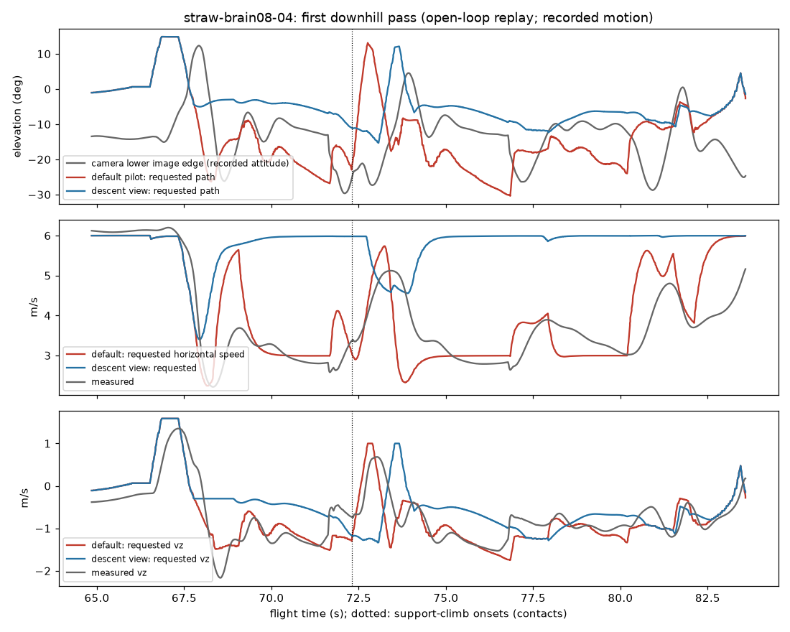

# View-keeping descent (round 4)

**Status: not flown.** Off by default (`--descent-view on|off|DECLARATION`). Only surrogate
runs, open-loop replays of logged flights and unit tests exist. The declaration is
`configs/pilot/descent_view.json` **version 1**; its frozen surrogate gates are
`configs/pilot/descent_view_gates.json` version 1.

**Version 1 fails its frozen surrogate gates for all three motors.** On the held-out seeds it
cut ground contacts by only 50% (fast PD), 69% (fast-brain-08) and 38% (brain-09b) against the
75% gate, although contact time fell 65-84%. It kept the flight path below the image for
36-53% of the descent time against the 5% gate. Checkpoint passes more than 1.5 m above the
centre rose from 1-3 to 13-24. Crashes and finishes were unchanged. On Straw Bale the
open-loop replay moves the requested path into the image before all 10 logged contacts, but
that is not flight evidence. The rule is not ready to fly as a fix; see
[Risks](#risks-for-live-flight).

It answers the user's request of 2026-09-26: on the Straw Bale downhill the drone drops and
touches the hill; it should rather keep throttle up and pitch forward, and touch the ground
less.

## Diagnosis (Straw Bale logs)

Scripts: session scratchpad `m4/descent/diag.py`, `downhill.py`, `pitch_speed.py`.

- **Where.** straw-brain08-04 and -06 had 10 support-climb contacts, always at two spots per
  lap: y 161-166 (z 21.5-22.3) and y 144-147 (z 17.4-18.2), at x about -37. The hill there
  falls about 12 degrees (13.6 m over 65 m of the downhill; about 10.6 degrees between the
  first two contact points).
- **The 3 s before each contact.**
  - The pilot was in `below` (ring clipped at the bottom edge) 56-80% of the time.
  - It requested 3.0-4.0 m/s horizontally (`below_speed_fraction` 0.5 of 6 m/s). Measured:
    2.9-3.4 m/s.
  - It requested 1.0-1.4 m/s of sink, a path of 16-30 degrees down (the clipped edge's
    depression plus a margin that grows from 5 to 20 degrees while the clip lasts).
  - The camera's lower image edge lay 13-16 degrees down. The measured flight path pointed
    below the image 70-79% of that time.
  - The brain's throttle averaged 0.09-0.13 below hover (brain units, hover -0.43), with
    cuts to 0.27-0.36 below it.
- **The mechanism** (confirmed): every bottom clip began with a brake to half speed. The
  brake pitched the nose 10-20 degrees up, which lifted the lower image edge to between -8
  and +11 degrees. Rings that lay only 5-10 degrees below the drone were then clipped. The
  growing margin asked for 20-30 degree descents at 3 m/s, far below the image, into a
  12 degree hill. When the ring came back into view the drone was already on the hillside.
- **During contact** the descent-path governor saw the sink the ground prevented and cut the
  horizontal request to 0.35-0.53x. In straw-brain08-01 (the hillside slide) the drone
  slid for 5 s at 2-3 m/s: requested 0.35 x 6 m/s and 1.25 m/s of sink, nose pitched 12
  degrees down by the slope, throttle 0.37 below hover, ring in view.
- **The rings were visible with a level nose.** When the nose was down enough to see them,
  the Straw rings lay 5-10 degrees below the drone, inside a level camera's view.
- **Speed alone does not lower the camera.** Steady cruise at 5-6 m/s holds the nose only
  about 2 degrees down (drag-light drone; median over 7000-9600 steady ticks per flight), so the
  lower edge sits at about -14 degrees. Only acceleration pitches the nose down.
- **The fast PD** (straw-fast6-03) porpoises on the same downhill: brake in `below` (nose
  +12 to +33 degrees), then accelerate in `cue` (nose -28 to -45 degrees) to see the ring.

So the hypothesis of the task holds, with one correction: more forward speed does not by
itself let the path go steeper in view; what matters is not braking (no nose-up) and not
diving faster than the view.

## The rule (version 1)

`haltere/liftoff/fast_race_cue.py` (`DescentViewConfig`, `FastRaceCue._view_sink_bound`). It
reads the measured attitude and velocity, the pilot's own ring-cue state and the calibrated
camera. It uses no height above ground and no course geometry.

1. **View bound.** The pilot's own requested sink is bounded so that the flight path points
   at least 3 degrees inside the camera's lower image edge.
   - The path is the measured horizontal velocity plus the requested vertical speed.
   - The edge comes from the measured attitude, through an exact projection of the
     calibrated camera, roll included.
   - With a level nose that is a 9 degree path at any speed. A braking (nose-up) drone may
     sink less; a hovering drone at most 0.3 m/s.
   - The attitude term is low-passed with 1 s. With the unfiltered attitude, and with 0.3 s,
     fast-brain-08's pitch and the bound formed a 0.6-1 Hz limit cycle.
   - Climbs are never changed.
2. **Keep speed.** A bottom-clipped ring keeps the speed schedule instead of half of it. The
   descent-path governor is not fed while the bound withholds sink, and it never cuts below
   0.75x (was 0.35x).
3. **More speed, not less.** While the bound withholds sink toward a ring ahead, the
   horizontal request rises toward the speed schedule, never above the declared speed.
4. **Throttle up.** A descent starts at up to 2.5 m/s² instead of 5, so the motors are not
   asked for a deep throttle cut.
5. **Steep late.** A ring that stays clipped below for more than 0.75 s lies more steeply
   below than the view allows. The margin then falls at 6 degrees/s, down to 20 degrees below
   the edge. A steep leg is flown shallow first (over a convex crest after the upper ring)
   and steep late, instead of steep from the start.
   - Without this step (a strict bound) the development runs overflew steep lower rings by
     up to 8 m and circled back.
   - It is the only part of the rule that points the path below the image.

A steady descent steeper than about 12-14 degrees cannot stay in this camera's view: only a
lower camera uptilt (which needs the brain's sensory contract retrained) or a ground sensor
would change that.

Order in `FastRaceCue.update`:
- the pilot's own request (search, launch and launch-plane rules first);
- the view bound;
- the descent-path governor, the speed rise and the support rule;
- the looming governor and the vertical guard, which see the bounded request as the pilot's
  own;
- turn-first and the command slews.

The looming wall cap and turn-first still bound the raised speed.

## Flag, logs, sidecar

| Flag | Default | Effect |
|---|---|---|
| `--descent-view on\|off\|DECLARATION` | off | Fast pilot only (`--pilot-profile fast --pilot-assistance race-cue`). `on` loads `configs/pilot/descent_view.json`; the runner refuses an unfrozen or edited declaration and another version. |

With the rule on, three CSV columns are appended to each row:
- `view_sink_bound`: the largest sink that keeps the path in view;
- `view_withheld`: the sink withheld from the pilot's own request;
- `view_boost`: 1 while the horizontal request was raised.

The sidecar records `pilot_assistance.descent_view` (version, rule, parameters, seconds
limiting and boosting, metres of sink withheld) and `pilot_assistance.descent_view_declaration`
(path, content and file sha256, version). With the rule off, the CSV and sidecar are exactly
as before.

## Declarations

| File | Version | sha256 (content) | Frozen |
|---|---|---|---|
| `configs/pilot/descent_view.json` | 1 | `8afb64d730ad...` | after the design on the development seeds, before any gate-seed run (commit `67d013b`) |
| `configs/pilot/descent_view_gates.json` | 1 | `d2b1e4bb312f...` | with rule version 1, before any gate-seed run (commit `7e96146`) |

The values were chosen on development seeds of the surrogate (`hill:6100-6111`,
`steep:5000-5007`, fast PD and fast-brain-08; brain-09b once). The declaration lists the
variants compared and their development numbers. No gate seed was run before both freezes.

## Offline rehearsal with terrain

`haltere/liftoff/fast_rehearsal.py` has an optional, scoring-only terrain model:
- `hill_course(seed)` builds climbs to a crest, then 1-3 descending legs of 6-30 degrees.
- `CourseTerrain` puts a hill under every leg that descends 2 m or more. The ground lies a
  seeded 1.2-2.5 m below each of the leg's checkpoints and follows a smoothstep between them,
  with a flat crest over 0-30% of the leg and a flat toe over 0-15%. It depends only on the
  distance along the leg. It exists while that leg is flown and for 1 s after the lower
  checkpoint's pass.
- `DescentScore` counts ground contacts (separated by 0.3 s), contact time, penetration,
  minimum clearance and speed into the surface. It also measures the time with the velocity
  vector below the camera's lower image edge while descending (exact projection at the true
  attitude), overall and on hills no steeper than 12 degrees, and counts checkpoint passes
  more than 1.5 m above the centre.

The pilot and the motor never see the terrain; the drone flies through it. Without terrain
`rehearse` is unchanged.

`haltere/liftoff/descent_rehearsal.py` runs the fast-brain development gate's closed loop
(`fast_motor_tracking.rollout`: 10% per-drone randomisation, HUD latency and dropout, command
delay, sim seed 17) for the fast PD or a fast-contract brain, with pilot keyword arguments and
this scoring. `haltere/liftoff/descent_gates.py` runs and scores the frozen gates.

## Gates (surrogate, held-out seeds)

Frozen in `configs/pilot/descent_view_gates.json` with rule version 1, before any gate-seed
run. Scores: `docs/experiments/descent_view_v1_scores.json`. Setup:
- seeds: flat 3000-3007 (no terrain), steep 3000-3007 and hill 6000-6011 (with hills);
- 150 s per course, sim seed 17;
- the baseline is the current pilot with the rule off, on the same seeds and drones;
- terrain gates pool the steep and hill sets; crash, finish and high-pass gates use every set.

Commands:

```
python -m haltere.liftoff.descent_gates runall --dir OUT
python -m haltere.liftoff.descent_gates score --dir OUT --json SCORES
```

| Gate | Threshold | Fast PD | fast-brain-08 | brain-09b |
|---|---|---|---|---|
| Contacts | >= 75% fewer, none new | **fail**: 22 -> 11 (-50%); none new | **fail**: 26 -> 8 (-69%); none new | **fail**: 26 -> 16 (-38%); none new |
| (contact seconds, reported) | - | 97.2 -> 15.2 s | 105.2 -> 21.5 s | 66.0 -> 23.2 s |
| Crashes | not more | **pass** (0 -> 0) | **pass** (0 -> 0) | **pass** (0 -> 0) |
| Finishes | not fewer | **pass** (28 -> 28) | **pass** (28 -> 28) | **pass** (28 -> 28) |
| Path below the image while descending | <= 5% | **fail**: 48.6% -> 36.5% | **fail**: 56.0% -> 53.3% | **fail**: 53.5% -> 45.8% |
| ... on hills no steeper than 12 deg | <= 5% | **fail**: 6.3% -> 5.2% | **fail**: 15.1% -> 20.0% | **fail**: 19.0% -> 28.7% |
| Passes > 1.5 m above a checkpoint | <= baseline + 1 | **fail**: 2 -> 13 | **fail**: 1 -> 24 | **fail**: 3 -> 17 |
| Course time (paired, terrain sets) | <= +3% | **pass**: 60.7 -> 55.2 s (-9.1%) | **fail**: 65.4 -> 67.7 s (+3.5%) | **pass**: 62.7 -> 63.1 s (+0.7%) |
| Flat courses | same finishes and crashes, time within +-2% | **fail**: 52.8 -> 50.5 s (-4.3%, faster) | **pass** (+0.1%) | **pass** (-0.5%) |

Per set (baseline -> rule):

| Set | Motor | Contacts | Deepest penetration | Speed into the ground | High passes | Mean time |
|---|---|---|---|---|---|---|
| steep | fast PD | 7 -> 2 | 6.71 -> 0.50 m | 3.64 -> 1.84 m/s | 1 -> 6 | 69.0 -> 64.0 s |
| hill | fast PD | 15 -> 9 | 4.84 -> 1.82 m | 1.81 -> 1.65 m/s | 1 -> 5 | 55.2 -> 49.3 s |
| steep | brain-08 | 8 -> 2 | 3.62 -> 0.47 m | 2.94 -> 1.42 m/s | 1 -> 8 | 71.6 -> 76.6 s |
| hill | brain-08 | 18 -> 6 | 5.42 -> 1.28 m | 1.55 -> 0.99 m/s | 0 -> 14 | 61.3 -> 61.8 s |
| steep | brain-09b | 10 -> 7 | 2.39 -> 1.11 m | 3.62 -> 2.37 m/s | 1 -> 4 | 69.0 -> 71.2 s |
| hill | brain-09b | 16 -> 9 | 2.61 -> 1.31 m | 3.08 -> 1.65 m/s | 2 -> 11 | 58.5 -> 57.8 s |

Stick chatter (mean roll/pitch change per tick) changed from 0.0058 to 0.0053 (PD), from
0.0029 to 0.0032 (brain-08) and from 0.0053 to 0.0053 (brain-09b).

**What the gates show.**
- **Contacts.** The rule makes contacts rarer, shallower and slower. It does not remove
  enough of them for the gate.
- **High passes.** It does not reach steep lower checkpoints from the right height. The high
  passes are the cost of descending shallower than the pilot used to. In Liftoff a ring
  passed 1.5-3 m above its centre is missed or its top frame is hit.
- **The brains** do not follow a 6 m/s descent. In the development traces fast-brain-08 was
  asked for (6, -1.8) m/s and flew about (3.0, -1.05) m/s. Asked for (3, -1.8) m/s by the
  default pilot, it tracked the request. The rule therefore leaves them high over lower rings
  without keeping the path in view: on the viewable hills brain-08 and brain-09b spend
  more time below the image than with the default pilot.
- **The strict view limit is physical.** In steady flight this camera cannot see a descent
  steeper than about 12-14 degrees. The steep and hill sets have many descending legs of
  15-35 degrees, so no rule can both keep those descents in view and reach their rings.
  Steep late gives up the view on those legs; a strict bound (development) overflew their
  rings.

## Open-loop replay of the Straw Bale downhill (development only)

```
python -m haltere.obstacles.descent_replay --declaration configs/pilot/descent_view.json --out DIR straw-brain08-04 ...
```

Output: `docs/experiments/descent_view_v1_straw_replay.json`. Every logged tick goes through
the default pilot and through the pilot with the rule (`vertical_replay.replay`, `--stack
none`). The recorded motion does not respond. Scored on the downhill region of the logs
(x -50 to -25, y 120 to 195, flying toward -y; offline only), at the recorded attitude.

| Flight | Downhill time | Request below the image: default -> rule | Requested horizontal speed | Requested sink over the downhill | 10th-percentile requested path |
|---|---|---|---|---|---|
| straw-brain08-04 (3 laps) | 55.1 s | 54.4% -> 7.5% | 4.06 -> 5.77 m/s | 45.2 -> 31.1 m | -24.5 -> -10.7 deg |
| straw-brain08-06 (3 laps) | 54.9 s | 52.6% -> 6.8% | 4.02 -> 5.69 m/s | 44.6 -> 30.2 m | -26.4 -> -10.5 deg |
| straw-brain08-01 (hillside slide)* | 11.0 s | 19.3% -> 6.4% | 4.66 -> 5.72 m/s | 6.9 -> 7.1 m | -18.9 -> -11.2 deg |
| straw-fast6-03 (fast PD)* | 54.6 s | 65.9% -> 39.2% | 3.22 -> 5.81 m/s | 61.8 -> 52.5 m | -59.6 -> -16.7 deg |

\* flown with an earlier pilot, so the replay of the default pilot does not reproduce the log
exactly (states 97.6% / 100% equal, horizontal request p99 differences 3.7 / 2.2 m/s). The
brain-08 runs 04 and 06 flew the current pilot and replay exactly (states 100%, request
difference 0).

In the 3 s before each of the 10 contacts of runs 04 and 06:
- the default pilot's request pointed below the image 58-83% of the time; the rule's 0-15%;
- the rule would have asked for 5.7-6.0 m/s instead of 3.0-4.0 m/s;
- it would have asked for 1.2-2.4 m of sink instead of 2.9-4.1 m.

Over the whole downhill of 04 it withholds 41 m of requested sink and raises the speed for
7.2 s. The plot shows the first downhill pass of straw-brain08-04: the lower image edge at the
recorded attitude, and the requested path, horizontal speed and vertical speed of both
pilots. Dotted lines mark the contact.



This shows where the requests would point at the recorded states, nothing more. A drone
flying the rule would be elsewhere: faster, higher on the hill, with another attitude, and
the brain may not fly the request (see the gates).

## Default behaviour unchanged

With the rule off the pilot is bit-identical to m2-vertical (`935cfdb`):
- **Replay.** Open-loop replays were run through an export of `935cfdb` and through this
  tree, comparing every command array bitwise: 52 of 52 identical
  (`docs/experiments/descent_view_v1_identity.json`). They covered:
  - straw-brain08-04 and -06 (default pilot);
  - minus-fast6-vg-02 and minus-brain09b-vg-01 (stack as flown, wall rules and vertical guard
    on);
  - pine-fast6-ttc-01 and minus-brain08-vg-01 (full stack on);
  - two 40 s `rehearse` runs without terrain, whose result dicts are also identical.
- **Unit test.** `test_default_pilot_is_bit_identical_to_m2_vertical` pins a golden digest of
  a scripted descent, clip and climb sequence, taken from the `935cfdb` tree.
- **Logs.** With the flag off, the CSV columns and the sidecar keys are unchanged.

## Risks for live flight

Version 1 failed its gates. Flying it would be a disclosed development deviation, not a
qualified fix. If it is flown, fly the fast PD first. A default-pilot flight can also be
replayed through the rule offline (`haltere.obstacles.descent_replay`); no live shadow mode
is needed.

- **Brain motors do not fly the request.** fast-brain-08 (and less so brain-09b) keeps about
  3 m/s and sinks less than asked when the rule asks for 6 m/s descents. The gates show more
  high passes (1 -> 24) and more time below the image on gentle hills (15% -> 20%) than with
  the default pilot.
  - On Straw Bale this means rings reached from above: the top frame, or a missed ring and a
    turn back.
  - The expected fix is a brain distilled under this pilot (the fast-brain-08 recipe with the
    rule in the DAgger rollouts), scored on these frozen gates, not another pilot value.
- **Straw Bale downhill.**
  - The replay puts the requests in view before every logged contact.
  - The drone now enters the downhill at 6 m/s instead of braking to 3. Contacts that remain
    come at higher ground speed.
  - The slope-support rule needs a requested sink below -0.8 m/s, which the bound allows only
    above about 5 m/s. A slow drone resting on the hillside is recognised only by the
    ordinary support rule, and the descent-path governor's floor keeps it moving at 0.75x.
- **Straw Bale uphill and hilltop.** Climbs are never changed.
  - At the hilltop no bottom-clip brake happens any more. The side-clamped turn onto the
    downhill and the gentle search are unchanged.
  - Steep late starts after 0.75 s of unbroken bottom clip. A ring hidden below the crest
    would get the steepening late, over the convex crest, which is the part a looming sample
    cannot see either.
- **Minus Two garage floor** (about 1-2 m high).
  - When the looming governor or turn-first brakes, the nose-up attitude shrinks the allowed
    sink toward 0.3 m/s. This is gentler on the floor than the default pilot, which asks for
    edge + 5..20 degree descents at half speed.
  - The rise toward the speed schedule acts before the looming wall cap and turn-first, which
    still bound it; it was not replayed on Minus logs.
  - Steep late relative to a nose-up edge stays small.
- **Pine Valley mound.** Terrain climbs (looming governor, vertical guard) come after the
  bound and are unchanged. Descents after the mound stay near the view, where the vertical
  guard's lower looming window can see the ground. The boulder descent (-0.7 m/s at 6 m/s)
  is under the bound.
- **Surrogate limits.**
  - The hills are synthetic and scoring-only: no contact physics, no Liftoff hill shapes.
  - The HUD clamp rule differs from Liftoff (rings behind are clamped to the nearest edge,
    not to the top corners).
  - The brains' behaviour in the surrogate is itself a model.

## Tests

- `tests/test_fast_race_cue_descent_view.py`:
  - the declaration and gates are frozen; edits and other versions are refused;
  - the bound's geometry for four nose pitches, and its speed scaling and free sink;
  - keep speed for a bottom clip, with the path 3 degrees inside a -12 degree edge;
  - steep late: the rate and the bound;
  - the descent-path governor's floor;
  - the gentle sink onset;
  - climbs are unchanged, and the rule is off by default;
  - a golden digest of the default pilot equals the m2-vertical tree's;
  - the runner's flag, columns and refusals.
- `tests/test_descent_rehearsal.py`: the terrain model, the contact, view and high-pass
  scoring, and the course sets.
