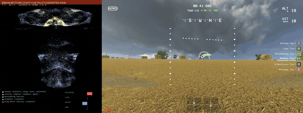

# fast-brain-06: experimental fast motor-readout weights

Reviewed on 2026-09-24. Download from
[GitHub Releases](https://github.com/skulitom/haltere/releases/tag/fast-brain-06-experimental)
or [Hugging Face](https://huggingface.co/Skulitom/haltere/tree/main/fast-brain06).



*Straw Bale lap 1, hilltop through the descending checkpoint, at 4x speed: connectome
activity (left) beside gameplay (right). Brain motors, fast race-cue pilot, assisted yaw.*

**The first brain-motor finishes at race speed.** Under the fast race-cue pilot at a
declared 6 m/s, fast-brain-06 finished the full three-lap Straw Bale / Field Day
race twice: **5:50.489** and **5:50.204**, with no detected contact. The previous
brain best on this race was 14:05.703 (scene09, 2.5 m/s pilot). The matched fast PD
with the same pilot and code finished in 5:02.933, so the brain is 16% slower than
its teacher. Minus Two and Pine Valley were **not** finished; the fast PD fails
them too, on obstacles lying on or beside the line to the next checkpoint.
This is a seen development course, not an unseen-race or freestyle result, and it
is far from the 1:34.807 Straw Bale target.

## What changed

- **Motor readout only.** The fast velocity PD (`FastMotorPD`, measured thrust and
  rate curves of the original `[Copy] New Drone`) was distilled into the throttle,
  roll and pitch rows of `readout.weight` and `readout.bias` by DAgger in the
  measured-drone surrogate on seeded synthetic checkpoint courses (40% steep legs,
  5 rounds x 10 courses, speed-balanced ridge fit from the parent each round).
  The audit against the parent, motor10 candidate05, confirms that the yaw readout,
  connectome wiring, transmitter signs and all other saved tensors are identical
  (max change 0.0061 in the weight rows). The PD teacher is absent at inference.
- **Scene currents blanked.** Replays of live flights showed that the recorded
  scene currents shifted brain-05's mean throttle by up to 0.2 and pitch by 0.1
  depending only on which images it saw; live Straw Bale images meant less braking
  and more thrust, so it could not follow slow or descending requests. brain-06
  was trained with a zero retina and the checkpoint records
  `recorded_scene_currents: false`; the runtime then zeroes the brain's retina
  input. The camera still provides the checkpoint-ring cue to the pilot.
- **Declared contract.** The pilot's world velocity request becomes a body-frame
  goal (horizontal x0.4 s, vertical x1 s) and horizontal velocity senses are
  scaled by 0.4, so 6 m/s looks like 2.4 m/s to the brain. Speeds above 6 m/s are
  refused.

The pilot is the disclosed [fast race-cue pilot](fast_racing.md): world velocity
along the causal bearing of the visible next-checkpoint HUD ring, continuous turn
slowdown, bottom-edge descents, a descent path governor and assisted yaw. No
course file, route, per-course parameter, teacher or navigation predictor is loaded.

## Evidence

All attempts with this checkpoint, original drone, hidden Anode desktop, CPU brain
and CUDA vision, one configuration (6 m/s, no looming) unless noted:

| Run | Course | Outcome |
|---|---|---|
| `straw-brain06-01` | Straw Bale | Clean through lap 1; stopped in lap 2 by the 120 ms telemetry-gap guard (one 127 ms game hitch; guard since 250 ms). Not a finish |
| `straw-brain06-02` | Straw Bale | **Finish 5:50.489** (1:56.209, 1:56.246, 1:56.418) |
| `straw-brain06-03` | Straw Bale | **Finish 5:50.204** (1:56.531, 1:55.813, 1:56.252) |
| `minus-brain06-01` | Minus Two | Pillar on the line to the ring, 0:07 race time |
| `pine-brain06-01` | Pine Valley | Rising terrain, then a tree, 0:11.6 |
| `pine-brain06-ttc-01` | Pine Valley with `--looming-brake` (diagnostic) | Overshot a low checkpoint and crashed turning back |
| `straw-fast6-03` | Straw Bale, fast PD, same code | Finish 5:02.933 |

Main-race batch with the declared configuration: **1/3 courses** (2/2 Straw Bale
finishes after the guard fix). On the Straw finishes the brain's median speed was
4.87 m/s (PD 5.89), roll/pitch command change per 10 ms tick 0.0050 (PD 0.0055)
and body-rate RMS 0.66-0.69 rad/s (PD 1.04-1.09). Surrogate evaluation (not flight
evidence): 6/8 steep held-out synthetic courses finished, 0 crashes. Each flight
passed a processed-control ground check. The full suite passed 579 tests at
`d5dd2d2`.

## Limits

- Seen development courses only; unseen races and freestyle are untested.
- No obstacle sense beside or on the line to a checkpoint. Three offline side
  cues (split-field looming, optic-flow balance, monocular depth) did not detect
  the Minus Two pillar or Pine Valley boulder in time ([flight card](flight_cards/2026-09-23_fast_stack.md)).
- The brain's sideways response lags the request by about 0.3 s and it flies
  below the requested speed on straights (about 5.5 of 6 m/s).
- Straw Bale in 5:50 is 3.7x the 1:34.807 target.

## Download and use

Extract `fast-brain06-inference.zip` into the repository root at `d5dd2d2` or a
later compatible revision. It contains the checkpoint, the GateNet detector and
stick mapping it expects, the measured dynamics profile, training source,
configuration, audit, evaluation, flight sidecars, ground checks, finish
screenshots and per-file hashes (`fast-brain06-manifest.json`). The connectome
graph is tracked in the repository. Training examples (~1 GB) and raw flight logs
are retained locally and not included.

```powershell
.venv/Scripts/python.exe -m haltere.liftoff.visual_brain runs/fast-brain-06-6mps-noscene/candidate.pt `
  --mapping runs/pine-route-collection-01/liftoff-original-drone.yaml --device cpu --vision-device cuda `
  --pilot-assistance race-cue --pilot-profile fast --assist-speed 6 --motor-controller brain `
  --dynamics-profile runs/measured-dynamics-low-speed-20260923/profile.json `
  --udp-out 127.0.0.1:9003 --pause-on-stop --log runs/my-flight.csv
```

| Artifact | SHA256 |
|---|---|
| Archive `fast-brain06-inference.zip` | `89a1c2cb6345a4db76b5ce609e15b8ed8ceefc0defb7748e1fc508dadb5db611` |
| `runs/fast-brain-06-6mps-noscene/candidate.pt` | `bd6addf34c1b31423ca6b25f08e774a7329de03e6f37411b030321a4bb376bf3` |
| Parent motor10 candidate05 | `64444a628c58b2c1615086bc84f8c5d3c0a0a12667df31d888c4587a802288b2` |

Videos (release assets): the full 5:50 Straw Bale finish, a 4x version, and the
Minus Two and Pine Valley failures, each with connectome activity beside gameplay.
