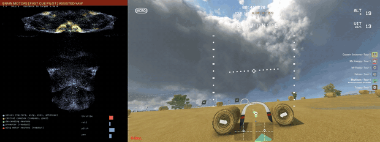

# fast-brain-07: experimental fast motor-readout weights, smoother after gates

Reviewed on 2026-09-25. Download from
[GitHub Releases](https://github.com/skulitom/haltere/releases/tag/fast-brain-07-experimental)
or [Hugging Face](https://huggingface.co/Skulitom/haltere/tree/main/fast-brain07).



*Straw Bale lap 1, hilltop through the descending checkpoints, at 4x speed:
connectome activity (left) beside gameplay (right). Brain motors, fast race-cue
pilot with arc turns, assisted yaw.*

**The fastest and smoothest brain-motor races so far.** Under the fast race-cue
pilot at a declared 6 m/s, fast-brain-07 finished the full three-lap Straw Bale /
Field Day race twice: **5:45.792** and **5:46.846**, with no detected contact.
fast-brain-06 took 5:50.204 and 5:50.489; the earlier brain best was 14:05.703.
Minus Two and Pine Valley were **not** finished, as with brain-06 and the fast PD:
obstacles on or beside the line to the next checkpoint. These are seen development
courses, not an unseen-race or freestyle result, and far from the 1:34.807 target.

## What changed from fast-brain-06

- **The pilot flies checkpoint switches as coordinated turns.** When the ring
  jumped to the next checkpoint, the old pilot braked hard and re-accelerated
  (a pitch swing the user saw as jitter). It now rotates the velocity request at
  up to 8 m/s² centripetal and follows a side-clamped ring at 65% speed instead of
  30% ([fast racing](fast_racing.md), commit `58a0cfe`).
- **The brain was re-distilled under that pilot** (same recipe as brain-06:
  FastMotorPD labels, DAgger in the measured-drone surrogate, readout rows 0-2
  only, scene currents blanked), so it learned to carry speed through a turn.

Weight audit against the parent (motor10 candidate05): only `readout.weight` and
`readout.bias` rows 0-2 changed (max 0.0060 / 0.0005); the yaw readout, connectome
wiring, transmitter signs and every other tensor are identical. The teacher is
absent at inference.

## Evidence

Live on Straw Bale, brain-07 against brain-06 (same course and drone):

| | brain-06 | brain-07 |
|---|---:|---:|
| Race time | 5:50.204 / 5:50.489 | **5:45.792 / 5:46.846** |
| Minimum speed after 45-75 degree checkpoint switches | 2.50 m/s | **3.75 m/s** |
| Stick change per 10 ms tick after a switch | 0.0133 | **0.0092** |
| Roll/pitch command change per tick, whole race | 0.0049 | **0.0037** |
| Body-rate RMS | 0.66 rad/s | **0.54 rad/s** |

Every attempt with this checkpoint (original `[Copy] New Drone`, hidden Anode
desktop, CPU brain, CUDA vision, 6 m/s, processed-control ground check per pad):

| Run | Pilot | Outcome |
|---|---|---|
| `straw-brain07-02` | `58a0cfe` | **Finish 5:46.846** |
| `straw-brain07-03` | `58a0cfe` | **Finish 5:45.792** |
| `minus-brain07-01` | `a7dbbac` (same pilot) | Pillar on the line to the ring, ~14 s |
| `pine-brain07-01` | `a7dbbac` (same pilot) | Impact at (74.5, -5.0, 6.0) m, ~21 s |
| `straw-brain07-nosweep-01` | downhill yaw-sweep fix (later reverted) | Lap 2: top beam of the second descending arch |
| `straw-brain07-steep-01` | fix + steeper descent | Stopped at the user's request (the virtual gamepad reached their own game) |
| `straw-brain07-steep-02` | fix + steeper descent | Lap 1: same arch beam |

The downhill fix removed a real yaw weave, but brain-07 does not follow the
steeper descent and slower horizontal request it asked for, so without the weave
it reached a lower ring from above. Those pilot changes were reverted; see the
[downhill flight card](flight_cards/2026-09-24_downhill.md). Surrogate evaluation
(not flight evidence): 7/8 steep held-out synthetic courses, 0 crashes. The full
suite passed 596 tests at `a7dbbac`.

## Limits

- Seen development courses only; unseen races and freestyle are untested.
- No obstacle sense beside or on the line to a checkpoint (Minus Two pillar, Pine
  Valley terrain and boulder); a learned clearance model is in development.
- On long descents the pilot's yaw sweeps side to side (see above); the fix waits
  for a brain that tracks steeper descents.
- The virtual gamepad used for Liftoff is machine-wide: do not play another
  gamepad game while it flies.

## Download and use

Extract `fast-brain07-inference.zip` into the repository root at `a7dbbac` or a
later compatible revision. It contains the checkpoint, the GateNet detector and
stick mapping it expects, the measured dynamics profile, training source,
configuration, audit, evaluation, flight sidecars, ground checks, finish
screenshots and per-file hashes (`fast-brain07-manifest.json`).

```powershell
.venv/Scripts/python.exe -m haltere.liftoff.visual_brain runs/fast-brain-07-6mps-arc/candidate.pt `
  --mapping runs/pine-route-collection-01/liftoff-original-drone.yaml --device cpu --vision-device cuda `
  --pilot-assistance race-cue --pilot-profile fast --assist-speed 6 --motor-controller brain `
  --dynamics-profile runs/measured-dynamics-low-speed-20260923/profile.json `
  --udp-out 127.0.0.1:9003 --pause-on-stop --log runs/my-flight.csv
```

| Artifact | SHA256 |
|---|---|
| Archive `fast-brain07-inference.zip` | `63512d54e0fbaba5a15814f839cc5c81b60e9ac09ed90c691d7dff7d6a9d2f2e` |
| `runs/fast-brain-07-6mps-arc/candidate.pt` | `5d003678be4fe3902d78f5a5b987a932cac9348787c2ca304548d9f192657a84` |
| Parent motor10 candidate05 | `64444a628c58b2c1615086bc84f8c5d3c0a0a12667df31d888c4587a802288b2` |

Videos (release assets): the full 5:45 Straw Bale finish, a 4x version, and the
Minus Two and Pine Valley failures, each with connectome activity beside gameplay.
