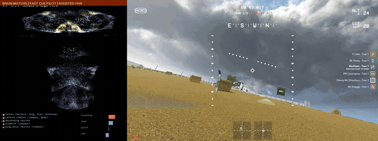
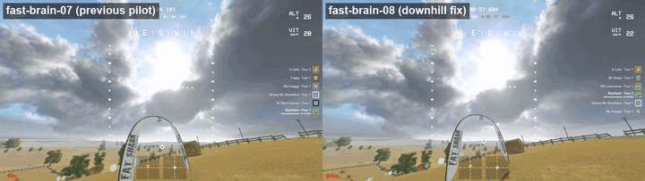

# fast-brain-08: experimental fast motor-readout weights for the downhill-fixed pilot

Reviewed on 2026-09-25. Download from
[GitHub Releases](https://github.com/skulitom/haltere/releases/tag/fast-brain-08-experimental)
or [Hugging Face](https://huggingface.co/Skulitom/haltere/tree/main/fast-brain08).



*Straw Bale lap 1, hilltop through the descending checkpoints, at 4x speed:
connectome activity (left) beside gameplay (right). Brain motors, fast race-cue
pilot with the downhill fix, assisted yaw.*

**The fastest brain-motor races so far, without the side-to-side weave on the
downhill.** Under the fast race-cue pilot at a declared 6 m/s, fast-brain-08
finished the full three-lap Straw Bale / Field Day race twice: **5:17.898** and
**5:17.805**. Neither the runtime impact guard nor the offline contact check found
an impact, but the pilot's slope-support rule fired 4 and 6 times on the downhill,
where the drone skims the straw, so light contact with the hillside is not
excluded. fast-brain-07 took 5:45.792 and 5:46.846 with the previous pilot; the
fast PD's 5:02.933 was flown with an earlier pilot (before arc turns and the
downhill fix) and has not been flown with this one. Minus Two and Pine Valley were
**not** finished: obstacles on or beside the line to the next checkpoint, as for
fast-brain-06, fast-brain-07 and the fast PD at 6 m/s (the slower scene09 stack did
finish Minus Two). These are seen development courses, not an unseen-race or
freestyle result, and far from the 1:34.807 target.



*The same downhill, 2x speed: fast-brain-07 with the previous pilot (left) yaws
back and forth; fast-brain-08 with the fixed pilot (right) holds its line.*

## What changed from fast-brain-07

- **Pilot: no yaw sweep on the downhill.** A slow yaw sweep meant for rings
  clipped at the top edge also ran on rings clipped at the bottom, so every
  downhill wove from side to side. It now runs only for top clips, and a ring that
  stays clipped below makes the descent steeper over time
  ([downhill card](flight_cards/2026-09-24_downhill.md)). This pilot change is
  what removes the weave.
- **The brain can follow that pilot.** fast-brain-07 crashed 2/2 with the fix: it
  barely braked or sank when asked. Replays against the teacher showed a
  distillation gap, not a simulator mismatch: the readout's ridge of 10 held
  braking back (a pitch gap of +0.78 to the teacher on steep, slow ticks), and the
  goal neurons stop responding beyond a vertical goal of about 1 m. brain-08
  encodes the vertical goal as the request x 0.4 s (was 1.0 s) and was distilled
  under the fixed pilot with steep-sink samples up-weighted, a lower ridge (0.3)
  and a penalty on the command change per 10 ms tick
  ([brain-08 card](flight_cards/2026-09-25_brain08.md)).
- **Pilot: support on a slope.** Sliding down a hillside still sinks at the
  hill's slope, so the old support rule (sink stopped) never fired. A sink
  shortfall with the issued throttle held below hover now also triggers a short
  climb.
- **Pilot: gentle search.** A lost ring used to trigger a stop at the 10 m/s²
  command limit; near the ground the pitch-up and the sharp turn that followed hit
  the hilltop twice. The search now slows at up to 3 m/s² and rises at 0.5 m/s
  for 1.5 s. In the surrogate, with the ring blanked 1.4 s every 9 s, brain-08
  crashed on 2 of 16 courses instead of 8 with the old search (emulated as a
  10 m/s² stop without the climb).

Weight audit against the parent (motor10 candidate05): only `readout.weight` and
`readout.bias` rows 0-2 changed (max 0.026 / 0.0009); the yaw readout, connectome
wiring, transmitter signs and every other tensor are identical. The teacher is
absent at inference.

## Evidence

Live on Straw Bale, brain-08 (pilot at `e71f4c0`) against brain-07 (pilot at
`58a0cfe`), same course and drone. Both the weights and the pilot differ between
the columns, and no same-pilot brain-07 or PD race exists (brain-07 crashed 2/2 on
the fixed pilot), so these are whole-stack results. Every metric is computed with
the same code for both; pairs are in run order (brain-07 runs 02, 03; brain-08 runs
04, 06):

| | brain-07 | brain-08 |
|---|---:|---:|
| Race time | 5:46.846 / 5:45.792 | **5:17.898 / 5:17.805** |
| Downhill time with yaw rate above 0.5 rad/s | 31% / 32% | **3.0% / 4.7%** |
| Roll/pitch command change per 10 ms tick, whole race | 0.0037 | **0.0031** |
| Mean horizontal speed | 4.61 m/s | **5.01 m/s** |
| Lowest speed after a checkpoint switch (primary switches) | 3.78 / 3.84 m/s | **4.20 / 4.11 m/s** |
| Time to regain speed after a switch | 3.0 s | **2.0 s** |
| Stick change per tick after a switch (primary switches) | 0.0084 / 0.0083 | 0.0083 / 0.0082 |
| Lowest speed after 45-75 degree switches | 3.75 / 3.84 m/s | 3.59 / 3.46 m/s |
| Stick change per tick after 45-75 degree switches | 0.0092 | 0.0102 / 0.0100 |
| Roll/pitch body-rate RMS (the brain-07 page's metric) | 0.54 / 0.51 rad/s | 0.58 / 0.57 rad/s |
| 3-axis body-rate RMS | 0.66 / 0.64 rad/s | 0.65 / 0.65 rad/s |

Primary switches are those more than 1 s after the previous one. Stick commands
are smoother over the whole race and equal after switches, and yaw is much calmer
on the downhill; roll/pitch body rates are about 10% higher than brain-07's, and
sharp (45-75 degree) switches are slower and slightly rougher.

Every attempt with this checkpoint (original `[Copy] New Drone`, hidden Anode
desktop, CPU brain, CUDA vision, 6 m/s, processed-control ground check per pad):

| Run | Pilot | Outcome |
|---|---|---|
| `straw-brain08-01` | downhill fix | Lap 1, 76 s: slid down the hillside and struck it |
| `straw-brain08-02` | + slope support (`e65b5af`) | Lap 2, 164 s: hilltop, after losing the ring |
| `straw-brain08-03` | + slope support | Lap 1, 59 s: same hilltop sequence |
| `straw-brain08-04` | + gentle search (`e71f4c0`) | **Finish 5:17.898** |
| `straw-brain08-05` | `e71f4c0` | Lap 2: stopped by the controller deadline guard (a 202 ms log write, runtime; rows are written on a background thread since `4445a73`, not yet exercised in a full race) |
| `straw-brain08-06` | `e71f4c0` | **Finish 5:17.805** |
| `minus-brain08-01` | `4445a73` | Pillar on the line to the ring, ~13 s (brain-07's spot, ~14 s) |
| `pine-brain08-01` | `4445a73` | Terrain/obstacle impact at (67.8, -10.6, 4.3) m, ~18 s |

Times are from the start of the flight log.

Surrogate (not flight evidence): on the 16-course development gate (8 flat and 8
steep synthetic courses; the steep ones are the distillation's evaluation courses
and the gate chose between refits), with the downhill-fixed pilot before slope
support and gentle search (`c6e57c5`; brain-08's results are identical with the
released pilot), brain-08 finished 15/16 with 1 crash (brain-07: 15/16, 0 crashes,
1 timeout), steep-request sink shortfall 0.16 m/s (brain-07 0.69, PD 0.15),
roll/pitch stick chatter 0.0030 (0.0027). The finish count accepts a pass anywhere
within 3 m of a checkpoint, which hid brain-07's high descending passes (5 of 10
more than 1.5 m above the checkpoint, brain-08 0 of 10). These gate outputs are
not in the archive; the bundled `evaluation.json` is the refit's own 8-course
check (8/8, chatter 0.005, steep shortfall 0.28, its own metric definitions). The
full suite passed 787 tests at `09898a1`.

## Limits

- Seen development courses only; unseen races and freestyle are untested.
- No obstacle sense beside or on the line to a checkpoint (Minus Two pillar, Pine
  Valley terrain and boulder); a learned clearance model is in development.
- brain-08 tracks the pilot's requested line more closely than brain-07, which
  climbed well above it; near the ground it relies on the pilot's slope support
  and gentle search, and it touches the straw on the downhill. Sharp checkpoint
  switches are slower and slightly rougher.
- Runs 04-06 and the Minus Two and Pine Valley flights ran with an Anode 0.9.0
  build whose HidHide seat isolation kept the virtual pad inside the seat
  (`pads_seat_only` true in preflight and postflight); runs 01-03 predate that
  check. Without it, the pad is machine-wide and the game guard unplugs it when
  another game runs.

## Download and use

Extract `fast-brain08-inference.zip` into the repository root at `09898a1` or a
later compatible revision (the finishes ran at `e71f4c0`, which differs only in the
flight-log writer). It contains the checkpoint, the GateNet detector and stick
mapping it expects, the measured dynamics profile, the training source and
configuration of both the collection run and the refit, the audit, evaluation,
flight sidecars, ground checks, finish frames and per-file hashes
(`fast-brain08-manifest.json`).

```powershell
.venv/Scripts/python.exe -m haltere.liftoff.visual_brain runs/fast-brain-08-vgs04-s10r03m30/candidate.pt `
  --mapping runs/pine-route-collection-01/liftoff-original-drone.yaml --device cpu --vision-device cuda `
  --pilot-assistance race-cue --pilot-profile fast --assist-speed 6 --motor-controller brain `
  --dynamics-profile runs/measured-dynamics-low-speed-20260923/profile.json `
  --udp-out 127.0.0.1:9003 --pause-on-stop --log runs/my-flight.csv
```

| Artifact | SHA256 |
|---|---|
| Archive `fast-brain08-inference.zip` | `4556e19a307d4cb2badc4f32025e445f8af1b5f99be71d4517c86dad0110699e` |
| `runs/fast-brain-08-vgs04-s10r03m30/candidate.pt` | `dad013ed19b161da1f8930f318b8763f5f0083d869684363ca573ca5dbb17ad6` |
| Parent motor10 candidate05 | `64444a628c58b2c1615086bc84f8c5d3c0a0a12667df31d888c4587a802288b2` |

Videos (GitHub release assets): the full 5:17 Straw Bale finish, a 4x version, the
downhill beside brain-07, and the Minus Two and Pine Valley failures, each with
connectome activity beside gameplay (the side-by-side shows gameplay only). The 4x
finish and the downhill comparison are also in the Hugging Face folder.
