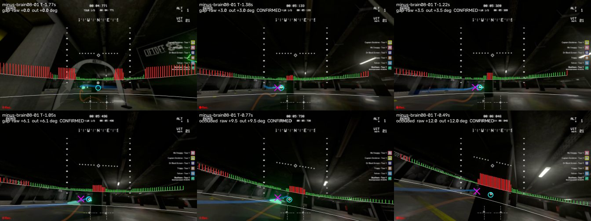
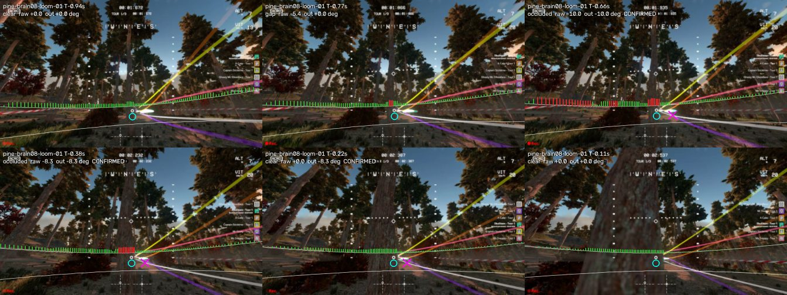

# Gap cue (M2): steer around a near object in front of the ring

A runtime cue that shifts the pilot's aim off the ring bearing when a near object
stands on or beside the line to the ring, using only the current frame's
relative depth. It targets the dark pillar on Minus Two that looming misses
(looming read ~14 m at the moment brain-08 hit it). **It is off by default and
not wired into the flight stack.** This page records what it does and how it
scored on the frozen offline gates.

## Runtime pieces

- `haltere/vision/relative_depth.py`: the frozen pretrained Depth-Anything-V2-Small
  relative model already on disk (Apache-2.0, revision 5426e4f0, weights sha256
  `3152477c...`, the same weights as the obstacle teacher cache). 448x252 input,
  fp16 on CUDA, fp32 CPU fallback; output (36, 64) 7x7-block relative disparity.
  No training, no download; the weights hash is checked at load.
- `haltere/vision/gap_cue.py` (numpy only): per frame, block rays are rotated to
  the world with the capture attitude; blocks in a gravity-levelled -4..+6 deg
  elevation band form a 1-degree azimuth profile about the ring bearing (each bin
  the max disparity within +-1.5 deg). Background = median within +-35 deg;
  a column is **near** where disparity / background > 1.8. The free interval
  containing the ring (or, if the ring column is near, the nearest free column
  within 25 deg) keeps a margin of 5 deg x clip(r / 1.8, 1, 2.5) from near
  edges; the aim shift is the point of that interval nearest the ring, clipped to
  +-12 deg (positive = left). Also reported: `kind`, `r_ring`, `r_peak`, `lr`
  (terrain side statistic) and `near_on_path` (a near column on the path the
  vehicle is committed to, from the declared velocity and a per-motor response
  model in `configs/obstacles/response_models.json`: PD 0.30 s / 8 m/s^2,
  brain-08 0.55 s / 6.5 m/s^2, checked against logs).
- Time logic (`GapCue`): a shift is confirmed after 2 consecutive fresh frames
  with |shift| >= 2 deg on the same side and released after 2 frames without;
  a side change or a missing ring releases at once; a frame older than 0.25 s
  gives 0 (stale); a gap over 0.3 s restarts confirmation.
- Masks: HUD glyphs, the ring marker / checkpoint volumes and ghost trails from
  `haltere/obstacles/overlays.py`; any block with a masked pixel is unknown
  (neither near nor free). The propeller zone is not masked.

Runtime inputs are causal only: the current frame, attitude, the ring cue of the
same frame and the declared velocity. No course geometry, routes, per-course
parameters or labels; `tests/test_obstacle_label_isolation.py` covers both new
runtime modules.

## Frozen offline gates (v1, scored once)

Configs frozen before any held-out frame was scored (commit `345f6d6`):
`configs/obstacles/gap_cue.json` sha256 `26ae946693a2...`, gate definitions
`configs/obstacles/gap_cue_gates.json` sha256 `fc4887713cd1...`. Full numbers:
`docs/experiments/gap_cue_v1_results.json`. Two disparity bases, same frames:

- **teacher** (primary): DA-V2-Small with the obstacle teacher preprocessing
  (602x336 bicubic input). Store frames use the existing teacher cache; the new
  flights ran through `RelativeDepth(input_hw=(336, 602))`, the same code path.
- **runtime**: `RelativeDepth()` at 448x252 fp16, the wrapper's default.

New flights (brain-07/08 Minus Two, the three 2026-09-23 live baselines, the
Pine trunk flight, four finished Straw Bale laps) were decoded from their run
videos and aligned to telemetry by matching the HUD ring marker to the logged cue
(offsets -0.04 to -0.11 s, median residual 1.5-1.9 px at 1280 px). One GPU chunk
of 86 s covered 22,240 new frames, 4,160 leak frames and 1,910 store frames; the
model runs in 8.6 ms per frame at either input size on the RTX 4090.

| Gate | Target | teacher (primary) | runtime 448x252 |
|---|---|---|---|
| G1 pillar A: left confirmed at >= 5.5 m | >= 6 of 8, never into the pillar | **4 of 8, FAIL**; aim into pillar 0 frames, into own near column 2 | 0 of 8 |
| G2 pillar B: -x shift >= 1.0 s before impact | both runs | **1.35 s and 1.04 s, PASS** | 0.62 s, 0.93 s |
| G3 clean Straw Bale laps (22.6 min) | <= 6 episodes/min, p90 <= 10 deg, >= 95% quiet switches | **9.3 /min, p90 12.0 deg, 119 of 120 switches: FAIL** | 8.2 /min, 9.6 deg, 97.5% |
| G4 leaks | >= 95% of frames within 1 deg; HUD-only never near | painted 95.9%, **removed 94.8%: FAIL**; HUD-only 0 of 17,580 | 94.1%, 94.5%; 0 |

G1 per approach (first confirmed LEFT, metres from the pillar face; first raw
left in brackets; teacher basis): brain-03 4.88 (6.83), brain-04 5.83 (6.12),
brain-05 5.71 (6.26), brain-06 5.32 (5.58), brain-07 5.46 (7.03), brain-08 6.98
(7.26), fast PD 4.49 (4.78), fast PD current pilot 6.45 (9.43). Reported, not
gated: brain-08 slow-3.5 2.81 (7.69), brain-08 looming 5.29 (5.65). The first
four and the fast PD run are design-study dev runs; brain-07, brain-08 and the
current-pilot PD run are new. The raw rule sees the pillar at >= 5.5 m on 7 of 8
approaches; two-frame confirmation loses three of them to single-frame
flicker. Confirmed right shifts appear only below 2.7 m, when the pillar fills
the view (too late to matter); the two own-near frames are the +-12 deg clip
landing inside the near run at 1.8 and 1.4 m.



G3: the clean-lap episodes (9.8, 7.8, 10.9, 8.7 /min per lap) come mostly from
real near objects near the line (inflatable arch legs while approaching a gate,
round bales, the hilltop slope), as on the dev laps (11.2 /min), and the shift
often reaches the 12 deg clip. The cue stays quiet in the last 0.5 s before
checkpoint switches (one exception in 120).

### Pine Valley trunk (pine-brain08-loom-01, report only)

The cue sees the trunk late: first near column 0.77 s before impact, a
confirmed **right** shift of 10 deg at 0.66 s (runtime basis: 0.61 s), held to
0.22 s. Right is the side the ghost-racer trails pass (not an input). At 0.2 s
the trunk fills most of the band, the background median becomes the trunk and
the cue reads clear. With brain-08's 0.55 s response this would not have
avoided the trunk.



## What this means

- The rule finds the dark pillar and pillar B on the correct side with the
  teacher preprocessing, but not early enough at the gate's 5.5 m on half the
  approaches, and it is too busy on clean Straw Bale laps (gate arches and bales
  are near objects too). It is not ready to enable.
- The 448x252 runtime input confirms pillar A 0.3-3.2 m later (median 1.6 m)
  than the 602x336 input and costs the same 8.6 ms, so a flight integration
  should use
  `RelativeDepth(input_hw=(336, 602))`; that needs a new config version and
  freeze (the primary-basis numbers above are that configuration).
- Levers for a v2 (each needs a new frozen version and a full rescore):
  confirmation that tolerates one-frame flicker, suppressing thin near runs that
  flank the ring symmetrically (gate legs), and a background that does not
  collapse when one object fills the window.

## Reproduce

```
set HALTERE_DATA_ROOT=C:/DEV/Haltere
python -m haltere.obstacles.gap_cue_eval masks  --out OUT --runs 118,119,120,121,122,123,127
python -m haltere.obstacles.gap_cue_eval frames --out OUT --flight-lock LOCK
python -m haltere.obstacles.gap_cue_eval depth  --out OUT --flight-lock LOCK --max-s 300
python -m haltere.obstacles.gap_cue_eval score  --out OUT
python -m haltere.obstacles.gap_cue_eval sheet  --out OUT --flight pine-brain08-loom-01 --tti 0.94,0.77,0.66,0.38,0.22,0.11 --image docs/gap_cue_pine_trunk.jpg
```

`frames` keeps every new video frame at 448x252 in `OUT/flights/*.u8` (about
10 GB for all ten flights; scratch data, delete after scoring).
