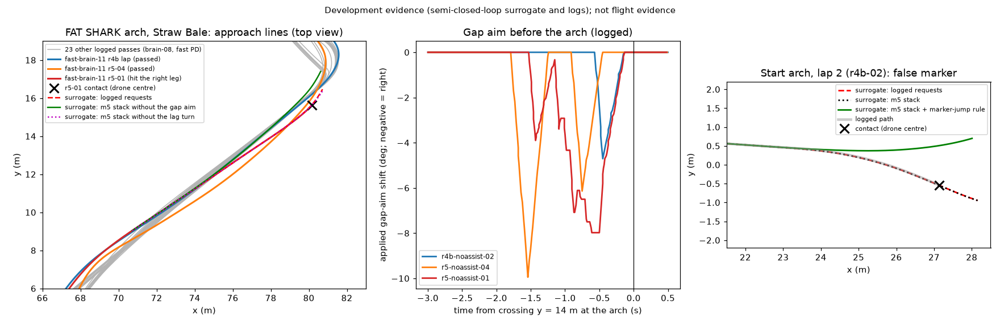

# Gate clearance around checkpoint switches (round 6, branch `m6-gates`)

**Nothing here has flown.** Branch `m6-gates` from `m5` (`bc7c71c`). The three development cases are the Straw Bale
crashes of `fast-brain-11-b-cw13` under the round-4b and round-5 stacks. Their causes below were checked on the
recorded video as well as the telemetry. Every other gate pass in every Straw Bale, Minus Two and Pine Valley log is
held-out data for the one rule this round froze.

## Summary

| Crash | What happened (video and logs) | What moved the drone into the structure | What this round did |
|---|---|---|---|
| `straw-brain11cw13-r5-noassist-01`, FAT SHARK arch, 19.4 s | Crossed the arch plane very obliquely. The marker slid to the next ring (far left) over three captures from 19.00 s, the pilot turned left and the nose yawed left, and the path, still on its old line, ran into the right leg | The **gap aim**: from 17.4 to 18.7 s it shifted the aim up to 8.0 deg right, away from the near left leg. Both round-5 passes crossed 0.5-1.1 m right of each of the 23 other logged passes of this arch | Measured. A post-switch hold was tested on this case: no effect (the path cannot respond within 0.37 s), **not frozen**. Without the gap aim the surrogate path clears the contact point by 0.64 m |
| `straw-brain11cw13-r4b-noassist-02`, second start arch, 112.4 s | After 0.55 s without any reading, the ring reader read a banner logo 16.8 deg right of the ring for two captures. The pilot turned toward it and coasted the turn into the next arch's leg | The **false marker** (and the lag-aware turn's lead on it: 0.27 m of the path's offset) | **Marker-jump rule v1, frozen and scored: it passes this development case (the surrogate path clears the contact point by 1.03 m) and fails its held-out gates** ([below](#the-marker-jump-rule-frozen-scored)) |
| `straw-brain11cw13-r5-noassist-04`, ImmersionRC arch top bar, 81.9 s | Downhill touch 79.43-79.97 s. Contact support v3 started a 0.6 s climb at 80.08 s, after the touch had ended. 1.8 s later the drone was 0.5-0.7 m higher than the lap run and descended at about 12 deg onto the next arch's top bar | The **late support climb**. The view bound and the sink slew then kept the descent at the view's angle | A gate-below brake was tested on this case: at most 0.32 m lower at the bar (0.83 m without the late climb), **not frozen**. No causal cue measured the arch's distance |

*Left: every logged pass of the FAT SHARK arch (grey: fast-brain-08 and the fast PD without the stack) and the
surrogate paths of `r5-noassist-01` from 17.2 s. Middle: the applied gap-aim shift before the arch. Right: the
start-arch surrogate paths of `r4b-noassist-02` from 111.2 s. Development evidence, not flight evidence.*

Measurement (1): the lag-aware turn adds about 4.4 deg (p50) of request turn 0.3 s after a switch. The request turns
at the coordinated-turn limit (about 80 deg/s at 5.5 m/s) from the first tick after a switch, with or without the lag
turn. The gap aim changes nothing at the switch (a ring conflict releases it), but it moved the whole approach line
before the FAT SHARK arch.

## The three development crashes

### FAT SHARK arch (`straw-brain11cw13-r5-noassist-01`, 19.4 s)

Video (recording time equals log time within 0.1 s here):

- 18.44-18.94 s: the arch, a tall curved banner, is seen obliquely. Its left leg is near and large; the right leg is far
  and to the right.
- 19.00 s: the arch top is overhead.
- 19.06-19.28 s: the ring marker slides to the lower left. The view yaws left about 40 deg while the right leg, with
  the "FAT SHARK" lettering, grows on the right of the image.
- 19.39 s: the banner fills the right half of the image. The drone tumbles at 19.44 s.

The contact audit puts the drone centre at the impact at (80.16, 15.62), 5.25 m/s, at 19.377 s.

**The line.** The path of every logged pass, taken where it crosses y = 14 m (x in m):

| Passes | x at y = 14 m |
|---|---|
| 12 brain-08 passes (no obstacle stack) | 77.17-77.56 |
| 10 fast-PD passes (no obstacle stack) | 77.27-77.39 |
| fast-brain-11 round-4b lap (m4b stack, passed) | 77.44 |
| fast-brain-11 `r5-noassist-04` (m5 stack, passed) | 78.30 |
| fast-brain-11 `r5-noassist-01` (m5 stack, **hit the leg**) | 78.08 |

The two round-5 passes were 0.5-1.1 m right of each of the 23 others (east is right when flying north-east here).

**The gap aim moved them.** Logged applied gap shift before the arch (negative = aim right of the ring):

- `r5-noassist-01`: -3.3 deg at 17.5 s, -6.3 at 18.0, -7.5 at 18.25 and -8.0 at 18.27 s (peak), then back to 0 by 18.76 s.
- `r5-noassist-04`: up to -9.9 deg at 17.5-17.9 s and -6.1 deg at 18.4 s.
- The round-4b lap: one brief shift, up to -4.7 deg for 0.22 s from 18.34 s.

The shifting samples were mostly kind `gap`, with a near run 2-7 times nearer than the background (r_peak) on the
left (lr 2.6-13.5, left nearer). Their `near_on_path` was 0, except one `occluded` sample of `r5-noassist-04` at
17.31 s. The near object was the arch's own near (left) leg, beside the committed path, and the free-interval margin
pushed the aim toward the far (right) leg, which did not yet count as near. In the last 0.6 s later samples voted
+1.5 to +4.5 deg (left, away from the right leg), but no left shift was applied.

**Semi-closed loop** (the identified surrogate from the logged state, `fast-brain-11-b-cw13` warmed on its recorded
inputs; distance of the path from the contact point at its closest; development evidence):

| Requests flown in the surrogate | From 17.2 s | From 18.8 s |
|---|---|---|
| logged (validation) | 0.023 m | 0.017 m |
| m5 stack replayed (identical to the log) | 0.025 m | |
| m5 stack without the lag-aware turn | 0.011 m | |
| m5 stack without the gap aim | **0.638 m** (path left of it) | |
| m5 stack without both | 0.634 m | |
| request heading and yaw stick held at the switch values for 0.2 s after the switch (18.995 s) | | 0.016 m |
| the same for 0.35 s | | 0.021 m |
| only the yaw stick held for 0.2 / 0.35 s | | 0.015 / 0.015 m |

After the switch nothing the pilot does reaches the path before the leg (0.37 s at 5.4 m/s; the brain follows about
0.3 s late). The line was set before the switch. **The post-switch clearance rule was therefore not frozen**: on
the only development case it was meant for, it changes nothing.

### Second start arch, lap 2 (`straw-brain11cw13-r4b-noassist-02`, 112.4 s)

This is [arches.md](arches.md)'s false-marker case:

- The live reader read no marker from 110.85 s (capture 218017.610, ring bearing -3.3 deg).
- Two in-view readings, ingested at 111.40 and 111.47 s (captures 218018.163 and 218018.238), read ring-centre
  azimuths of -20.15 and -20.43 deg: a banner logo.
- The next reading was an edge-clamped marker at 112.11 s.

The request heading turned from -3.6 to -20.85 deg. Semi-closed loop from 111.2 s:

| Requests | Distance from the contact point (27.13, -0.54) |
|---|---|
| logged (validation) | 0.022 m |
| m5 stack (replayed) | 0.023 m |
| m5 stack without the gap aim | 0.023 m |
| m5 stack without the lag-aware turn | 0.274 m, left of it |
| m5 stack with the marker-jump rule | **1.034 m**, left of it (development, before the freeze) |

The lag-aware turn led the false jump by 4.7-7.4 deg; it accounts for 0.27 m of the path's offset. With the rule,
the jump never reaches the pilot, so neither does the lead.

### ImmersionRC arch top bar (`straw-brain11cw13-r5-noassist-04`, 81.9 s)

Video, 80.4-81.8 s: the arch's top is a white semicircle at the bottom of the image, with the ring marker clamped at
the bottom edge inside it. The drone flies level into it; the bar fills the view at 81.83 s.

**Contact support fired late.** Downhill touch 79.427-79.968 s (audit). Contact support v3 fired at 80.078 s (`contact_fire`; the declaration's note rounds it to 80.09 s): after
the touch had ended, because contact support v3 excluded 79.61-79.90 s as a manoeuvre window (the ring came into view
and the drone pitched up). Contact support v2 fired during the round-4b lap's touch, at 79.66 s. The climb (+1 m/s
requested for 0.6 s, to 80.63 s) left the drone at 13.9-14.15 m at y 125-128, where the lap run was at 13.7-13.8 m.

**Then the descent could not catch up.** The ring was bottom-clipped from 80.43 s:

- The view bound allowed 1.28-1.34 m/s of sink (withheld up to 1.35 m/s of the pilot's own below-state request).
- The request slewed from +1.0 m/s at 80.63 s to -1.3 m/s by 81.45 s.

The drone crossed y = 120.7 m at 13.5 m; the lap run crossed it at about 12.8 m.

Semi-closed loop from 79.9 s (height at the arch's y; development evidence):

| Requests | Height at the bar |
|---|---|
| logged (validation) | 13.48 m (audited contact at 13.50 m) |
| horizontal request scaled to 75% from 80.63 s | 13.31 m |
| scaled to 60% | 13.16 m |
| without the support climb (80.08-80.95 s at the pre-climb request) | 12.65 m |

**The gate-below rule was not frozen.** A brake helps by at most about 0.3 m even when it is known to be needed, and
no causal cue measured the arch's distance:

- GateNet's range read 6.9-14.0 m while the arch was 1.7-7.2 m away (hindsight). On the downhill it read 4-10 m for
  gates 20-50 m away.
- Looming reported no evidence.
- The gap cue had no ring (the marker was clamped).

Braking for every bottom-clipped ring is the downhill failure the view-keeping descent removed
([descent_view.md](descent_view.md)). The effective fix is upstream: contact support must not start a climb after
the touch has ended.

## Measurement: turn timing after checkpoint switches

Switch events are the lag-aware turn's own trigger, computed in shadow on every log (an in-view ring-centre jump of
at least 10 deg). They are kept when the new bearing persists: the next 0.4 s of in-view readings lie within 8 deg of
it, and the jump from the previous 0.5 s is at least 15 deg.

That gives 57 switches in the two fast-brain-08 finishes (`straw-brain08-04`, `-06`; flown without the obstacle
stack) and 13 in the three fast-brain-11 Straw logs (m4b/m5 stack). Signed toward the new ring, p50 (p10-p90) in
degrees:

| After the switch | brain-08 finishes, request (logged) | brain-11, request (logged, with lag turn) | brain-11 logs, request without lag turn (open loop) | brain-08, course (logged) | brain-11, course (logged) |
|---|---|---|---|---|---|
| 0.1 s | 7.4 (1.5-8.9) | 8.9 (8.1-10.1) | 8.8 (5.8-10.0) | | |
| 0.2 s | 15.0 (2.2-17.3) | 17.7 (15.7-20.3) | 16.0 (8.8-18.5) | | |
| 0.3 s | 16.2 (2.4-23.4) | 25.9 (23.2-31.0) | 21.5 (12.3-23.2) | 1.7 (-1.6-9.1) | 3.7 (-1.1-11.2) |
| 0.5 s | 12.9 (-0.5-31.2) | 41.4 (26.1-44.8) | | 8.1 (-2.5-18.1) | 13.5 (4.6-29.3) |
| 0.8 s | | | | 26.5 (-3.7-32.8) | 33.6 (25.5-53.0) |

- The request starts turning on the first tick after a switch in every stack, at the coordinated-turn limit
  (`turn_acceleration` 8 m/s², about 80 deg/s at 5.5 m/s). The lag turn shortens the heading taper, which adds
  about 4.4 deg by 0.3 s (the same 4.4 deg on the brain-08 logs replayed through the m5 stack: 16.2 -> 20.6).
- The yaw follows at a similar rate in both: 14.3 deg (brain-08) and 15.4 deg (brain-11) at 0.3 s. The lag turn
  does not change the yaw.
- The path (course) has turned only 2-4 deg by 0.3 s.
- The gap aim changes almost nothing after a switch (the same p50 at every offset, p90 within 0.1 deg), because a
  ring conflict releases the shift.

**So the risk is not the post-switch turn.** A lagging brain's path keeps the pre-switch line for about 0.3 s whatever
the pilot asks. Where that line meets a structure (an oblique arch's far leg), the clearance has to come from the line
before the switch. At FAT SHARK the gap aim set that line. The lag turn's extra lead matters only when the switch is
false (the start-arch case).

Scripts and outputs: the session scratchpad under `m6/gates/` (`switch_replays.py`, `switch_events.py`,
`switch_summary.py`, `windows_dev.py`).

## The marker-jump rule (frozen, scored)

`configs/pilot/marker_jump.json` version 1 (`8752cd7e...`); `MarkerJumpConfig` in `haltere/liftoff/fast_race_cue.py`;
runner flag `--marker-jump on|off|shadow` (off by default; fast race-cue pilot only).

A fresh in-view (not edge-clamped) marker is a **candidate** when both hold:

- its ring-centre ray lies at least `jump_deg` (10 deg) from the ring-centre ray of the last accepted in-view marker;
- no reading was accepted for more than `gap_s` (0.15 s).

A candidate is held: the pilot treats that capture as no reading (coast, then search, as for a lost marker). It is
accepted with its `confirm`-th reading (3), each within `agree_deg` (6 deg) of the previous one and all within
`window_s` (0.3 s) of the first. Unread captures in between do not end a candidate. A marker that moves directly from
one reading to the next (a real switch, or motion) and every edge-clamped marker are taken as before; a clamp counts
as a reading.

The values are a priori:

- `jump_deg`: the lag turn's switch trigger.
- `agree_deg`: the gap pilot's ring-conflict angle.
- `gap_s`: two missed captures at 18 Hz.
- `confirm`: one more than the longest false reading seen.
- `window_s`: three readings with one unread capture between each at 14.6 Hz.

Log columns (appended last, only when declared): `marker_held`, `marker_candidates`. Sidecar:
`pilot_assistance.marker_jump` (counts) and `marker_jump_declaration`. In shadow nothing is held and the verdicts are
logged.

### Gates (`configs/pilot/marker_jump_gates.json` v1 `4eb99684...`; scored by `haltere.obstacles.marker_jump_gates`)

Frozen with the rule in `f4b2ebd`, before any held-out result. One scorer fix was committed before scoring
(`1249e77`): a log the m5 tree's own harness cannot replay (`pine-fast6-loom-01`: looming samples without the
`looming_below_fraction` column) is skipped and reported, like the two logs without replayable ticks. Scores:
`docs/experiments/marker_jump_v1_scores.json` (`58c3d48`). 63 of the 66 logs were scored.

**The rule fails its held-out gates. Do not fly `--marker-jump on`.**

| Gate | Threshold | Result | |
|---|---|---|---|
| I1 off = m5 (both bases: m5 stack, default pilot) | bit for bit, 63 logs | 126/126 identical | pass |
| I2 shadow = base | bit for bit | 126/126 | pass |
| D1 start arch (development) | both false readings held; the base's surrogate path within 0.15 m of the contact point, the rule's at least 0.4 m and left of it | both held; base 0.129 m (the scorer's window stops at the impact, 0.1 s before the contact point), rule 1.034 m, left | pass |
| D2 FAT SHARK and top bar (development, report) | | no request changed in either window | report |
| H1 no new stop (held-out, 62 changed windows per base) | none | 6 windows. Three are Minus Two fast-PD re-accelerations after a stand-off at a wall (`r4b-01` first garage wall 39.9 s, `r5-01` hairpin 23.2 s, `vg-02` 21.0 s), where the held marker delayed the pilot's return to the ring. In `r5-01` the coast started a turn-first episode whose creep bound took the request to 0.17 m/s where the base asked 1.3 m/s. The others: `straw-brain05-01` and `-gov-01` (default pilot), and one tick of `minus-fast6-r5-01` (0.922 against 0.923 m/s, default pilot) | **fail** |
| H2 clearance (held-out, surrogate, stack base) | every changed window within 0.3 m of the base's path | 34 of 40 windows beyond it: median 0.83 m, worst 5.41 m (`straw-brain08-06`, 221.1 s). Fast PD 12 of 12, fast-brain-08 17 of 23, fast-brain-11 5 of 5. Of the 20 windows in logs no earlier step had read, 18 | **fail** |
| H3 course time (held-out) | at most 2% per log | at most 0.37% (`minus-fast6-r4b-01`) | pass |
| HG1 posts (fresh harness, 30 gate scenarios) | rule <= base | fast PD 7 -> 0 (all 7 with a false marker), fast-brain-11 0 -> 0, fast-brain-08 0 -> 0 | pass |
| HG2 finishes | rule >= base | fast PD 21 -> 28, fast-brain-11 30 -> 30, **fast-brain-08 28 -> 27** | **fail** |
| HG3 scenarios without a false marker | at most 2% slower, no new stop | -0.04%, 0.00%, +0.05%; none | pass |
| HG4 hairpins (fresh, 8 per motor) | walls <=, clean >= | identical: fast PD 0 walls, 5 clean; brains 8 and 6 walls, 0 clean (no motor assist, as on Straw) | pass |

**Why it failed.** On the logs a real ring often returns after a gap at a jumped bearing:

- across a checkpoint switch, when the reader loses the marker near the ring (the start arches, the hilltop hairpin at
  about (11, 187), the downhill arches);
- after a stand-off turn at the Minus Two hairpin.

The rule held 133 readings in 98 candidates over 25 logs. In 27 of the 82 held episodes the next accepted reading lay
within 6 deg of the held one, so those were real rings whose acceptance was delayed. While a candidate was held, the
pilot coasted and then searched (slowing at 3 m/s² and yawing toward its last side), which moved the surrogate paths
by 0.4-5.4 m. The HUD readings alone did not separate the false logo (two readings after 0.55 s unread, 16.8 deg off)
from these real reacquisitions.

**A version-2 variant was explored after the scores and not frozen** (development only; the patch is in the session
scratchpad, `m6/gates/dev_v2_hold_keeps_bearing.patch`). In it a held reading keeps the pilot on its bearing (no coast
or search from a hold) while the last accepted reading is at most 0.6 s old. It removed every new stop, but 33 of the
40 surrogate windows still deviated more than 0.3 m (median 0.84 m, worst 4.54 m): delaying real rings by two
readings is itself the change. A reader-side discriminant is needed instead. The round-5 arches study recommended the
same: log the live reader's candidates (annulus fractions, position) so that a reader rule can be scored on live
frames.

## Tooling

- `haltere/obstacles/vertical_replay.py` gains three switches:
  - `--marker-jump DECLARATION [--marker-jump-mode shadow]` (tags `-mj1`, `-mj1-mjshadow`);
  - `--lag-turn off` and `--gap-aim off` (tags `-ltoff`, `-gaoff`), report-only diagnostics of each component's
    share;
  - `replay(..., probe=callable)` for per-tick analysis values.
- `haltere/liftoff/motor_assist_eval.py` gains `gate_scenario` / `gate_set`:
  - two arches whose legs are vertical posts;
  - an optional false marker on the approach (unread for 0.55 s, two captures `false_deg` beside the ring, unread for
    0.5 s);
  - scored for post contacts, the smallest post gap and the lowest speed near the arches.
- `haltere.train.deployed_pilot.deployed_pilot_kwargs(..., marker_jump='on'|'shadow')`.
- `haltere.obstacles.marker_jump_gates`: `replays`, `windows`, `harness`, `score`.

## Limits

- Nothing here is flight evidence. Replays are open loop, the windows are semi-closed loop in the identified surrogate
  (no Liftoff contact physics), and the harness is synthetic.
- The development evidence is one case per crash.
- The marker-jump rule failed its held-out gates. No rule of this round is ready to fly.
- The rule acts only on in-view readings after a gap. A false marker that appears edge-clamped, or right after a true
  reading, would be taken as before.
- The FAT SHARK and top-bar crashes are not addressed by any rule here (below).

## Next steps

- **Gap aim at oblique arches** (the largest Straw Bale lever found here). At FAT SHARK the near object was the
  ring's own gate leg, and the free-interval margin pushed the aim toward the gate's far leg. The gap aim is also what
  got fast-brain-08 past Minus Two pillar A (`minus-brain08-gapon-01/-02`), so it cannot simply be dropped.
  - The logged samples do not separate the two cases. The FAT SHARK shifts had `near_on_path` 0 and the gapon pillar-A
    shifts 1. But `near_on_path` is computed for the path toward the shifted aim, and the round-4b and round-5
    fast-PD pillar-A shifts (which passed) had 0 too.
  - A revision needs the gap cue's own profile: the interval, and the near runs on both sides of the ring and above it
    (a gate spans its ring; a pillar stands on one side). Log it, or run the depth model on recorded approaches
    offline.
  - Then freeze gates on the gap-commit sets (pillars A and C, Straw switch quietness) and every Straw arch pass, in
    the surrogate.

  Until then a Straw Bale run with `--gap-cue off` inside the stack is a disclosed component-off diagnostic, not a
  product mode.
- **Contact support must not climb after the touch has ended** (the round-6 ground work): 0.83 m of the top-bar miss.
- **Live:** nothing from this round should fly with authority. `--marker-jump shadow` changes nothing (126/126
  identical) and logs where the rule would hold (`marker_held`, `marker_candidates`) on live captures. That is the
  data a reader-side rule needs, together with the reader's candidates.
