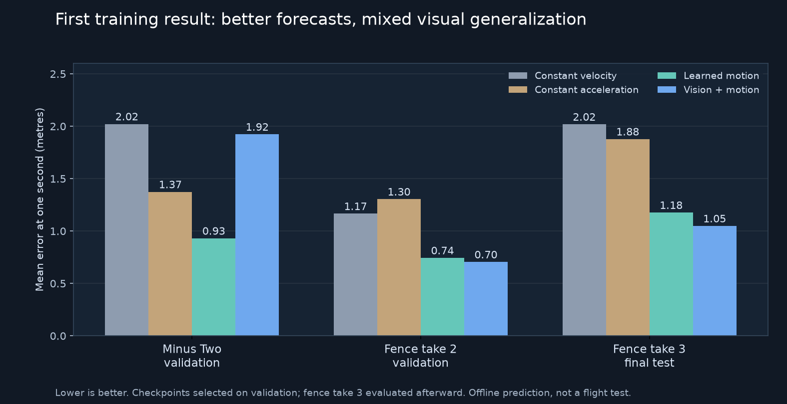

# Learning local paths from human flights

`NavigationNet` is an offline experiment: it predicts the next 0.25, 0.5 and
1 second of the human's path in the drone's current forward/left/up frame.
It does not output controller commands or change the connectome motor brain.

```powershell
.venv/Scripts/python.exe -m haltere.vision.demonstrations configs/human_demonstrations_v3.json --out data/vision/human_demonstrations_v3
.venv/Scripts/python.exe -u -m haltere.vision.train_navigation data/vision/human_demonstrations_v3 --out runs/navigation-human-01
```

Both output directories must be new. Raw recordings stay local under
`data/vision/manual_sessions`. The plans pin specific recordings; recording
another take does not change a running experiment.

## Split and comparisons

Training uses the first Straw Bale race, the second Pine Valley race, and the
first fence flight. Validation uses Minus Two take 2 and fence take 2. Fence
take 3 is instantiated by the trainer only after both checkpoints are selected,
and serves as the final test. The two user-reported mistake takes remain
review-only. No windows from a flight enter another split.

The fixed first experiment trains two predictors for 25 epochs each, with the
same seed, temporal input features, optimizer and sampling:

- Motion only: velocity, gravity direction, angular rates derived causally
  from preceding attitudes, and elapsed time.
- Vision and motion: the same inputs plus a small image encoder.

The model sees no absolute position, global heading, course identifier, future
state, or recorded controls. The stick display, compass, timer and standings
are masked in the model itself. Static reticles and in-scene racing guidance
markers remain visible; this is a Liftoff experiment, not evidence of operation
without those cues.

The network adds a learned correction to constant-velocity extrapolation.
The final layer starts at zero, so both models begin exactly at that baseline.
The CNN uses GroupNorm rather than normalization over time/batches. A causal
GRU consumes 16 frames, with four initial frames used for warmup. Training
samples the three takes with equal probability and uses photometric augmentation
only. No spatial transform is applied without also transforming the targets.

## Evaluation and artifacts

Errors are Euclidean position errors in metres at each prediction horizon.
Constant velocity and causal constant acceleration provide deterministic
baselines. Validation scores each frame once, after warmup, and weights both
takes equally relative to their one-second constant-velocity errors. This score
selects the checkpoint. Therefore validation is not an untouched test set;
the third fence flight provides that separate check. One final test flight is
still too small to estimate broad generalization.

Each model directory saves `history.jsonl`, `best.pt` and `metrics.json`.
The run directory saves the configuration and dataset hash in `config.json`,
and both validation and final-test metrics in `results.json`. The vision model
also receives a zero-image ablation after selection. Compare with the separately
trained motion-only model before attributing an improvement to vision.

Checkpoints record their configuration, selected epoch, horizons, architecture
and dataset hash. They are research checkpoints; no live pilot command loads
them automatically. Physical display delay is still uncalibrated. Offline path
error is not a gate-completion or fence-clearance result.

The training loop uses the existing temperature pause and a short inter-batch
delay so it can coexist with Liftoff. GPU temperature is checked every ten batches.

## First completed run — 20 September 2026

Both fixed 25-epoch runs completed on the RTX 4090. Validation selected epoch 22
for motion only and epoch 19 for vision plus motion. There were 5,093 training,
3,075 validation and 1,767 final-test examples. Nonoverlapping scored frames
numbered 1,632 for Minus Two, 1,428 for fence take 2 and 1,752 for fence take 3.

Mean **one-second endpoint error**, in metres:

| Method | Minus Two validation | Fence take 2 validation | Fence take 3 final test |
|---|---:|---:|---:|
| Constant velocity | 2.022 | 1.165 | 2.018 |
| Constant acceleration | 1.374 | 1.304 | 1.877 |
| Learned motion | **0.930** | 0.744 | 1.176 |
| Vision + motion | 1.923 | **0.705** | **1.048** |



The vision model reduced error on the reserved fence flight by 48.1% relative
to constant velocity and 10.9% relative to the learned motion model. Its
95th-percentile error was still 2.087 m. At the 0.25-second horizon, constant
acceleration was better (0.056 m mean versus 0.078 m for vision). At 0.5 seconds,
vision reached 0.260 m versus 0.331 m for constant acceleration.

Vision helped on the fence flights but degraded the strong motion result on the
unseen indoor course. This does not establish course-general visual navigation
or collision avoidance. The next experiment should add visual corrections to
the stronger motion predictor and test how those corrections behave on different
scenes. The third fence take has now been evaluated; it must not be described as
an untouched test set for experiments designed using these results.

The [machine-readable results](experiments/navigation-human-01.json) include
all horizons, p95 errors, the zero-image ablation, configuration, source-code
commit, dataset hash and checkpoint hashes. Experimental checkpoints:

- [Motion model](../artifacts/experimental/navigation_human_v1_motion_only.pt),
  31,625 parameters, selected on the stronger overall validation score.
- [Vision model](../artifacts/experimental/navigation_human_v1_vision_motion.pt),
  101,769 parameters, retained for research comparison.

Neither checkpoint is wired into the live pilot. The game settings, controller
mapping and shipped motor/vision models were not changed by this experiment.

The [v0.2.0 follow-up](navigation_release_v02.md) freezes this motion model and
learns a bounded visual correction, preserving the Minus Two result while
slightly improving the motion baseline on the fence flights. It includes
downloadable weights and labelled offline comparison videos.
