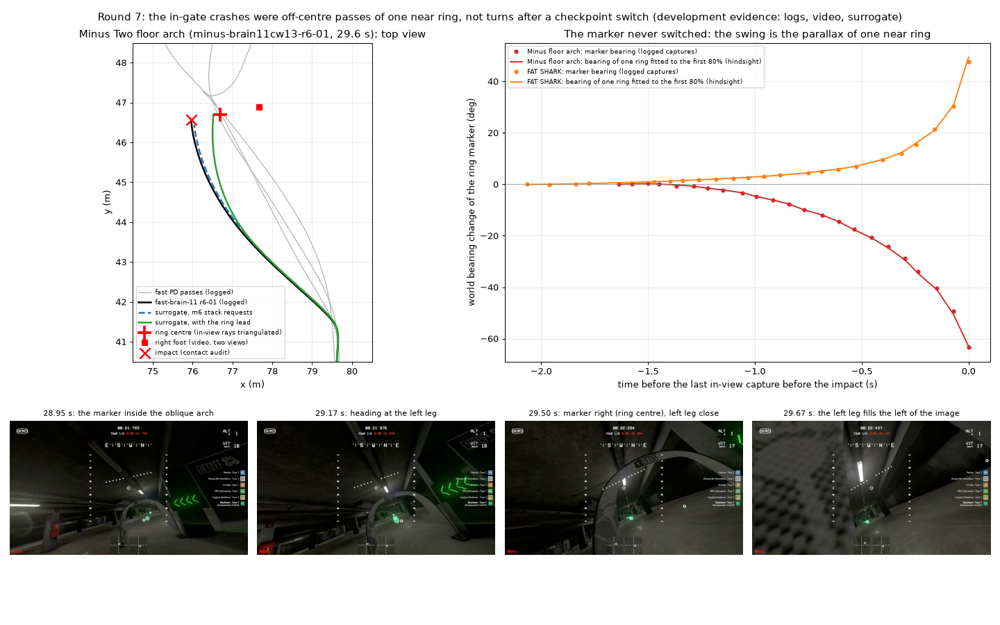

# In-gate turns and the near-ring lead (round 7, branch `m7-ingate`)

**Nothing here has flown.** Branch `m7-ingate` from `m6` (`c88bf73`). The task of this round was to stop the drone
turning into a gate's leg right after a checkpoint switch. Re-checking the three development crashes on video and in the
logs showed that **in none of them did the marker switch before the impact**, so that idea had no case to fix. The rule
this round froze instead leads the ring when the lagging brain's pursuit of a near ring falls behind.



*Top left: the Minus Two floor arch. The logged path of `minus-brain11cw13-r6-01` is shown with the surrogate paths from
27.3 s under the m6 stack's requests and under this rule, and with three fast-PD passes. The ring centre is triangulated
from the log's own in-view marker rays (hindsight). Top right: the world bearing of the ring marker before both brain
crashes. The line is the bearing of a single ring fitted to the first 80% of the readings; it also predicts the last 20%.
Bottom: video frames of the floor-arch crash. Development evidence only, not flight evidence.*

## Summary

| Crash | What happened (video, logs, hindsight triangulation) | Cause | This round |
|---|---|---|---|
| `minus-brain11cw13-r6-01`, low floor arch, 29.6 s | The marker stayed on this arch's ring until the impact. The drone passed 0.73 m **left** of the ring centre, at 0.8 m height, where the low arch's **left** leg curves in. In the video that leg fills the left of the image at 29.61-29.67 s. The right turn before the impact went toward the ring centre, away from that leg | The approach line. After the previous checkpoint (about 27.4 s), the early brake's cap still lay along the old travel ray (90.5 deg). It turned the request 10-17 deg left of the new ring's bearing for 1.3 s. The lagging course then fell further behind the ring's swinging bearing | The near-ring lead (below). Surrogate: 0.158 -> 0.553 m from the contact point, 0.692 -> 0.163 m from the ring centre |
| `straw-brain11cw13-r5-noassist-01`, FAT SHARK, 19.4 s | The marker did not slide to the next ring. Its fast leftward sweep from 19.0 s was the parallax of the FAT SHARK ring itself, which the drone passed about 1.2 m right of centre | Confirmed from round 6: the gap aim's right shift (up to 8 deg, 17.4-18.7 s) set the line | Not fixed. The rule does not act while a gap shift is applied, and makes this crash no worse (0.163 -> 0.209 m). A gap-aim revision is the next step |
| `minus-fast6-r6-01` (fast PD), arch bump, 41.4 s | Ring A was passed at about 39.2 s. The governor then braked the drone from 6.0 to 1.4 m/s at the wall behind ring B's narrow arch, and it stopped within about 0.7 m of that ring's centre. The marker was clamped below the image and at the side. The pilot followed the clamped marker's lateral bearing sideways along the arch (south, 1-2 m/s) into its structure | A clamped marker at close range after a brake stop. It was not a turn after a switch, and not a pursuit lag (the PD follows within 0.13 s) | Not addressed (the rule has no PD entry) |

The round-6 flight card, the fast-brain-11 release notes and `gate_clearance.md` described the two brain crashes as
turns toward the next ring after a checkpoint switch. At the Minus floor arch they also named the right leg. This page
corrects those descriptions (see [the checks below](#the-three-development-crashes-re-checked)).

## The three development crashes, re-checked

Method: every logged capture with an in-view (not edge-clamped) marker gives a world ray. The ray starts at the drone's
position at the capture and uses the pose at the capture, as in the pilot's own pose history and the calibrated camera
(focal 100 px at 320, uptilt 30 deg). Rays of one ring meet at its centre. After a checkpoint switch they meet at another
point, metres away. `haltere.obstacles.ring_lead_gates.capture_rays` / `ring_fit` compute this offline (hindsight, scoring
only). The frames come from the recorded videos, where recording time matches log time to about 0.05 s.

### Minus Two floor arch (`minus-brain11cw13-r6-01`, 29.6 s)

- **One ring to the impact.**
  - All 24 in-view rays of 27.8-29.57 s meet at (76.686, 46.693, 0.736), with an RMS residual of 0.042 m.
  - A fit to 27.8-29.2 s alone predicts the later rays within 0.11-0.20 m. At 29.57 s the drone was still 0.80 m from
    the ring, with its bearing swinging from 99.7 to 51.4 deg in 0.54 s.
  - The contact audit's terminal impact (29.656 s, (75.96, 46.58, 0.81), 4.66 m/s) lies 0.73 m west of the ring centre.
- **The arch.**
  - Its right foot triangulates from three frames to (77.67, 46.89, 0.03), 0.99 m east of the ring centre (residuals
    0.02-0.04 m).
  - The arch is low. Its top is about twice the ring's height in the frames. At the drone's height (0.8 m) the inner
    edge of each leg is roughly 0.6 m from the centre line.
  - The arch was seen obliquely. At 28.95 s the left leg is near and thick and the right leg far and thin. At 29.17 s
    the image centre (the heading) points at the left leg. From 29.50 s the left leg sweeps across the left of the image.
    At 29.61-29.67 s it fills the left 40% of the image. After the impact (29.72 s) the view has yawed left, with the
    arch's surface on the right.
  - The drone passed the ring on its left side and met the **left** leg.
- **How the line got there.**
  - The checkpoint before this arch switched at about 27.4 s, when the bottom-clamped marker jumped from u 0.53 to 0.26.
    The new ring lay 28 deg left of the course.
  - The early-brake episode that began at 26.6 s held its cap along its engagement ray (90.5 deg, the old travel
    direction) at 2.56-4.87 m/s until 28.7 s. That cap removed the request's northward part and kept its westward part.
    The request heading ran to 129-132 deg while the ring bore 118-119 deg (27.9-28.1 s), and the drone drifted west.
  - At 28.7 s the course (136 deg) was 25 deg left of the bearing to the ring (110.7 deg), with 3.96 m to go.
  - The pilot then pursued a bearing that swung right faster and faster. The request lagged it by 9-12 deg (the heading
    taper), and the brain's course lagged a further 12-28 deg.
  - The lag-aware turn's trigger (a ring-centre jump of 10 deg within 0.25 s) fired on this swing at 29.256 s, 0.40 s
    before the impact, and led the request right, toward the centre.
- The four fast-PD passes of this arch (`minus-fast6-01`, `-r4-02`, `-r4b-01`, `-r6-01`; positions read for the
  geometry) flew through its opening, three of them within 0.05-0.3 m east of the centre line.

### FAT SHARK (`straw-brain11cw13-r5-noassist-01`, 19.4 s)

- **One ring to the impact.**
  - The in-view rays of 17.3-19.01 s meet at (78.994, 15.342, 1.343), with an RMS residual of 0.031 m.
  - A fit to 17.0-18.96 s alone is met by the three later rays within 0.10-0.18 m. Those rays were taken 1.11-0.57 m
    from the ring, at bearings of 60-87 deg.
  - A ring 10 m or more away would have moved less than 3 deg over that 0.7 m of travel. So the sweep the round-6 study
    read as "the marker slides to the next ring" was the parallax of the FAT SHARK ring itself.
  - The impact (80.16, 15.62) lies about 1.2 m east of the ring centre, at the right leg.
- **The pilot's turn went toward the centre.** The lag-aware turn fired on the sweep at 18.997 s (0.38 s before the
  impact) and led the request 11-15 deg left, the right way but too late.
- **The cause is unchanged:** the gap aim's right shift (the round-6 gates branch, [gate_clearance.md](gate_clearance.md)).
  Surrogate from 17.2 s (distance from the contact point; the m6 stack's requests give 0.163 m):
  - without the gap aim: 0.638 m;
  - with the applied shift released from 17.5 / 17.9 / 18.1 / 18.3 s: 0.571 / 0.482 / 0.356 / 0.225 m.
  A causal release would need to know the ring is near. On this nearly head-on approach the in-view rays give a valid
  triangulation (smallest eigenvalue at least 0.05) only from 18.40 s, too late. No gap-aim rule was frozen this round.

### Fast PD arch bump (`minus-fast6-r6-01`, 41.4 s)

- **Ring A** was passed at about 39.2 s. The marker was bottom-clamped at 38.96 s and side-clamped at 39.03-39.26 s.
  The first in-view reading of ring B came at 39.29 s, at a bearing of -160 deg.
- **The approach to ring B.**
  - Ring B is a narrow arch, about 0.6-0.7 m wide at 3.3 m (video, 40.17 s), with the garage wall behind it.
  - At 6 m/s the governor braked for the wall, from 6.0 to 1.4 m/s at 40.3-40.9 s. The drone pitched up and the marker
    went below the image: bottom-clamped at 40.46-41.2 s, side-clamped at 40.85-40.91 s (turn-first engaged).
- **The bump.**
  - The drone stopped at about (54.6, 94.8). The only two in-view readings near the ring, at 41.29-41.35 s, put its
    centre at about (54.2, 94.2), roughly 0.7 m to the southwest (a rough two-ray estimate).
  - The pilot's request followed the clamped marker's bearing, heading -100 to -130 deg. The drone flew sideways
    (south, 1-2 m/s) along the arch and bumped its structure at 41.4 s, 2.1 m/s.
  - This was not a turn after a switch (the last switch was 2.1 s earlier) and not a pursuit lag.

### What this means for the suggested ideas

- **Holding the lateral request after a switch** until the drone is a gate depth past the plane: no development case.
  No crash had a switch before its impact. The one real switch nearby (Minus, 27.4 s) led to a turn toward the next ring
  that was needed; the cap's geometry overdid it.
- **Not shifting the gap aim toward the far leg of an oblique gate** (FAT SHARK): this is the right lever there. Its
  discriminator needs the gap cue's depth profile on both sides of the ring, recomputed from the recorded video, and a
  range cue. No causal range was available in time on this approach (above). This is left to a gap-pilot revision with
  its own gates.
- **The lag-aware turn's trigger** misreads a near ring's parallax as a switch in the last 0.4 s before a pass. There it
  leads toward the ring centre, which helped in both cases but came too late.

## The rule: near-ring lead (`configs/pilot/ring_lead.json` version 1)

`RingLeadConfig` in `haltere/liftoff/fast_race_cue.py`; runner flag `--ring-lead on|off|shadow`. It is off by default,
works inside `--obstacle-stack` (it needs the stack's lag-aware turn), and is declared per motor contract. The brain
contract has an entry; the fast PD has none and flies bit-identically.

- **Line-of-sight rate.** The world azimuth rate of the fresh in-view ring-centre ray, measured from the first to the
  last reading of the last 0.3 s. It needs at least 3 readings spanning at least 0.1 s. A reading more than 15 deg from
  the previous one starts the measurement again.
- **When it acts** (every tick where all three hold):
  - the measurement is at most 0.25 s old and at least 8 deg/s;
  - the pursuit is falling behind: the angle between the flown course and the ring-centre bearing is on the same side
    at the measurement's first reading and now, and not smaller now (at 1 m/s or more both times);
  - no gap-aim shift is applied.
- **What it does.** The lag-aware turn acts as in its switch window: the request aims 0.6 x (bearing - course) beyond the
  bearing, clipped to 15 deg, and its heading taper is 0.1 s instead of 0.25 s. It applies only while the ring is in view.
  These are the lag-turn declaration's own values (version 2, unchanged).
- **Logged.** CSV columns `ring_lead` and `ring_los_rate` (appended last, only when declared), the sidecar's
  `ring_lead_declaration`, and `pilot_assistance.ring_lead` (seconds, episodes). The lead itself is in `lag_turn_lead_deg`.

Why these parts:

- A far ring's line of sight hardly moves. A near ring passed off centre sweeps at V m / R^2: at 5 m/s, 8 deg/s means a
  0.3 m miss at 3.3 m or a 1 m miss at 6 m.
- A lead whenever the rate was high moved one development pass off centre. At the arch before the Minus hairpin, 0.7 s
  after an early-brake episode, the course was 17 deg off the bearing and turning onto it. The lead moved the crossing to
  0.62 m from that ring's centre, where the pursuit alone passed within 0.055 m.
- The pursuit test keeps a converging course alone. With it, that pass is unchanged and the floor arch keeps most of the
  gain.
- The gap aim owns the aim while it shifts. The lead is computed on the ring's own bearing (lag turn version 2), so it
  would pull the course back toward the obstacle the gap aim steers around (the Minus Two pillars).

Development measurements (surrogate from the logged state; the m6 stack's requests versus the rule's):

| Window | m6 stack | With the rule |
|---|---|---|
| Minus floor arch from 27.3 s: contact point / ring centre | 0.158 / 0.692 m | **0.553 / 0.163 m** |
| FAT SHARK from 17.2 s: contact point / ring centre | 0.163 / 0.559 m | 0.209 / 0.535 m |
| Minus hairpin approach from 20.0 s: that arch's ring centre / round-4b wall point | 0.055 / 1.958 m | 0.055 / 1.958 m |
| Fast PD arch bump | - | identical (no PD entry) |

Other forms were tried on the development logs and not chosen:

- a lead of the line-of-sight rate times 0.55 s: floor arch 0.594 m, hairpin arch 0.536 m off centre;
- a parallax time-to-go gate of 1.0-1.5 s: floor arch 0.24-0.47 m, hairpin arch 0.20-0.37 m off centre;
- rates of 5 and 12 deg/s with the pursuit test: floor arch 0.553 m for both; at 5 deg/s the hairpin arch is 0.25 m off
  centre.

The declaration records these numbers and the draft that the dry run revised.

## Frozen gates and scores

`configs/pilot/ring_lead_gates.json` v1 (`30f8715a...`) was frozen with the declaration (`b34286f3...`) in `d7f3433`,
before any held-out replay, window or fresh harness run. It is scored by `haltere.obstacles.ring_lead_gates`.

Before the freeze, the draft rule and the scorer were dry-run on the three development logs and on a development harness
set (sim seed 5, fast-brain-11 only). The dry run found the draft moving the hairpin-approach arch off centre, and the
pursuit test was added. The three development logs are excluded from every held-out gate as whole logs.

SCORES_PLACEHOLDER

## Limits and risks

- **Nothing here is flight evidence.** Replays are open loop. The windows are semi-closed loop in the identified
  surrogate (the logged state and the replayed requests; later pilot decisions come from the recorded states, not the new
  path). The harness is synthetic: posts for arch legs, a pass radius of 1.5 m, no looming or gap samples.
- **One development case per mechanism.** The floor-arch gain rests on one live crash.
- **FAT SHARK is not fixed.** The gap aim's pre-switch shift is still the largest Straw Bale arch risk.
- **The PD's clamped-marker creep is not addressed.**
- **The lead acts late in the harness's short turns.** In the development harness set (seed 5, not scored), after a
  45 deg turn at a ring 8 m before the next one, the brain overshot the turn, crossed the next ring's line and met a post
  0.2 s after the harness counted the ring passed. The rule acted 0.6 s before the contact and did not change it.
- **The lag-aware turn's own trigger** still fires on near-ring parallax in the last 0.4 s before a pass (both
  development crashes). Its lead then goes toward the centre, but its fixed one-second window can outlast the pass.

## Reproduce

```
python -m haltere.obstacles.ring_lead_gates replays --out OUT
python -m haltere.obstacles.ring_lead_gates windows --out OUT
python -m haltere.obstacles.ring_lead_gates harness --out OUT
python -m haltere.obstacles.ring_lead_gates score --out OUT --json docs/experiments/ring_lead_v1_scores.json
```

The m6 baseline tree is a `git archive` of `c88bf73` at the path named in the gates file. The development scripts
(triangulation, video frames, lever diagnostics, the dry run and the figure) are in the session scratchpad under
`m7/ingate/`.
