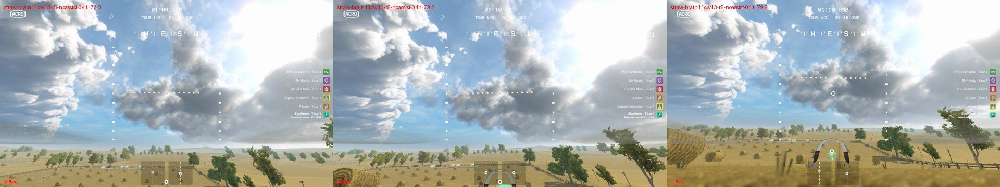
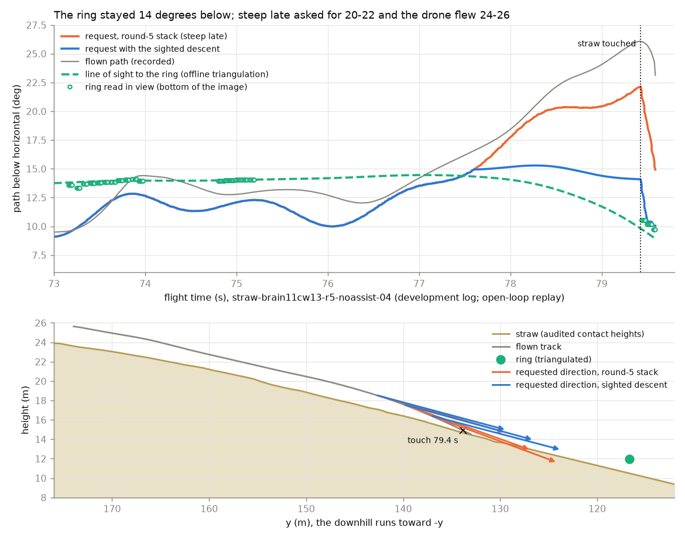

# Sighted descent (round 6): never descend steeper than the ring's line of sight

**Status: not flown.** Off by default (`--sighted-descent on|off|shadow`, needs `--descent-view`). Declaration
`configs/pilot/sighted_descent.json` **version 1** (`49b8d7a79f32...`), frozen with its gates
`configs/pilot/sighted_descent_gates.json` version 1 (`46deedeeea36...`) in commit `98c4609`, before any gate run.
With the rule off the pilot is bit-identical to `m5`. Everything below is offline: open-loop replays of logged flights,
the descent surrogate and Straw-like downhills rebuilt in the surrogate. None of it is flight evidence.

It answers the user's standing request (fewer ground touches; on downhills keep speed and the nose forward instead of
sinking into the hill) for the one Straw Bale touch every fast-brain-11 run that reached the downhill made.

**In short.** On the Straw Bale downhill the camera never sees the hill (its lower image edge runs nearly parallel
to it), so no image cue measures the ground clearance there; both brain-11 touches came from the view rule's steep
late, which asked for a path about 10 degrees steeper than the ring the pilot had just seen. The sighted descent keeps
the requested path on the ring's line of sight instead. **Frozen gates: 10 of 12 pass.**
- Straw-like downhills (held out): fast-brain-11 touches fell from 15 to 8 (36.9 -> 20.5 s) on 32 fresh variations
  and from 6 to 5 (14.0 -> 11.0 s) on 32 fresh randomisations of the logged Straw geometry; the fast PD 16 -> 11 and
  16 -> 12. High passes fell or stayed (fast PD 8 -> 5 and 7 -> 2), every drone finished in both variants, and the
  paired times changed by -0.06 to -2.36%.
- Development replays: the steepest requested path in the 1.5 s before the two live touches is 15.3 and 16.1 degrees,
  against 22.1 and 23.3 with the round-5 stack (the ring lay 14.4 and 15.1 degrees down).
- Identity: 93 of 93 replay pairs bit-identical to `m5` (rule off) and to shadow.
- **Fails:** held-out synthetic hills, fast PD: one more high pass (8 -> 9 on 24 courses; brain-11 9 -> 8); keep-speed
  in two counterfactual replays of fast-brain-08 laps (horizontal request up to 0.17 m/s lower for at most 0.25 s, via
  the descent-path governor, 17 and 32 ticks).
- On the synthetic hills contacts barely change (fast PD 17 -> 16, brain-11 16 -> 16): other mechanisms cause them
  (below).

## What happened on the Straw Bale downhill (development logs, checked on the video)

Both fast-brain-11-b-cw13 runs that reached the downhill (`straw-brain11cw13-r4b-noassist-02`, the 1:42.988 lap, and
`straw-brain11cw13-r5-noassist-04`) touched the straw at the same place, x -36.5, y 133-134 (audited contacts
79.354-80.044 s and 79.427-79.968 s, 5.2 m/s). Both logs and their videos are this rule's development data.



*The game view of r5-04 (development log) at 77.0 s (two seconds before the touch), 79.2 s and 79.6 s. The view shows
the far field from the lower image edge up; the ring marker sits clamped at the bottom centre. At 79.2 s the top of the
next arch (ImmersionRC) appears at the bottom edge. Only the knock of the touch (79.6 s) pitches the nose down far
enough to show the straw in front of the drone.*

- **The ring was never far below.** The next ring (the ImmersionRC arch at the bottom of the hill) is where the in-view
  marker rays of both laps meet: triangulated at (-36.34, 117.5, 12.13) from 122 rays of r4b-02 and (-36.34, 115.9,
  11.76) from 174 rays of r5-04 (median ray residuals 0.13 and 0.08 m; offline). Its line of sight stayed 13.6-14.4
  degrees below the drone in r5-04 and 13.6-15.1 degrees in r4b-02 from the hilltop until 78 s.
- **The pilot saw it.** The marker was read in view at the bottom of the image at 13.4-14.6 degrees (for example
  74.80-75.19 s of r5-04 at 14.0-14.1 degrees against 14.0 from the triangulation): within 0.5 degrees of the
  triangulated line of sight on the approach.
- **Then it stayed clipped for 4.2-4.8 s.** With the nose within 0-5 degrees of level the camera's lower image edge lies
  12-17 degrees down and the marker's clamp line about 2 degrees above that, so a ring 14 degrees down flickers between
  in view and clipped.
- **Steep late took the path 10 degrees below the ring.** The view rule (`docs/descent_view.md`) keeps the path 3 degrees
  inside the lower image edge, and after 0.75 s of unbroken bottom clip lets the margin fall at 6 deg/s down to 20
  degrees below the edge. The requested path went from 12-13 degrees to 20-22 degrees (r5-04; 20-24 in r4b-02) and the
  brain flew 24-27 degrees. The ring's line of sight at the same time fell to 10 degrees: the drone was diving below the
  line to the ring, into the straw.
- **No camera cue could have measured the straw.** The audited contact heights put the hill at 9 degrees below the crest
  and 14-15 degrees near y 130-145 (a convex hill). A lower image edge at 12-17 degrees meets such a slope, if at all,
  tens of metres ahead at grazing incidence: at 1.5-2 m above a 13-degree slope a ray 2 degrees steeper than the slope
  meets it 43-57 m ahead, where its optical flow at 5.5 m/s is about 0.005 rad/s (half a pixel per second in the
  pilot's 320-pixel camera model). The looming sampler reported no evidence on the whole downhill, and the video shows
  no straw below the horizon band until the knock. The relative depth of the lower image band, the flow of the straw
  texture and the ring's size were considered for this reason and not pursued: the image does not contain the hillside
  the drone descends toward.

What the image does contain is the ring's line of sight, and the line of sight bounds a safe descent: a drone that flies
along the line to a ring keeps that line fixed (pure pursuit) and arrives at the ring's height; a path steeper than the
line aims below the ring, at the ground in front of it.



*Development log, open-loop replay (the recorded drone does not respond to the requests). Top: the requested path of
the round-5 Straw stack (orange) and with the sighted descent (blue), the flown path (grey), the triangulated line of
sight to the ring (green, dashed) and the ring readings in view (green circles). Bottom: side view with the straw from
the audited contact heights, the flown track, the ring, and the requested directions at 77.8, 78.3 and 78.8 s drawn
from the recorded positions. The rule holds the request at 14-15 degrees, 1 degree below its line-of-sight estimate;
the round-5 stack asks for 20-22 degrees.*

## The rule (version 1)

`haltere/liftoff/fast_race_cue.py` (`SightedDescentConfig`, `FastRaceCue._sighted_ingest`, `_sighted_limit`):

1. **Sighting.** Two fresh in-view ring-centre rays (marker u, v; not the flag-clearance aim) with the marker at
   v >= 0.85 (near the bottom edge), captured at most 0.5 s apart and agreeing within 1.5 degrees, set the ring's line of
   sight to the later one's world depression (the pose at capture). A single or disagreeing reading sets nothing.
2. **Update.** While the measured flight path is shallower than the line of sight, the ring turns down in view as the
   drone passes above it; the estimate turns down at V sin(los - path)/20 m per second, as fast as for a ring 20 m away
   (faster than for any ring farther away). Every bottom-clipped marker raises it to the clamped marker's ray if that
   is lower: the ring lies below the clamp line.
3. **Limit.** While the ring is clipped at the bottom edge (pilot state `below`), the view rule's sink bound is lowered
   to the sink at which the flight path (measured horizontal speed, requested vertical speed) points 1 degree below the
   line of sight; never below the in-view bound at the current attitude, never above the view rule's own bound (steep
   late included). It only withholds sink that the pilot's own bottom-clip margin or steep late would request.
4. **Reset.** An in-view ring cue above v 0.85 (the ring well inside the view; the view rule alone), a side or top
   clamp, a bottom-clamped marker whose u moves by more than 0.1 (another ring), the pilot's own checkpoint switch,
   search and launch clear it.

It reads the ring cue, the measured attitude and velocity and the camera calibration. No height above ground, no terrain
memory, no course geometry, no per-course value. The view rule's keep-speed parts stay: no brake for a clipped ring,
the speed rise while sink is withheld (the rule withholds more, so the horizontal request stays at the speed schedule),
and the descent-path governor is not fed while sink is withheld.

**Flag, logs, sidecar.**

| Flag | Default | Effect |
|---|---|---|
| `--sighted-descent on\|off\|shadow` | off | Needs `--descent-view`. `on` loads `configs/pilot/sighted_descent.json` (frozen, hash-checked; other versions refused); `shadow` computes and logs it and changes nothing |

With `on` or `shadow` the CSV ends with `sighted_los` (the line-of-sight estimate, degrees; NaN while none is set),
`sighted_bound` (the sink it allows while the ring is clipped; NaN otherwise) and `sighted_withheld` (the sink it
withheld from the request this tick; in shadow, would withhold). The sidecar records
`pilot_assistance.sighted_descent` (rule, parameters, seconds set and limiting, metres withheld, counts) and
`pilot_assistance.sighted_descent_declaration`. With the flag off the CSV and sidecar are unchanged. The deployed pilot
(`haltere.train.deployed_pilot_kwargs(..., sighted_descent='on')`) and the replay harness (`--sighted-descent
DECLARATION [--sighted-mode shadow]`, tag `-sd1`) follow it.

## How it was developed (disclosed)

Everything here was looked at before the freeze and is development evidence
(`docs/experiments/sighted_descent_v1_development.json`; scripts: session scratchpad `m6/ground/`).

- **Logs:** the two brain-11 Straw laps above: telemetry, the recorded video frames of the downhill, the offline
  triangulation of the ring, and open-loop replays through the round-5 Straw stack (`--stack on --near-on-path
  --throttle-column command_thr --descent-view --stale-evidence`, the live plan's run (c)). No other log was replayed
  with the rule before the freeze.
- **Surrogate:** fresh development seeds hill 8100-8111 and steep 8200-8207 at sim seed 73 (the fast PD and
  fast-brain-11-b-cw13 under the round-5 Straw stack, `deployed_pilot_kwargs(contract, stale_evidence=True)`).
- **Straw-like downhills** (`haltere/liftoff/straw_downhill.py`): the logged hilltop and downhill rebuilt in the
  surrogate (ground from the drone's height during the 46 audited downhill contacts of every Straw log; the ring and
  the hilltop checkpoint from the logs), 16 randomised drones at sim seed 73, and seeded variations (slope x0.8-1.25,
  ring 50-70 m away and 1.2-2.2 m above the ground, +-3 m to the side, approach turned +-40 degrees) on seeds 1-24.
  The pilot sees only the synthetic HUD marker; the ground is scoring-only.

**Variants compared** (margin, growth range, where it acts):

| Evidence | Motor | round-5 stack | first draft: margin 1, no growth, steep late only | growth 10 m, every clip | **v1: growth 20 m, every clip** |
|---|---|---|---|---|---|
| Straw logged geometry, 16 drones: contacts / contact s / high passes | brain-11 | 5 / 19.40 / 2 | 3 / 14.15 / 4 | 3 / 13.77 / 2 | **3 / 13.77 / 2** |
| same | fast PD | 9 / 38.72 / 2 | - | 8 / 34.80 / 1 | **8 / 34.80 / 1** |
| Straw variations 1-24 | brain-11 | 14 / 47.76 / 4 | - | 12 / 43.25 / 4 | **10 / 30.92 / 4** |
| same | fast PD | 15 / 62.98 / 2 | - | 15 / 59.33 / 2 | **13 / 54.44 / 1** |
| Surrogate hill 8100-8111 + steep 8200-8207 | brain-11 | 10 / 18.32 / 8 | 10 / 18.49 / 8 | 10 / 18.45 / 8 | **10 / 18.26 / 8** |
| same | fast PD | 12 / 19.46 / 9 | 12 / 19.46 / 11 | 12 / 19.43 / 9 | **12 / 19.43 / 9** |
| Replay r5-04: steepest request in the 1.5 s before the touch (ring 14.4 deg) | brain-11 | 22.1 deg | 14.8 | 17.1 | **15.3** |
| Replay r4b-02: same (ring 15.1 deg) | brain-11 | 23.3 deg | 14.9 | 19.1 | **16.1** |

Also compared on the logged Straw geometry with the brain (steep late only, growth 10 m unless named): margin 0, 1 and
2 degrees and growth 5, 10 and 20 m all gave 3 contacts and 2 high passes. An assumed-range dead reckoning (the ring
30 m away along its sighted ray) raised the fast PD's high passes on the variations from 2 to 6 and was dropped.
Without growth the fast PD passed two more development checkpoints high (hill 8100-8111: 6 -> 8). Growth 20 m kept
every development high-pass count and removed the most contact time; larger ranges were not tried.

**What the surrogate shows about the other touches.** On the development hills the rule changes no contact count: those
contacts come from other mechanisms (each seen in the Straw scenarios too):
- the brain flies 2-4 degrees steeper than it is asked while the ring is in view, so a drone on the pursuit line drifts
  below it, and on the Straw geometry the line to the ring runs only 1.5-1.7 m above the straw;
- the straight line from the hilltop checkpoint to the ring runs 0.4-0.6 m above the convex Straw crest; a drone that
  dives toward the ring right after the hilltop turn (the fast PD, nose down after the turn) meets the crest;
- on the synthetic hills the chord between two checkpoints passes through the convex shoulder of their S-shaped hill.
The sighted descent does not act on any of these: the ring is in view, or the path is not steeper than its line of
sight.

## Gates (frozen) and scores

Frozen in `configs/pilot/sighted_descent_gates.json` version 1 (`46deedeeea36...`, commit `98c4609`) with the
declaration, before any gate run; `haltere.liftoff.sighted_descent_gates` runs and scores them. Scores:
`docs/experiments/sighted_descent_v1_scores.json` (scored on `afd6277`: the first scoring found an inverted sign in a
report-only field, `more_sink_ticks`; the fix changed no gate). Baseline: the round-5 Straw stack of the live plan (c)
with the rule off, in this tree (identical to `m5`, SD_Identity). Motors: the fast PD and fast-brain-11-b-cw13.
Nothing is flight evidence.

| Gate | Evidence | Threshold | Result | Pass |
|---|---|---|---|---|
| SD_Identity | deterministic replays of all 31 logs | bit-identical command arrays: `m5` archive = this tree for the default pilot and for the round-5 Straw stack; rule off = shadow | 93 of 93 | yes |
| SD_Replay_Causal | 31 logs (29 held out) | the first changed request of each log is a tick where the rule withheld sink | 11 logs changed, each first at a withheld tick; 20 unchanged | yes |
| SD_Replay_KeepSpeed | 31 logs | where the rule withholds sink, the horizontal request is not lower by more than 0.05 m/s | `straw-brain08-04`: 0.111 m/s (17 ticks); `straw-brain08-06`: 0.173 m/s (32 ticks); 0.050 at most elsewhere | **no** |
| SD_Straw_Development | development (the two brain-11 laps) | steepest request in the 1.5 s before each touch at least 3 deg shallower than the round-5 stack's and at most 3 deg steeper than the ring | r5-04: 15.29 deg against 22.10 (ring 14.4); r4b-02: 16.11 against 23.34 (ring 15.1) | yes |
| SD_Straw_Family, fast PD | held out: variations 1001-1032, sim seed 97 | contacts, high passes and crashes not more, finishes not fewer, paired time at most +1% | contacts 16 -> 11 (58.51 -> 42.97 s), high passes 8 -> 5, 32/32 finished both, time -0.36% | yes |
| SD_Straw_Family, fast-brain-11 | same | same, and contact seconds at most 0.85 of off | 15 -> 8 (36.86 -> 20.50 s, 0.56), high passes 4 -> 4, 32/32, time -0.31% | yes |
| SD_Straw_Logged, fast PD | held out: the logged geometry, 32 drones, sim seed 97 | as SD_Straw_Family | 16 -> 12 (63.67 -> 55.21 s), high passes 7 -> 2, 32/32, time -2.36% | yes |
| SD_Straw_Logged, fast-brain-11 | same | as SD_Straw_Family with the benefit | 6 -> 5 (13.99 -> 11.04 s, 0.79), high passes 5 -> 4, 32/32, time -0.06% | yes |
| SD_Surrogate_Hills, fast PD | held out: hill 8500-8515 + steep 8600-8607, sim seed 97 | contacts, high passes and crashes not more, finishes not fewer, paired time at most +1% | contacts 17 -> 16 (21.41 -> 20.52 s), **high passes 8 -> 9**, 24/24, time +0.46% | **no** |
| SD_Surrogate_Hills, fast-brain-11 | same | same | 16 -> 16 (29.85 -> 29.62 s), high passes 9 -> 8, 24/24, time +0.29% | yes |
| SD_Flat, fast PD | held out: flat 8700-8707 | same finishes and crashes, high passes not more, time within +-1% | 7/8 finished, 1 crash, high passes 1 -> 1, time 0.00% | yes |
| SD_Flat, fast-brain-11 | same | same | 8/8, high passes 1 -> 1, time +0.002% | yes |

**Post-scoring diagnosis (not tuning; nothing was changed after the scores).**
- **SD_Surrogate_Hills, fast PD.** Three courses changed a high pass: 8500 lost one (3.0 -> 1.3 m above the checkpoint,
  but finished 5.7 s later), 8515 gained one (0.6 -> 1.9 m) where the rule acted 2.9 s, and 8504 gained one (1.4 ->
  1.6 m) where it **never acted** (0.0 s limiting). The surrogate draws every drone's HUD dropout from one shared random
  stream, so a drone that finishes at another time changes the dropouts of every drone still flying: per-course
  differences arise on courses the rule never touched. The gate as frozen is a strict count, so it fails.
- **SD_Replay_KeepSpeed.** In the counterfactual replays of two fast-brain-08 laps (flown with the default pilot; the
  recorded drone climbs while both variants ask to sink) the descent-path governor cut the horizontal request to its
  floor (0.75) in both, and the rule's variant left the floor a few ticks later because the rule had changed the
  vertical command's history; the difference lasts at most 0.25 s (3 episodes in -06, 1 in -04). On the same logs the
  support rule fires at shifted ticks: within 1 s after a round-5 support climb that the rule's variant does not have
  at that tick, the rule's variant asks up to 0.33 m/s more sink (92, 137 and 287 ticks on `straw-brain08-02`, -04,
  -06); both variants have the same number of support climbs. Neither happens on a log flown with the view rule.

**What the rule changed in the held-out logs** (open loop; `SD_Replay_Report`):
- **Straw Bale, fast PD laps** (`straw-fast6-02`, -03, `-arc-01`; flown with the default pilot, so counterfactual):
  the rule withheld sink 1.3-3.4 s per minute, at most 0.67-0.79 m/s. No audited contact on these laps.
- **Straw Bale, fast-brain-08 laps** (`straw-brain08-01`, -02, -04, -06; default pilot, counterfactual): 0.2-1.2 s per
  minute. At the audited downhill slides after the crest the steepest request was 1-2 degrees shallower (for example
  `straw-brain08-04` 79.6 s: 10.1 -> 8.1 degrees; 181.5 s: 9.8 -> 7.9); at the slides near the crest (y 163-171) it
  changed nothing: the ring was in view there.
- **Minus Two:** at the first arch (x 19, 0.7 m high) it withheld sink for 0.03-0.15 s on three brain logs; the requests
  changed by less than 0.001 m/s. **Pine Valley** (`pine-fast6-ttc-01`): 0.15 s, no request changed.
- **Unchanged:** the other 20 logs, among them every fast-PD Minus log and `straw-brain11cw13-r5-noassist-01` (its
  crash at the FAT SHARK arch had no bottom clip).

## Default behaviour unchanged

- **Replays.** Every fast-stack log with ticks (31) was replayed through a git archive of `m5` (`bc7c71c`) and through
  this tree, each with its own harness: the default pilot (`--stack none`) and the round-5 Straw stack (`--stack on
  --near-on-path --throttle-column command_thr --descent-view --stale-evidence`) give bit-identical command arrays (62 of
  62), and the rule in shadow equals the rule off (31 of 31) (SD_Identity).
- **Unit tests.** The golden digests of the default pilot, the view rule and the round-5 view rule with contact support
  v3 equal the `m5` archive's, with the rule absent and in shadow.
- **Runner.** Without `--sighted-descent` (or with `off`) the rule is not built: the CSV columns, the sidecar keys and the
  pilot are exactly `m5`'s.

## Risks for live flight

- **It has not flown.** The replays are open loop: in flight the drone would be elsewhere after the first second the
  rule acts (higher on the hill, arriving at the arch at a different height).
- **The other touch mechanisms remain** (above): the brain's sink overshoot while the ring is in view, a dive after the
  hilltop turn, and pursuit lines that graze convex crests. The motor assist's sag compensation (motor assist v3,
  withdrawn for its approach source) addresses the first; nothing addresses the others.
- **Rings closer than 20 m approached from above.** The line of sight is assumed to turn down no faster than for a ring
  20 m away. A nearer ring clipped below turns down faster; the rule can then hold the path too shallow (a high pass, or
  a gate's top bar, as in r5-04's terminal crash at the ImmersionRC arch). The bottom clips raise the estimate only when
  the nose pitches down.
- **A wrong sighting.** A false marker reading near the bottom of the image that repeats (two readings within 1.5
  degrees) would set a wrong line of sight. A shallow one makes the pilot descend less (never more) than the view rule.
- **Straw lap time.** The rule withholds sink and keeps the horizontal request; on the Straw downhill it may arrive at
  the arch higher than the r4b lap did. Watch the arch.
- **Surrogate limits.** Synthetic hills and the Straw rebuild have no contact physics, no gate structures and a HUD
  clamp that differs from Liftoff's; the brains' behaviour there is itself a model.

## Live plan (for the main session; development flights)

**Superseded on `m6`:** fly the one-stack plan of the flight card's section "Round 6 (offline): the merged m6 stack"
(`docs/flight_cards/2026-09-26_obstacles_m2.md`), which adds `--sighted-descent on` to every run. The command below is
this branch's own proposal and is kept for the record.

No run of this round is flown by this branch. If the main session flies it (a disclosed development deviation: the
rule fails 2 of its 12 frozen gates, no brain is selected), the Straw Bale run of the round-5 amended plan (c) adds
one flag:

```powershell
.venv/Scripts/python.exe -m haltere.liftoff.visual_brain runs/fast-brain-11-b-cw13/candidate.pt --mapping runs/pine-route-collection-01/liftoff-original-drone.yaml --device cpu --vision-device cuda --pilot-assistance race-cue --pilot-profile fast --assist-speed 6 --motor-controller brain --dynamics-profile runs/measured-dynamics-low-speed-20260923/profile.json --looming-brake --obstacle-stack on --stale-evidence on --descent-view on --contact-support on --sighted-descent on --seconds 480 --max-height 250 --max-speed 14 --max-distance 2000 --udp-out 127.0.0.1:9003 --pause-on-stop --log runs/fast-stack-20260923/straw-brain11cw13-r6-sd-01.csv --record runs/fast-stack-20260923/straw-brain11cw13-r6-sd-01.mp4 --video-encoder h264_nvenc
```

(Without the motor assist, as in the round-5 amendment. Merge with the other round-6 branches first; this flag only
appends the three `sighted_*` columns.) The sidecar must record `sighted_descent_declaration` version 1 `49b8d7a7...`,
`applied: true`.

What to look for (replay figures are open loop, from the development laps):
- **Downhill after the hilltop (72-80 s in both laps):** `sighted_los` about 13.5-15 degrees from the crest; from about
  77.5 s `sighted_withheld` > 0 and the requested path held near 15-16 degrees where the round-5 stack asked 20-23; the
  horizontal request stays at 6 m/s. No touch at y 133-134 (x -36.5).
- **The ImmersionRC arch at the bottom (y about 120):** the drone should arrive near the ring's height (about 12 m)
  instead of bouncing off the straw; watch the top bar (r5-04's terminal crash) and the pass height.
- **Stop criteria (in addition to round 5's):** the drone overflies the arch or turns back for it (the rule holding the
  path too shallow), or a support climb starts on the downhill with the rule acting (`sighted_withheld` > 0 and
  `contact_fire` 1): a touch it did not prevent.
- **Graduation evidence:** none (no brain selected; the rule fails 2 gates).

## Tests

`tests/test_sighted_descent.py` (13 tests): the declaration and gates are frozen and the loaders refuse edits and other
versions; the default, view-rule and round-5 (view rule + contact support v3) pilots keep m5's golden digests, and
shadow equals them; the line of sight is set by two agreeing near-edge readings and not by one or by disagreeing ones,
raised by bottom clips, turned down while the path stays above it, and cleared by each reset condition; the limit caps
steep late at the line of sight, never goes below the in-view bound, never raises the sink or lowers the horizontal
request; shadow logs and changes nothing; the runner's flag, refusals and CSV tail; the deployed pilot and the replay
harness.
