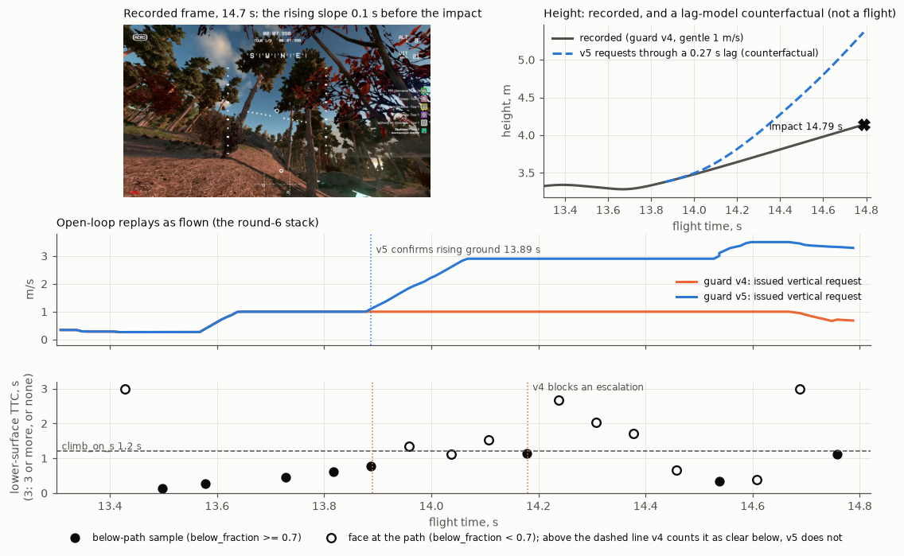
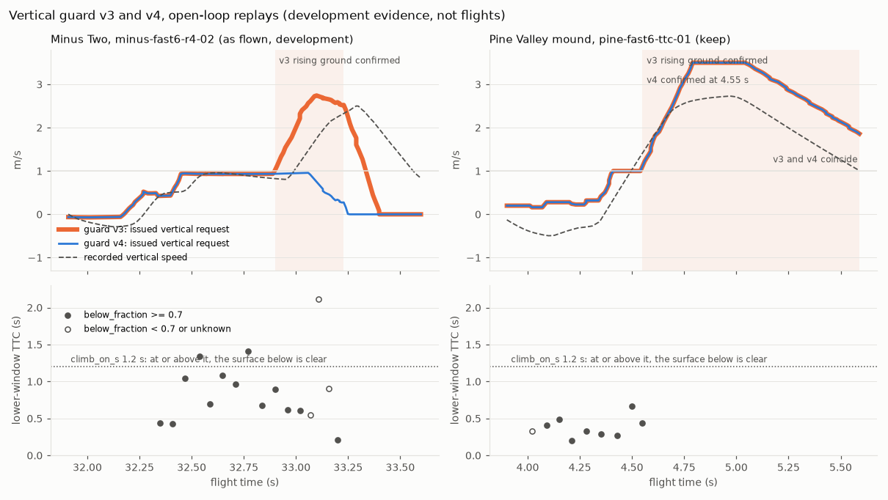
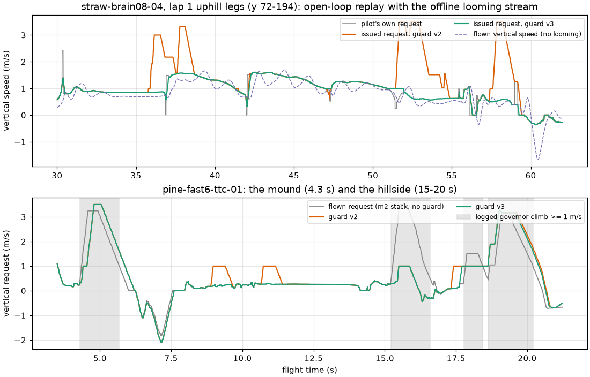
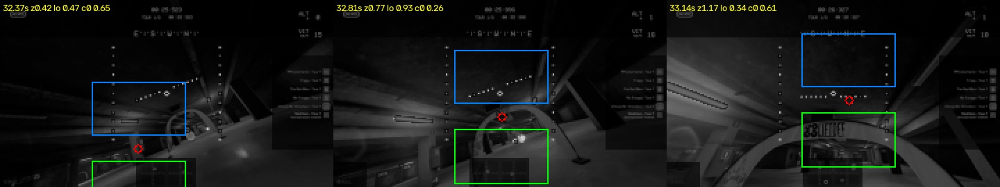

# Obstacle stack: vertical guard (rounds 3-7)

**Status: version 5 is not flown.** Only open-loop replays of logged flights, idealised
closed-loop checks and unit tests exist for it. Version 4 flew in rounds 4b-6 (branches `m4b`,
`m5`, `m6`) on Minus Two, Straw Bale and Pine Valley. In round 6 it answered the Pine Valley
hillside with its gentle 1 m/s climb, and the fast PD hit the slope (`pine-fast6-r6-01`).
Version 3 flew three Minus Two attempts in round 4 (`minus-fast6-r4-02`: rising ground falsely
confirmed, then a ceiling impact), and version 2 three in round 3.

The guard is part of the obstacle stack (`--obstacle-stack on|shadow`; `--vertical-guard off`
removes it), and `shadow` computes and logs it without applying it. Nothing changes without the
stack. The declaration is `configs/obstacles/vertical_guard.json` **version 5**. Versions 1-4
are kept and refused.

*`pine-fast6-r6-01`, the round-6 live failure (development evidence). Top left: the recorded
frame 0.1 s before the impact. Middle: open-loop replays as flown (the round-6 stack). Version 4
keeps the gentle 1 m/s; version 5 confirms rising ground at 13.89 s and asks 2.9 m/s from
14.11 s. Bottom: the looming samples' lower-surface TTC. Every below-path sample (filled) read
the ground under 1.2 s; the long readings that blocked version 4's escalations (dotted lines)
came from samples of the slope's face at the path (hollow). Top right: the height with version 5's
requests passed through a first-order lag of the fast PD (0.27 s) is a counterfactual, not a
flight.*

**Round 7 in short (version 5).** Version 5 changes which samples count as evidence for version 4's
condition, and adds no value. Only a below-path sample (`below_fraction` at least 0.7) can show
that the ground below the path is clear and block an escalation.

- **The failure it answers (development case).** On the Pine hillside version 4 blocked both
  escalations with samples of the slope's face at the flight path (`below_fraction` 0.05-0.64,
  lower TTC 1.3-5.7 s). Meanwhile every below-path reading stayed under 1.2 s. Replayed as flown,
  version 5 confirms rising ground at 13.89 s, 0.9 s before the impact, and asks 2.9 m/s from
  14.11 s.
- **Kept.** Identity with `m6` (146/146 pairs). Under the round-6 stack only three of 43 logs
  change at all: `pine-fast6-r6-01`, `pine-brain08-01` (the escalation version 4 lost, 16.96 s) and
  the held-out `pine-brain05-02` (0.2 s before its end). Every Minus Two and Straw Bale replay is
  bit-identical to `m6`: no escalation on 18 Minus logs (6 held out) or 13 Straw laps (4 held
  out), and `minus-fast6-r4-02` stays blocked.
- **Gates: 6 of 8 pass.**
  - V_Pine_hillsides fails on its own frozen threshold: the `pine-fast6-ttc-01` hillside escalates
    at 19.0501 s, the same tick as version 4, 0.0001 s after the window end of 19.05 s.
  - The idealised check fails its identity criterion. In 1 of 40 floor seeds (sigma 0.5) version 4
    had been blocked by *ceiling* samples, which it counted as clear below, and version 5 escalates.
  - On hills with face readings version 5's median clearance is higher in all six cases (+0.08 to
    +1.05 m; at least 0.1 m in five). A floor misread with face readings escalates in 62.5-95% of
    seeds, against 7.5-12.5% for version 4.

See [Round 7](#round-7-version-5) and [Limits](#limits-and-risks).

*Open-loop replays (development evidence, not flights). Left: `minus-fast6-r4-02` replayed as
it flew. Version 3 confirms rising ground at 32.90 s and asks for up to 2.7 m/s; version 4
stays at the gentle 1 m/s. Its readings of 1.34 and 1.41 s (above the dotted line) show that the
surface below did not keep looming. Right: the Pine Valley mound. Both versions escalate at
4.55 s, where no reading exceeds 0.67 s.*

**Round 4b in short (version 4).** Version 4 adds one condition to the rising-ground confirmation, with no
new value: no looming sample of the rising window (0.5 s) may have seen the surface below the
path farther than `climb_on_s` (1.2 s).

- **Fixed (development case).** The false escalation of `minus-fast6-r4-02` is gone in its
  replay as flown. The guard stays at 1 m/s, where version 3 asked 3.5 m/s under the ~2.2 m
  ceiling.
- **Kept.**
  - Identity with `m4` (61/61 pairs).
  - No escalation on Straw Bale (0 s on nine laps).
  - Minus Two at most 1 m/s on all 11 logs, the two held-out round-4 flights included.
  - The Pine mound: escalated at 4.55 s, 106% of the flown height request.
- **Cost.**
  - The Pine hillside at 17.6 s escalates 0.61 s later. V-Pine's climb fraction falls from
    77.7% to 74.3%; it fails as with version 3.
  - `pine-brain08-01` loses its one escalation, 1.0 s before that flight's impact.

Two findings change the picture of round 4:

- **The live surface was not only a floor.** It was the floor at the onset, then a race arch
  that the gentle climb lifted the path onto.
- **The floor skim at 26.5-29.5 s came from the looming brake, not the descent view.** A
  stand-off cap along an 11-deg upward ray turned the pilot's +0.2 m/s into a -0.35 m/s request.

See [Round 4b](#round-4b-version-4) and [Limits](#limits-and-risks).

*Round 4, version 3. Open-loop replays (development evidence, not flights). Top: the first
uphill legs of `straw-brain08-04`, which flew without looming and without contact there. Version 2
escalated three times, to 3.0-3.5 m/s, while the pilot itself climbed toward rings up the
hill; version 3 follows the pilot. Bottom: `pine-fast6-ttc-01`. Both versions climb the
mound at up to 3.5 m/s; on the hillside at 15.2 s both answer the flown 3.5 m/s climb with
only 1 m/s.*

**Round 4 in short.** Version 3 removes the escalated climbs on the Straw Bale uphills: 0 s
on nine laps, against 108 s for version 2. It keeps the Minus Two ceiling fix (at most
0.98 m/s) and the Pine mound climb (106% of the flown height request). It still fails two
gates:

- V-Straw downhill: looming cannot see the downhill contacts.
- V-Pine: the hillside at 15.2 s gets 1 m/s, and the end of the flight is a descent.

The idealised check still gives too little clearance when the drone sinks into a steep
ramp. See [Round 4](#round-4-version-3) and [Limits](#limits-and-risks).

It answers three findings of round 2 (see the
[M2 flight card](flight_cards/2026-09-26_obstacles_m2.md) and
[obstacle_gap_pilot.md](obstacle_gap_pilot.md#wall-pilot-rules-round-2)):

- **Minus Two.** The looming governor's fixed 3.5 m/s terrain climb drove three drones
  into the ~2.2 m garage ceiling: brain-08 (`minus-brain08-gapon-01/02`) and the fast PD
  (`minus-fast6-wall-01`). The PD was sinking at 0.3-0.37 m/s from 0.7 m with a
  below-path TTC of 0.24 s, and the climb held for about 0.8 s.
- **Straw Bale downhill.** In both fast-brain-08 finishes the drone followed the pilot's
  line to a ring below a convex hill and skimmed the straw (4 and 6 support climbs at
  x ~ -37, y 145-168). The user asked for fewer ground touches: on downhills, keep speed
  and height instead of sinking into the hill.
- **Pine Valley.** The mound climb (`pine-fast6-ttc-01`) must keep working.

## The rules (version 5)

Rules 1, 2 and 4 are version 2's. Version 3 changed two parts of rule 3 (marked **v3**).
Version 4 adds one condition to rule 3 (marked **v4**). Version 5 restricts the evidence of that
condition (marked **v5**) with one switch, `clear_below_terrain`. No version changed a value.

All in `haltere/liftoff/fast_race_cue.py` (`VerticalGuardConfig`, `TtcClearanceGovernor`,
`FastRaceCue`). The guard is **scale-free**:

- It reads only the looming samples the governor already receives: `below_fraction`,
  `ttc_lower` (the time to contact with the surface fitted below the flight path) and the
  alarm `ttc`.
- It also reads the measured vertical speed.
- It uses no height above ground and no metric distance. The only height is a
  telemetry difference, the episode bound, as in the TTC policy.

Descending means measured vz < -0.3 m/s, climbing means vz > +0.3 m/s, and level is in
between.

1. **Sink margin.** The pilot's own requested sink is scaled by
   `clip((crossing - 0.6) / (1.5 - 0.6), 0, 1)`. That is all of the sink at a crossing TTC
   of 1.5 s or more, and none at 0.6 s or less.
   - The crossing TTC is `max(alarm ttc, ttc_lower)` of the latest sample that has a
     `ttc_lower`, aged by the time since its capture and kept for 1 s. Both TTCs must be
     short: the path itself must head into the surface below it.
   - Over flat ground both TTCs of a descending path equal height / sink rate, so the
     allowed sink shrinks as the ground approaches.
   - The factor falls at up to 4 /s and recovers at up to 1 /s. The command keeps the
     pilot's 5 m/s² slew, so there is no jump. A requested climb is never scaled.
2. **Descent first.** A below-path alarm (`below_fraction >= 0.7`, crossing TTC < 1.2 s)
   received while descending holds the vertical request at least level
   (`max(pilot, 0)`) for 0.5 s, brought there at up to 10 m/s².
   - No alarm received while descending starts a climb.
   - While the drone descends, no terrain climb is applied at all.
3. **Terrain climb only for rising ground.**
   - A climb needs two below-path alarms (`below_fraction >= 0.7`, `ttc_lower < 1.2 s`)
     received while level or climbing within 0.3 s.
   - **v3:** a climb that is not already running starts only if at least one of them is a
     *path alarm*: its crossing TTC `max(alarm ttc, ttc_lower)` is also under 1.2 s, so the
     flight path itself heads into the surface below it (the crossing TTC of rules 1 and
     2). A short `ttc_lower` with a long alarm (the lower window sees the slope below a
     crest, or below the pilot's line up a hill, while the focus of expansion sees over it)
     starts no climb. It only sustains a running one. The sidecar counts such alarm pairs
     as `no_path_onsets`.
   - Its rate is graded by urgency on `ttc_lower`: 0 at 1.2 s, the full 3.5 m/s at
     0.6 s.
   - It is bounded to **1 m/s and 1 m** above where the episode began until rising ground
     is confirmed. Confirmation needs two alarms within 0.5 s, received while the drone
     already climbs faster than 0.5 m/s *and* the guard's own climb binds.
   - **v3:** the guard's climb binds when it exceeds *every* vertical request the pilot
     made itself in the last 0.5 s by at least 0.5 m/s (`rising_window_s`,
     `rising_min_rise`). The drone then climbs at least 0.5 m/s faster because of the
     guard, and the ground keeps looming. A pilot that follows a ring up a hill climbs by
     its own request, and a one-tick dip of that request at a checkpoint switch does not
     make the guard's climb the reason. Version 2 compared the guard's climb only with the
     pilot's request of the same tick.
   - **v4:** the ground must keep looming throughout the rising window. No looming sample
     received in the 0.5 s before the confirming alarm may have seen the surface below the
     path farther than `climb_on_s` (1.2 s). That is a lower-surface TTC, aged by odometry,
     of 1.2 s or more, or no lower-surface TTC although `below_fraction` is known (the
     lower window saw no crossing). A sample without vertical-window evidence says nothing.
     A floor misread below the path, or a structure the climb is already clearing, gives
     such readings while the gentle climb runs; rising ground that the gentle climb does
     not clear keeps every reading under 1.2 s. See [Round 4b](#round-4b-version-4).
   - **v5:** only a below-path sample can show the surface below clear: `below_fraction` at
     least the TTC policy's `terrain_fraction` (0.7, the governor's own terrain test), with a
     lower-surface TTC of 1.2 s or more, or none. A sample whose expansion lies at or above the
     path (a wall to the governor, such as the face of a slope that the flight path heads into,
     which reads about 0.5), or without vertical-window evidence, says nothing about the surface
     below. See [Round 7](#round-7-version-5).
   - After confirmation the graded rate applies, up to 3.5 m/s and the policy's 2.5 m
     bound.
   - The hold (0.5 s) and release (3 m/s²) are the TTC policy's. The ceiling guard
     (wall-pilot v3) still cuts climbs under overhead evidence.
4. **Keep speed.** The descent-path governor's shortfall is not fed in any of these
   cases:
   - the guard withholds part of the pilot's sink;
   - it arrests a descent;
   - it withholds a climb because the drone descends;
   - the pilot's support timers run (contact: the requested sink is not achieved while
     resting on the terrain).

   So the horizontal request is not cut for a sink that was withheld or that the terrain
   prevents. The guard itself never changes the horizontal request.

No other rule of the fast pilot climbs faster than about 1 m/s without the pilot's own
target: the support climb (1 m/s), the search climb (0.5 m/s) and the ceiling guard's weak
climbs (1 m/s). The launch and a ring clamped at the top edge are the pilot's own.

## Flag, logs and sidecar

| Flag | Default | Effect |
|---|---|---|
| `--vertical-guard on\|off` | on inside the stack | Component override. `on` is refused without `--obstacle-stack`. In `shadow` the flown governor is unguarded and a guarded copy fed the same samples logs the request the guard would make. |

CSV columns appended at the end of each row. They are NaN without the guard or before the
first looming sample:

- `vertical_pilot`: the pilot's own vertical request;
- `vertical_target`: the guard's request, applied or, in shadow, intended;
- `vertical_factor`: the sink factor;
- `vertical_arrest`: 1 while descent first holds the request level;
- `vertical_stage`: 0 no climb, 1 gentle, 2 rising ground confirmed;
- `vertical_climb`: the guard's climb request.

The sidecar records these under `pilot_assistance`:

- `vertical_guard_declaration`: path, content and file sha256, version and `applied`;
- `vertical_guard`: the rule, parameters and counts, and the seconds spent limiting,
  arresting and climbing. Its `version` is 5 with `clear_below_terrain` true among the parameters
  (4 for the same code with the switch off). `counts.clear_below_samples` and
  `clear_below_blocks` count only below-path samples under version 5.

`obstacle_stack.components.vertical_guard` says whether the guard was part of the stack.

## Declarations

| File | Version | sha256 (content) | Frozen |
|---|---|---|---|
| `configs/obstacles/vertical_guard.json` | 5 | `43a9ddb221c1...` | after the round-6 live flights of v4; before any replay of v5 except its development cases (`pine-fast6-r6-01`, the gates-v4 flights) (commit `2d55a6d`) |
| `configs/obstacles/vertical_guard_v4.json` | 4 | `409d06f9ded7...` | after the round-4 live flights of v3; before any replay of v4 except its development cases (r4-02, the Pine mound, the idealised check) (commit `70e0918`); kept verbatim, refused |
| `configs/obstacles/vertical_guard_v3.json` | 3 | `b70e263ccdc5...` | after the replays of v2 (21 logs) and its round-3 flights, before any replay of v3 (commit `79895b7`); kept verbatim, refused |
| `configs/obstacles/vertical_guard_v2.json` | 2 | `e06b690d0d4f...` | after the replay of v1, before any replay of v2 (commit `61f10f4`); kept verbatim, refused |
| `configs/obstacles/vertical_guard_v1.json` | 1 | `703f60e33aa0...` | before any replay of the guard (commit `1861e8e`); kept verbatim, refused |
| `configs/obstacles/vertical_guard_gates.json` | 5 | `cbe2f0ca21b0...` | with guard v5, before any replay of a held-out log and before the idealised checks' fresh seeds (commit `2d55a6d`) |
| `configs/obstacles/vertical_guard_gates_v4.json` | 4 | `7901b154abbe...` | with guard v4, before any replay of v4 except its development cases (commit `70e0918`); kept verbatim |
| `configs/obstacles/vertical_guard_gates_v3.json` | 3 | `689635881467...` | with guard v3, before its replay (commit `79895b7`); kept verbatim |
| `configs/obstacles/vertical_guard_gates_v2.json` | 2 | `53926ceada10...` | v1's definitions, scoring guard v2, before its replay; kept verbatim |
| `configs/obstacles/vertical_guard_gates_v1.json` | 1 | `977740fbc0f5...` | with guard v1, before any replay |

**Where the values come from.**

- Task values: the margin (1.5 s -> 0.6 s) and about 1 m/s without rising-ground evidence.
- Declared values reused from the existing rules:
  - 0.3 m/s is the ceiling guard's `overhead_min_rise`;
  - 1.2 s is the TTC policy's `climb_on_s`;
  - 10 m/s² is the policy's terrain climb acceleration;
  - 1 m is the ceiling guard's `weak_climb_max_m`;
  - the hold, release and 2.5 m bound are the policy's own.
- They were set after inspecting the incidents' logs and looming samples.

**Version 2 keeps every value and changes three rules** after the v1 replay:

- the crossing TTC for rules 1 and 2;
- the binding test for rising ground;
- keep speed on contact.

Every replayed flight is therefore development evidence for version 2, not held-out
evidence.

**Version 3 keeps every value and changes two parts of rule 3** after the replays of
version 2 (see [Round 4](#round-4-version-3)). Both changes reuse declared values
(`climb_on_s`, `rising_window_s`, `rising_min_rise`). Every replayed flight is development
evidence for version 3.

**Version 4 keeps every value and adds one condition to rule 3**, after the round-4 live
flight `minus-fast6-r4-02` (see [Round 4b](#round-4b-version-4)). It reuses `climb_on_s` and
`rising_window_s`. Development evidence for version 4: `minus-fast6-r4-02` (inspected, re-run
through looming2 on its recorded frames, replayed through v4 while it was designed), the Pine
Valley mound of `pine-fast6-ttc-01` and the idealised checks. Held out from its design:
`minus-brain10b-r4-02` and `minus-brain09b-r4-01` (their guard columns were not inspected before
the freeze) and every other log's v4 replay.

**Version 5 keeps every value and adds one switch** (`clear_below_terrain: true`), after the
round-6 live flight `pine-fast6-r6-01` (see [Round 7](#round-7-version-5)). It reuses the TTC
policy's `terrain_fraction` (0.7). Development evidence for version 5: `pine-fast6-r6-01`
(inspected, video checked, replayed through v5 while it was designed), every flight of gates v4
(read while versions 1-4 were designed; `minus-fast6-r4-02`, the Pine logs and the Minus and
Straw logs were also replayed through the v5 candidate before the freeze) and the idealised
checks' seeds 0-1 (a smoke test of the script with guard v4 only). Held out from its design: the Minus Two and Straw Bale flights of
rounds 4b-6, eight Pine Valley flights never replayed through a guard and seeds 1000-1039 of the
idealised checks.

## Round 7: version 5

### The live failure (`pine-fast6-r6-01`, development case)

Branch `m6` flew guard v4 on Pine Valley in round 6 with the fast PD (the round-6 stack). The drone passed the mound and hit
the hillside at (59.1, -16.3, 4.1), 5.9 m/s, 14.79 s. The log, the video and the replay as flown (it reproduces the
logged requests: horizontal p99 0.0 m/s, vertical p99 0.013 m/s) show this sequence. Heights are launch-relative.

The figure at the top shows the recorded frame 267 (14.7 s, 0.1 s before the impact): the rising slope fills the lower
half of the image. Frame 268 shows the nose-up tumble and the damage icons.

1. **Onset (13.50-13.65 s).** Two path alarms (alarm 0.805 s, lower TTC 0.135 and 0.264 s, `below_fraction` 1.0)
   arrived while the drone was level (-0.26 m/s) at 3.3 m. The gentle climb started at 13.65 s.
2. **Gentle climb (13.73-14.76 s).** The guard's 1 m/s lifted the drone at 0.66-0.85 m/s, with the pilot asking
   0.29-0.34 m/s toward its ring.
   - Every below-path sample (`below_fraction` >= 0.7) read the lower surface at 0.34-1.15 s: the ground kept
     looming, as version 4's premise requires for an escalation.
   - The alarm fell from 1.35 s to 0.67 s between 14.11 and 14.61 s: the flight path headed into the slope.
   - Between them came samples whose expansion lay at or above the path: `below_fraction` 0.51-0.64 with lower
     TTCs of 1.13-2.66 s at 13.96-14.38 s, and 0.0 with no lower TTC at 14.69 s. That is the slope's face at the path,
     which the governor itself treats as a wall.
3. **Blocked escalations.** Rising ground was confirmed twice by version 3's conditions, and version 4 blocked both:
   - at 13.89 s (below-path alarms of 13.82 and 13.89 s: lower 0.62 and 0.77 s, climbing 0.66-0.73 m/s, the guard's
     climb 0.67 m/s above the pilot's) by the sample of 13.43 s (`below_fraction` 0.05, lower 5.7 s, alarm 2.7 s);
   - at 14.18 s by the samples of 13.96 and 14.11 s (`below_fraction` 0.60 and 0.64, lower 1.34 and 1.52 s).
4. **Impact.** No confirming pair of alarms followed 14.18 s, so the gentle climb's hold ran out from 14.68 s, and the
   governor braked at the face (alarm 0.67-0.68 s). The drone climbed 0.85 m/s into the slope. The round-3 governor's
   3.5 m/s climb had carried `pine-fast6-ttc-01` over the same slope at 5.43 m (x = 59.2).

**So version 4's block came from the wrong samples.** Its clear-below evidence counted any sample with a long or
missing lower TTC. On `minus-fast6-r4-02` those were below-path samples of the garage floor (`below_fraction` 1.0,
lower 1.34 and 1.41 s). On the Pine hillside they were samples of the face ahead, whose lower-window plane fit is not
the ground under the path.

### The rule (version 5) and what was dropped

Version 4's condition stands, but **only a below-path sample can show the surface below the path clear**: a sample whose
expansion lies below the path (`below_fraction` at least the TTC policy's `terrain_fraction`, 0.7, the governor's own
terrain test) and whose lower surface does not loom within `climb_on_s` (a lower TTC, aged by odometry, of 1.2 s or
more, or none). A sample with its expansion at or above the path, or without vertical-window evidence, says nothing
about the surface below.

- One switch is added (`clear_below_terrain: true`); every value of version 4 is kept. `false` is version 4's rules
  (the replays and the idealised checks rebuild version 4 with it).
- It can only lift a block of version 4, and only one made by samples that are not below-path samples (version 3 had
  no clear-below condition at all).
- Replayed as flown, `pine-fast6-r6-01` escalates at 13.89 s, and the issued request reaches 2.9 m/s at 14.11 s.
- `minus-fast6-r4-02` stays blocked at all four of version 3's attempts (32.90-33.20 s) by its below-path floor
  readings. The margin at the last attempt (33.20 s) is 0.07 s; that part of the replay follows the recorded
  escalated climb of version 3.

**Tried on the development cases and dropped before the freeze** (the declaration's `vertical_guard_notes.not_used`):

- **A TTC trend (the predicted contact moment, capture time + TTC, must not move later while the guard climbs).** On
  r6-01 the alarm's contact moment moved later, from 14.93 to 15.55 s, between 13.82 and 14.38 s as the gentle climb
  took effect. The below-path samples' moment moved from 14.17 to 15.33 s. Both happened before the drone hit the
  slope at 14.79 s, so the test would have blocked the escalation the hillside needed.
- **Persistence over a longer window (escalate once path alarms continue for twice `rising_window_s`).** On r6-01 the
  third path alarm of the climb came at 14.54 s, 0.25 s before the impact. A floor misread that keeps the gentle climb
  running under a garage ceiling would escalate.
- **Clear-below samples counted only while the guard's climb runs.** It passes r6-01 at 13.89 s only because both
  confirming alarms came before the face readings, and it blocks the later attempts.
- **Samples with the expansion at the path and a short alarm as rising-ground alarms.** A garage wall ahead of a gentle
  climb reads the same.

### Gates version 5 and scores

`configs/obstacles/vertical_guard_gates.json` version 5 (`cbe2f0ca21b0...`) was frozen with guard v5 in `2d55a6d`,
before any replay of a held-out log. One harness fix followed before any score (`36ccae6`): `pine-fast6-loom-01`, a log of
the first looming version without vertical-window columns, crashed the default-pilot replay.

- **Baseline:** branch `m6` (`c88bf73`, guard v4), the stack that flew in round 6.
- **Replays:**
  - `git archive` exports of `m6` and of the freeze commit, each replayed by its own harness, one process at a time;
  - the default-pilot replays of the six Pine logs from `pine-fast6-loom-01` on used the fixed harness against each
    tree.
- **Variants:**
  - `plan`: the round-6 live plan's stack (`--stack on --near-on-path --throttle-column command_thr --descent-view
    --contact-support shadow --stale-evidence --early-brake --sighted-descent --motor-assist --marker-jump shadow`);
  - `on`: gates v4's guard variant;
  - `r4`: the round-4 live flights as flown.

  Flights flown without logged below-path evidence use offline looming2 streams.
- **Development:** every flight of gates v4, and `pine-fast6-r6-01`.
- **Held out:**
  - the Minus Two flights of rounds 4b-6 (6);
  - the Straw Bale laps of rounds 4b-6 (4);
  - eight Pine Valley flights never replayed through a guard (seven with streams recomputed in round 7, one with logged
    samples);
  - seeds 1000-1039 of the idealised checks.
- **Scores:** `docs/experiments/vertical_guard_v5_scores.json`. The idealised outputs per seed are in
  `docs/experiments/vertical_guard_v5_ideal.json`.

| Gate (v5) | Threshold | **v5** | v4 (`m6`, same replays) |
|---|---|---|---|
| **Identity**: the default pilot, the round-6 stack in shadow and the stack without the guard, bitwise identical to `m6`, 43 logs | all | **pass** 146/146 pairs | - |
| **V_Pine_R6** (development): `pine-fast6-r6-01` as flown, escalated by 14.29 s (impact - 0.5 s), issued >= 2.5 m/s by then | both | **pass**: escalated 13.89 s, issued 2.90 m/s | no escalation; the gentle 1 m/s (the 1.5 m/s by then is the launch) |
| V_Pine_hillsides (development): `pine-brain08-01` escalated in 15.0-17.46 s; `pine-fast6-ttc-01` hillside escalated in 17.6-19.05 s; the mound escalated by 4.65 s with its height request >= 90% | all | **fails**: `pine-brain08-01` **16.96 s**; the ttc-01 hillside at 19.0501 s, the same tick as v4 but 0.0001 s after the window end (the frozen 19.05 s was v4's time rounded); mound **4.55 s, 106.1%** | `pine-brain08-01` none; ttc-01 19.0501 s (fails the same way); mound 4.55 s, 106.1% |
| **V_R4** (development): `minus-fast6-r4-02` as flown and under the round-6 stack: guard climb <= 1 m/s, no escalated tick, issued <= 1 m/s at 32.4-33.4 s | all | **pass** on both: climb max 1.0, no escalation, window max 0.958 m/s | same |
| **V_Minus**: the windows of wall-01 / gapon-01 / gapon-02 (variant `on`) <= 1 m/s, wall-01 levelled before 0.3 m is lost; no escalation on 12 development and 6 held-out logs | all | **pass**: 0.97 / 0.119 / 0.976 m/s; 0.022 m; guard climb at most 1.0 on every log and variant, the held-out 6 included | same (every Minus replay is bit-identical) |
| **V_Straw_uphill**: escalated seconds on 9 development laps (`plan` and `on`) and 4 held-out laps (`plan`) | 0 | **pass**: 0.0 s in 31.92 min (each development set); 0.0 s in 5.01 min (held out) | 0.0 |
| **V_Pine_heldout**: the first escalation no later than v4's, 8 held-out Pine logs | all | **pass** 8/8 | - |
| Idealised (held out, seeds 1000-1039): identical to v4 on ramps and the floor; on hills with face readings non-inferior, 4 of 6 improved by 0.1 m | all | **fails** identity: floor sigma 0.5 differs in 1 of 40 seeds (1027: v5 escalates to 2.56 m, v4 stays at 1.84 m); ramps and floor sigma 0.25 identical. Hills **pass**: non-inferior 6/6, improved 5/6 | - |
| **Result** | | 6 of 8 pass: Identity, V_Pine_R6, V_R4, V_Minus, V_Straw_uphill and V_Pine_heldout. V_Pine_hillsides fails on the rounding of its window; Idealised fails on one floor seed | |

Reports (not gates):

- **What changes under the round-6 stack.** Only three of the 43 logs change at all:
  - `pine-fast6-r6-01` from 13.888 s (0.90 s);
  - `pine-brain08-01` from 16.957 s (1.0 s);
  - `pine-brain05-02` from 21.32 s (0.2 s).

  Every other log is bit-identical to `m6`, including all 18 Minus Two logs and all 13 Straw Bale laps.
- **The V_Minus windows under the round-6 stack** read 0.97 / 0.608 / 1.531 m/s, the same as `m6`. In gapon-02's window
  the motor assist's sag compensation adds 0.645 m/s on top of the guard's gentle 1 m/s; in gapon-01's, it gives 0.608
  m/s with no guard climb. Both come from the assist, not the guard. They are open-loop upper bounds: the recorded drone
  does not respond.
- **V_Straw_downhill** (v4's definitions): limited 20%, 0 raised, 0 reduced. This is v4's result, and it fails as before.
- **Gates v4's V_Pine climb and no-descent criteria:** 74.3% (v4 74.3%) and -0.69 m/s. Both fail as before. The
  hillside at 15.2 s gets the gentle climb only, because the flown 3.5 m/s climb removes its evidence in open loop.
  `pine-fast6-r6-01` is that hillside's closed-loop record (V_Pine_R6).

### What the version-5 replays show

- **`pine-fast6-r6-01` (development).** Version 5 confirms rising ground at 13.89 s at (54.8, -19.5), 3.39 m, on the
  two below-path alarms of 13.82 and 13.89 s.
  - The issued request reaches 2.9 m/s at 14.11 s and 3.5 m/s at 14.60 s, against version 4's gentle 1 m/s.
  - Lag-model counterfactual (report only, not flight evidence): the fast PD's vertical response was fitted as a
    first-order lag on its logged climbs, tau 0.14-0.27 s (rms 0.105 m/s on r6-01's own climb, 0.45-0.48 m/s on
    `pine-fast6-ttc-01`'s). Driven by version 5's requests from 13.85 s along the recorded track, the drone is at
    5.36-5.65 m at the impact point (x 59.1), where it hit at 4.14 m. The round-3 flight passed there at 5.43 m.
  - The later samples would differ in closed loop, and the governor's brake at the face remains.
- **`pine-brain08-01` (development, offline stream):** the escalation that version 4 lost comes back, at 16.96 s at
  (63.7, -12.8), 1.0 s before that flight's impact.
- **The held-out Pine logs** (flown without the guard). Their escalations are version 4's own:
  - `pine-brain03-01` at 15.17 s, `-04-01` at 16.18 s (0.15 s before its end), `-06-01` at 15.31 s and `-07-01` at
    18.71 s, all on the hillside (x 57-65);
  - one new escalation on `pine-brain05-02`, at 21.32 s, 0.2 s before its impact;
  - no escalation on the fast PD's `pine-fast6-01` and `pine-fast6-loom-01`, nor on `pine-brain06-ttc-01`.

  In these logs the rising condition (the drone climbing faster than 0.5 m/s while the pilot asks at most 0.5 m/s) came
  only from the recorded drones' own climbs, and on four of them version 4 escalated as well. So this held-out set shows
  that version 5 does not escalate later than version 4. It does not show that a hillside is answered.
- **Minus Two and Straw Bale:** no change on any log, as the development replays of the candidate had shown.

### Idealised checks (held out: seeds 1000-1039, never used before)

The committed model (`haltere/obstacles/vertical_ideal.py`) is round 4b's point drone with log-normal TTC noise.
Each case has 40 seeds; both guards ran in the freeze tree.

| Hill case (face readings with probability 0.5) | v4: escalated, median / worst clearance | **v5** |
|---|---|---|
| slope 0.20, level from 1.5 m | 17.5%, 0.18 / -0.11 m | **75%, 0.26 / -0.11 m** |
| slope 0.20, from 1.0 m sinking | 77.5%, -0.10 / -0.78 m | **100%, 0.08 / -0.71 m** |
| slope 0.35, level | 80%, -0.47 / -1.31 m | **97.5%, 0.59 / -1.30 m** |
| slope 0.35, sinking | 90%, -0.48 / -2.40 m | **100%, 0.27 / -0.99 m** |
| slope 0.50, level | 85%, -0.78 / -3.32 m | **97.5%, 0.19 / -3.32 m** |
| slope 0.50, sinking | 100%, -1.05 / -3.05 m | **100%, -0.46 / -2.34 m** |

- **Ramps without face readings:** identical per seed (for example slope 0.35 level: 97.5%, 0.35 / -1.30 m).
- **Floor misread, the r4-02 shape under a 2.2 m ceiling:**
  - sigma 0.25: identical (100% escalated, height median 2.17 m, worst 2.51 m);
  - sigma 0.5: v4 82.5%, 2.05 / 2.59 m; v5 85%, 2.07 / 2.59 m.

  The one differing seed (1027) is a post-scoring finding. There version 4's block came from *ceiling* samples:
  `below_fraction` 0.1, the ceiling's crossing ahead of the climbing path, carrying the floor's long lower reading.
  Version 4 counted them as clear below; version 5 does not, and escalates as version 3 would.
- **Floor misread with face readings (the cost, a report):**
  - sigma 0.25: v4 escalates in 7.5% of seeds (height median 1.55 m, worst 2.38 m); v5 in 95% (2.07 / 2.51 m);
  - sigma 0.5: v4 12.5% (1.61 / 2.12 m); v5 62.5% (1.80 / 2.51 m).

  A structure at path height gave version 4 extra blocks in the garage model. Version 5 gives them up, and the ceiling
  guard is then the only backstop (in the model it lets the climb overshoot the 2.2 m ceiling).

**A candidate for the next version** (reasoning only; not frozen, not replayed). An overhead sample could block an
escalation explicitly: expansion above the path (`below_fraction` at most the ceiling guard's 0.3) with an alarm under
`climb_on_s`. That is ceiling evidence, not clear-below evidence. It should restore seed 1027's block (its blocking
samples had alarms of 0.32-1.0 s, one of 1.3 s). On r6-01 it would
not move the escalation at 13.89 s, because the sample that blocked version 4 there (13.43 s) had an alarm of 2.7 s. It
needs its own freeze and fresh held-out checks. The idealised seeds 1000-1039 and the logs above are now development
evidence for it.

## Round 4b: version 4

### The live failure (`minus-fast6-r4-02`, development case)

Branch `m4` flew guard v3 on Minus Two in round 4. The fast PD passed pillar A, the hairpin and
pillar C, then struck the ~2.2 m garage ceiling at (73.5, 69.4, 2.13), 34.1 s. The log, the
video and looming2 re-run on the recorded frames show this sequence. The re-run used 18 fps
frames with the `prep.pass1/pass2` alignment (epipolar residual 2.5 px). Heights are
launch-relative, and the launch is on the floor.

*Recorded frames of `minus-fast6-r4-02`, with looming2 re-run offline (not the camera's own
samples). Red: focus of expansion. Green: lower window. Blue: upper window. A race arch stands
on the floor ahead, with the checkpoint marker through it.*

1. **Onset (32.35-32.41 s).** Two path alarms started the gentle climb (alarm 1.14 s, lower TTC
   0.43-0.44 s, `below_fraction` 1.0). The drone was 0.40-0.44 m above the floor and already
   climbing 0.43-0.51 m/s, because the pilot asked +0.47 m/s toward its ring.
   - The lower window lay on the floor, and a flat floor below a climbing path does not cross
     it.
   - The roll was swinging from -25 to +28 deg within 0.7 s. The offline re-run needed a visual
     rotation correction of 5.5 deg on that frame, against 0.2-3 deg over the next 0.7 s.
2. **Gentle climb (32.47-32.95 s).** The guard's 1 m/s climb lifted the drone at 0.8-0.95 m/s
   toward the arch's top.
   - The lower window read the floor and the arch 0.60-1.41 s ahead (`below_fraction`
     0.77-1.0). Two readings were at or above `climb_on_s`: 1.34 s at 32.54 s and 1.41 s at
     32.77 s.
   - The alarm read 1.40-1.69 s through the arch.
   - The pilot's own request fell from +0.43 to -0.25 m/s: its ring was now below the path.
3. **Escalation.** Version 3 confirmed rising ground at 32.96 s in the log (32.90 s in the
   replay) and climbed at 3.5 m/s.
   - The guard's climb bound (0.52 m/s over the pilot's requests) once the pilot's 0.53 m/s had
     left the rising window.
   - Two alarms while climbing (lower 0.68 and 0.90 s) confirmed rising ground at 0.84 m.
4. **Ceiling (33.0-34.1 s).**
   - The upper window then read the ceiling: `below_fraction` 0.84, 0.77, 0.46, 0.32 and 0.28 at
     32.96-33.16 s, with the alarm at 0.83-1.25 s.
   - The ceiling guard cut the climb at 33.26 s, at 1.42 m and 2.4 m/s of climb.
   - The request reached 0 at 33.41 s with 1.8-2.0 m/s still measured. Impact came at 34.1 s.

**So the floor explains only the onset.** At the onset the lower window did read the flat floor
close below. By the escalation, the looming surface was the arch: a real structure on the path,
which the guard's own gentle climb had lifted the path onto. The ceiling made the escalation
fatal.

### The rule (version 4) and what was dropped

Rule 3's confirmation of rising ground needs one more condition: **no looming sample received
in the last `rising_window_s` (0.5 s) may have seen the surface below the path farther than
`climb_on_s` (1.2 s).** Such a sample has either:

- a lower-surface TTC of 1.2 s or more, aged by odometry; or
- no lower-surface TTC although `below_fraction` is known, meaning the lower window had evidence
  and saw no crossing.

A sample without vertical-window evidence says nothing either way. The condition is version 3's
own premise ("the ground keeps looming although the drone climbs") made strict. It uses version
3's values and adds none. It can only withhold a confirmation that version 3 would make at the
same evidence. A reading that stays under 1.2 s for 0.5 s is still escalated, whatever surface
produced it.

On r4-02, every one of v3's escalation attempts had such a sample in the 0.5 s before it. On the
Pine mound (4.09-4.56 s), no reading exceeded 0.67 s.

**Tried on the development cases and dropped before the freeze** (the declaration's
`vertical_guard_notes.not_used`):

- **The brief's suggestion: the lower-window TTC, or the implied height `ttc_lower x speed x
  tan(21 deg)`, should grow as the drone climbs.**
  - On r4-02 the implied height followed the telemetry height gained, as a floor would.
  - On the open-loop Pine mound it grew even faster, because the recorded 1-1.5 m/s climb cleared
    the slope's first part.
  - Any such test drops the mound's open-loop escalation, which the gates keep.
- **An approach-rate test: the predicted contact moment must not move later.**
  - In the idealised check it held every ramp at the gentle climb, with clearance down to
    -6.4 m. The gentle climb buys time while it takes effect, and a ramp then keeps its contact
    moment, so the comparison is an equality.
  - It blocked r4-02 only because of one low reading.
- **An overhead condition: `below_fraction` at most 0.5, alarm under 1.2 s, while climbing.**
  - It had no effect on either development case.
  - At the r4-02 escalation, the upper window's urgency (0.24-0.5 /s) was within what the Pine
    mound's open sky read (0.06-0.35 /s).
  - A steep hillside reads about 0.5 as well.
- **A bound on escalated climbs without overhead evidence.**
  - During the escalated climbs of r4-02 and of the Pine mound, the vertical windows kept
    evidence (`below_fraction` known). The top 20% HUD mask did not hide the upper window.
  - A bound on the climb angle that keeps the upper window in view would also cap the mound
    climb.

### Gates version 4 and scores

`configs/obstacles/vertical_guard_gates.json` version 4 was frozen with guard v4 (commit
`70e0918`). No v4 replay had been run before the freeze except the development cases.

- **Baseline:** branch `m4` (`3decaac`, guard v3, the integrated round-4 stack).
- **Replays:** both trees were `git archive` exports, run through the round-3 harness with the
  round-4 streams.
- **The round-4 live flights** were replayed as they flew: `--stack on --near-on-path
  --descent-view configs/pilot/descent_view.json`.
- **Scores:** `docs/experiments/vertical_guard_v4_scores.json`. Version 3 on the same replays
  under gates v4 is in `docs/experiments/vertical_guard_v3_under_gates_v4_scores.json`; its
  Identity row compares the m4 tree with itself and means nothing.

| Gate (v4) | Threshold | **v4** | v3 (same replays) |
|---|---|---|---|
| **Identity**: stack off (with and without stream or descent view) and shadow bitwise identical to m4, 24 logs | all | **pass** 61/61 pairs (report: 46/46 more, stack without the guard and flown with wall rules on/shadow) | - |
| **V_R4** (development): r4-02 as flown, guard climb and issued request at most 1 m/s at 32.4-33.4 s, no confirmation | all | **pass**: climb max 1.0, no escalated tick, issued max 0.96 m/s | escalated at 32.90 s, climb 3.5, issued 2.74 m/s |
| V_Straw downhill: sink limited before contact / not raised / horizontal | >= 80% / 0 / 0 | 20% / 0 / 0 (fails as in v3: looming cannot see those contacts) | 20% / 0 / 0 |
| **V_Straw uphill**: escalated s per min, 9 laps (tightened from 0.2) | 0 | **0.0** (climb seconds identical to v3 on every lap) | 0.0 |
| **V_Minus**: windows wall-01 / gapon-01 / gapon-02 at most 1 m/s; wall-01 levelled before 0.3 m lost | yes | **0.97 / 0.12 / 0.98; 0.02 m** | same |
| V_Minus no escalation, 9 logs + held out `minus-brain10b-r4-02`, `minus-brain09b-r4-01` | at most 1 m/s | **pass** (max 1.0; the held-out flights did not escalate under v3 either) | pass |
| V_Pine climb: at least 1 m/s during 80% of the logged governor's >= 1 m/s seconds | >= 80% | 74.3% (fails) | 77.7% (fails) |
| V_Pine no descent in the last 2 s | min >= 0 | -0.70 (fails, unchanged) | -0.70 |
| **V_Pine mound**: height request vs flown; escalated by 4.65 s | >= 90%; yes | **106%; at 4.55 s** | 106%; 4.55 s |
| **Result** | | Identity, V_R4, V_Straw uphill and V_Minus pass; V_Straw downhill and V_Pine fail (as in v3) | V_R4, V_Straw downhill and V_Pine fail |

### What the version-4 replays show

- **r4-02: no escalation.** The guard stays at the gentle 1 m/s. The four confirmations that v3
  would have attempted at 32.90-33.22 s are blocked; the last one came when the drone was
  passing over the arch's top, 0.2 s ahead. The issued request drops from 0.95 to 0 m/s at
  33.07-33.26 s. The looming brake does that (alarms 0.83-0.87 s), and then the ceiling guard.
  - This is the request at the recorded states, not a flight. With the gentle climb alone, the
    drone would still have risen over the arch, not through it, because the gentle onset itself
    was on a misread.
- **Everything else on Minus Two and Straw Bale is unchanged**, because v3 escalated nowhere
  there.
- **Pine Valley: the mound is kept, and two hillsides lose climb.**
  - The mound escalates at 4.55 s exactly as v3 does (106%).
  - The hillside at 17.6-20.5 s escalates 0.61 s later (19.05 s against 18.44 s). Its answered
    seconds fall from 2.25 to 2.08 s, and its height request from 5.43 to 4.55 m (the flown one
    was 4.53 m). That lowers V_Pine's climb fraction from 77.7% to 74.3%.
  - `pine-brain08-01` (a report flight with an offline stream, not inspected for v4 before the
    freeze) loses its only escalation: v3 climbed at 3.5 m/s for 1.0 s from 16.96 s, and v4
    stays at 1 m/s. That flight, flown without looming, ended in an impact 1.0 s later while
    climbing 0.9 m/s by itself.
  - Both hillsides' rising windows hold readings of the surface below beyond 1.2 s.
    - On `pine-fast6-ttc-01`: 2.4-6.4 s at 18.02-18.25 s and 1.42 s at 18.51 s, while the
      recorded flight climbed at 1.2-1.3 m/s by the flown governor's climb.
    - On `pine-brain08-01`: a sample whose lower window saw no crossing (16.74 s) and 1.21 s
      (16.90 s).
    - The latter flickers just as r4-02 did. Its upper window's urgency (0.26-1.07 /s) was even
      higher than r4-02's.
  - **No rule on these samples separates the three cases.** Version 4 chooses the Minus Two
    ceiling over part of Pine's hillside climbs. This is the main risk of flying it on Pine.

### Idealised checks (development evidence)

**Noise-free** (round 3's verifier model, 20 cases). Version 4 equals version 3 in 14 cases,
the garage step included. In 6 cases it keeps 0.02-0.12 m less clearance, because the ramp's
gentle-climb readings reach 1.2 s while the climb takes effect:

| Case | v3 | v4 |
|---|---|---|
| slope 0.20, level from 1.5 m | 0.43 m (max 3.27 m/s) | 0.35 m (max 1.75 m/s) |
| slope 0.20, sinking 1 m/s from 1.5 m | 0.42 m | 0.36 m |
| slope 0.20, from 2.5 m / from 1.0 m | 0.22 / 0.29 m | 0.20 / 0.25 m |
| slope 0.50, level from 1.5 m / from 1.0 m sinking | -0.43 / -1.14 m | -0.47 / -1.25 m |
| slope 0.70, from 1.0 m sinking | -2.64 m | -2.76 m |

**Noisy**: the same model with log-normal noise on both TTCs (sigma 0.25), 40 seeds, script
`m4b/guard/sim_noise.py`. Clearance is given as median / worst.

| Case | v3 escalated | v3 clearance | v4 escalated | v4 clearance |
|---|---|---|---|---|
| slope 0.20, level from 1.5 m | 98% | 0.48 / 0.27 m | 38% | 0.39 / 0.21 m |
| slope 0.20, from 1.0 m sinking | 100% | 0.41 / 0.15 m | 90% | 0.30 / -0.29 m |
| slope 0.35, level | 100% | 0.58 / -0.04 m | 98% | 0.33 / -1.30 m |
| slope 0.35, from 1.0 m sinking | 100% | 0.51 / -0.99 m | 100% | 0.29 / -0.90 m |
| slope 0.50, level | 100% | -0.20 / -1.32 m | 100% | 0.30 / -0.84 m |
| slope 0.50, from 1.0 m sinking | 100% | -0.85 / -2.31 m | 100% | -0.32 / -1.90 m |
| floor misread below the path (r4-02 onset shape, 2.2 m ceiling), sigma 0.25 / 0.5 | 100% / 100% | climb ends at 2.17 m median | 100% / 88% | 2.17 m median |

In this model a noisy reading of 1.2 s or more delays the escalation on gentle and medium ramps
(0.2-0.35), which lowers the median clearance by 0.1-0.25 m. On steep ramps (0.5) v4 does
better. It does not stop a floor misread that stays steady. Version 4 fixes r4-02 because its
readings flickered, not because it recognises a floor.

### Note: the floor skim of `minus-fast6-r4-02` at 26.5-29.5 s (not the guard; not implemented here)

On the integration branch `m4b` this is addressed by wall pilot version 5 from the contact branch: the
clearance brake never adds sink ([clearance_brake.md](clearance_brake.md); its gates pass except
B-Quiet). The analysis below is the guard branch's, written before that merge.

The flight card attributes this skim to the view-keeping descent: it held the sink request above
-0.8 m/s, so the support climb could not fire. A replay of the flight (m4, as flown) that records
the governor's cap shows another cause.

- **The pilot did not ask to sink.**
  - Its own request was +0.1 to +0.23 m/s: the ring it followed lay slightly above the
    horizontal.
  - The descent view withheld nothing (`view_withheld` 0), and the guard's target equalled the
    pilot's.
- **The looming brake did.**
  - At 26.1-26.4 s, nearly stopped in front of a wall (alarm 0.43-0.54 s), the TTC governor set
    a stand-off cap of 0.62 m/s along the travel ray of that moment, (-0.80, 0.58, 0.19). The
    ray was tilted 11 deg up, because the drone was rising slowly while almost stationary.
  - Further wall samples renewed the stand-off until 29.7 s.
  - The braking step `desired -= ray x (along - cap)` removed the pilot's excess speed along that
    tilted ray, and with it 0.19 x excess from the vertical request. With 2-2.5 m/s of excess,
    the issued request was -0.3 to -0.4 m/s while the pilot asked +0.1 to +0.2.
  - The drone sank from 0.77 m onto the floor (0.02 m at 27.6 s, and again at 29.3 s).
- **Why nothing caught it.**
  - The support rule needs a requested sink below -0.8 m/s, and the brake asked only -0.3 to
    -0.4.
  - Looming had no evidence. In the offline re-run the lower window lay below the image edge or
    on low-texture floor (usable fraction 0.06-0.29, the minimum is 0.35). The camera's lower
    TTC was inf.
- **It is rare in the logs.** Across all 24 replays with the stack on, a "brake-made sink" means
  the issued request at least 0.3 m/s below the guard's target and below -0.2 m/s under a cap.
  It totals 3.95 s on r4-02, 3.03 s of it below 0.5 m. On every other log it is at most 0.3 s
  and never below 0.5 m.

**What causal change could have prevented it:** a brake that does not command a descent. Either
of these would do:

- the braking correction acts on the horizontal projection of the wall ray only; or
- braking never lowers the vertical request below `min(pilot's own request, 0)`.

Either is a few lines in `FastRaceCue.update`. But it changes the TTC policy's braking for every
flight with looming, so it needs its own declaration, gates and replays; it is not part of guard
v4. A support rule keyed to the view-keeping descent's bounded sink would not have helped here,
because the pilot requested no sink.

## Round 4: version 3

### Diagnosis (version 2, open-loop replays of 21 logs)

Round 4 replayed version 2 on every log named below before version 3 was written. Seven
more Straw Bale laps and `pine-brain08-01`, which flew without looming, got offline looming2
streams recomputed from their videos, as in M2 round 2 (see the gates' `inputs`).

**Straw Bale uphills: the climbs were not needed, and version 2 started and escalated them
on the lower window alone.**

| Straw Bale lap (offline stream) | min | v2 climb s | v2 escalated s | v2 escalations | v2 extra height asked | v3 climb s | v3 escalated s | v3 extra height asked |
|---|---|---|---|---|---|---|---|---|
| straw-brain08-04 (finish) | 5.45 | 57.0 | 23.2 | 6 | 43.6 m | 9.6 | 0 | 1.2 m |
| straw-brain08-06 (finish) | 5.45 | 56.7 | 23.8 | 6 | 44.5 m | 11.2 | 0 | 1.1 m |
| straw-brain08-01 | 1.27 | 15.5 | 8.6 | 2 | 13.3 m | 4.6 | 0 | 0.6 m |
| straw-brain08-02 | 2.74 | 38.8 | 15.2 | 4 | 30.3 m | 7.4 | 0 | 0.7 m |
| straw-brain08-03 | 0.99 | 18.7 | 8.1 | 2 | 13.8 m | 4.1 | 0 | 0.6 m |
| straw-fast6-01 | 1.04 | 11.4 | 0.8 | 1 | 0.9 m | 4.4 | 0 | 0 |
| straw-fast6-02 | 5.20 | 36.7 | 10.2 | 5 | 12.7 m | 13.4 | 0 | 0.1 m |
| straw-fast6-03 | 5.19 | 34.7 | 9.5 | 4 | 16.1 m | 14.4 | 0 | 0.4 m |
| straw-fast6-arc-01 | 4.60 | 34.4 | 9.0 | 4 | 16.0 m | 19.3 | 0 | 1.6 m |
| **all 9 laps** | **31.9** | **304** | **108** | **34** | **191 m** | **88** | **0** | **6.4 m** |

"Extra height asked" integrates the guard's request above the pilot's own request while the
guard climbs. The laps flew without looming, so none of them had a terrain climb.

- No lap touched the ground on the uphill legs. The support climbs of the brain-08 laps are
  all at the downhill spots (x ~ -37, y 144-166).
- Five laps ended in an impact:
  - three on the downhill (x ~ -36, y 121-175);
  - two brain-08 laps (02, 03) at the hilltop (x 0-5, y 193-198), at 1-3 m/s horizontal
    during a turn. Those samples carried no below-path evidence (`below_fraction` unknown,
    alarm 0.9-1.2 s).

- **Onsets.** v2 started 208 climbs on these laps. Only 6 of them had a sample with both
  raw TTCs under 1.2 s in the 0.3 s before. The others followed samples whose lower TTC
  read 0.2-1.2 s while the alarm read 1.3-10 s or had no evidence. These are the crests
  (y 150-194) and the climb out of the valley (x ~ 38, y 94 on the brain-08 laps; y 72 on
  the PD laps). The lower window sees the slope below the pilot's line. Its fitted plane
  crosses the extended flight path, but the path passes over the crest.
- **Escalations.** All 34 happened while the pilot itself climbed toward a ring up the
  hill. Its own request reached at least 0.61 m/s in the 0.5 s before each escalation:
  - 0.85-1.05 m/s at the valley exits (the guard's 1 m/s exceeded it by at most 0.15 m/s);
  - one-tick dips to 0-0.25 m/s after 0.9-1.05 m/s at checkpoint switches;
  - 0.6-1.5 m/s on the crests.

  Version 2's binding test compared the guard's climb with the pilot's request of the same
  tick only, so these counted as "the drone climbs because of the guard".
- **Pine and Minus.** The three escalations on Pine Valley had the pilot's own request at
  most 0.44 m/s (the mound, 4.55 s), 0.13 m/s (the hillside, 18.4 s) and 0.39 m/s
  (`pine-brain08-01`, 17.0 s) in the 0.5 s before. On Minus Two, 2 of version 2's 8 climb
  onsets had a path sample: the floor sink of `minus-fast6-wall-01` and the arch of
  `minus-brain08-gapon-02`. The other six followed the lower window alone and stayed gentle
  (the floor or a wall foot ahead of a level path).

So the two tests that version 3 changes separate the groups in these logs. The margin is
small: the mound's pilot request (0.44 m/s) is 0.06 m/s under the 0.5 m/s the binding test
allows, and the lowest Straw Bale escalation (0.61 m/s) is 0.11 m/s over it.

**V-Pine was ill-posed.** Version 2's gate asked for a request of at least 1 m/s during 80%
of the seconds in which the logged governor climbed. Those seconds include:

- the governor's release tail (3 m/s² down from its hold);
- graded climbs below 1 m/s.

The flown pilot itself asked for less than 1 m/s in those seconds. The flown log therefore
reached 72.4%, under its own gate. Counting only the seconds in which the logged governor
itself asked for at least 1 m/s, the flown log answers 91.4% (of 5.02 s).

Version 2's real shortfall on Pine is the hillside at 15.2 s:

- The PD sank at 0.32-0.34 m/s while accelerating, although the pilot asked +0.3 m/s. A path
  alarm (alarm 0.85 s, lower 0.34 s) arrived while it sank, so descent first arrested and
  started no climb.
- A gentle climb began at 15.45 s.
- The recorded motion then climbed at the flown 3.5 m/s. The next samples read
  `below_fraction` 0.63-0.69, just under 0.7, so rising ground was never confirmed.

An open-loop replay cannot show whether a staged climb would have met more evidence there:
the recorded climb removes it.

### Gates version 3

`configs/obstacles/vertical_guard_gates.json` version 3 was frozen with guard v3, before any
replay of v3. Every version-2 definition is kept in `old_definitions` and scored on the same
replays. Where a v2 gate is redefined, `change` gives the reason:

- **Identity**:
  - baseline: m2-vertical (`935cfdb`, guard v2);
  - 21 logs: stack off (with and without the offline stream) and shadow must be bitwise
    identical.
- **V-Straw downhill**: v2's first three V-Straw criteria, unchanged. The first one (limit
  the sink before contact) is out of reach of looming, because the path points below the
  camera's view. It is expected to fail until the pilot keeps its descents in view, which is
  another change of round 4.
- **V-Straw uphill**: escalated seconds pooled over all nine laps, at most 0.2 s per minute
  (about 1 s per lap: "near zero"). This replaces v2's whole-lap criterion (zero ticks of
  guard climb above 1 m/s, on two laps). It is a disclosed loosening. The old criterion is
  still scored below.
- **V-Minus**: v2's windows and floor-sink criterion, unchanged, plus *no escalation*. The
  guard's climb must stay at most 1 m/s at every tick of all nine Minus Two logs.
- **V-Pine** (`pine-fast6-ttc-01`):
  - climb: at least 1 m/s during at least 80% of the seconds in which the logged governor
    itself asked for at least 1 m/s (min_vz and 80% unchanged; the flown log: 91.4%);
  - no descent in the last 2 s (unchanged);
  - the mound (new): the first episode, whose evidence precedes any climb, so the open-loop
    replay is fair up to its onset. The issued height request must reach at least 90% of
    the flown one (3.42 m).

The replays use the round-3 harness (`haltere/obstacles/vertical_replay.py`, see below), with
five variants per log:

- `--stack none`, with and without the stream;
- `--stack shadow`;
- `--stack on`;
- `--stack on --vertical off`;
- `--stack flown --wall on|shadow`.

Each tree was a `git archive` of its commit: m2-vertical `935cfdb` and v3's freeze commit
`79895b7`. `vertical_replay.py score` recognises gates version 3. The offline streams and
their alignment reports are named, with sha256, in the gates' `inputs`. Like round 3's
streams, the files stay in the session scratchpad, not in the repository.

Scores: `docs/experiments/vertical_guard_v3_scores.json`, and version 2 on the same replays
under the same gates: `docs/experiments/vertical_guard_v2_under_gates_v3_scores.json` (its header named
guard v3 until round 4b corrected it to v2, `e06b690d`, the guard actually replayed; the data are unchanged).

| Gate (v3) | Threshold | **v3** | v2 (same replays) | Control (m2-hairpin stack) |
|---|---|---|---|---|
| **Identity**: stack off and shadow bitwise identical to m2-vertical, 21 logs | all | **pass** 52/52 pairs (report pairs 43/43: the stack without the guard, flown with wall rules on/shadow) | - | - |
| **V-Straw downhill**: sink limited before contact | >= 80% of 10 | 20% | 20% | - |
| V-Straw downhill: request above max(pilot, 0) while descending | 0 ticks | **0** | 0 | - |
| V-Straw downhill: horizontal request below the control's | 0 ticks | **0** (descent_scale at the contacts 0.65-1.0) | 0 | descent_scale 0.44-0.53 |
| **V-Straw uphill**: escalated s per min, 9 laps pooled | <= 0.2 | **0.0** (0 s in 31.9 min; guard climb never above 1 m/s) | 3.39 (108 s) | climbs 3.4-34 s per lap, up to 3.5 m/s |
| **V-Minus** max requested vz, wall-01 / gapon-01 / gapon-02 windows | <= 1 m/s | **0.97 / 0.12 / 0.98** | 0.97 / 0.88 / 0.98 | 3.44 / 0.79 / 3.46 |
| V-Minus wall-01: request level before 0.3 m height lost | yes | **yes** (from the sink's start, 0.02 m lost) | yes | - |
| V-Minus no escalation: guard climb <= 1 m/s, all 9 Minus logs | all | **pass** (max 1.0) | pass (max 1.0) | - |
| **V-Pine** climb: >= 1 m/s during >= 80% of the seconds the logged governor asked >= 1 m/s | >= 80% | 77.7% | 77.7% | 89.4% (flown log 91.4%) |
| V-Pine: no requested descent in the last 2 s | min >= 0 | -0.70 | -0.70 | -0.72 |
| V-Pine mound: height request vs the flown one | >= 90% | **106%** | 106% | 92% |
| **Result** | | Identity, V-Straw uphill, V-Minus pass; V-Straw downhill, V-Pine fail | V-Minus passes; V-Straw downhill, V-Straw uphill, V-Pine fail | |

The version-2 definitions on the same replays (`old_definitions`):

| Old gate (v2 definitions) | v3 | v2 |
|---|---|---|
| V-Straw (04/06): limited >= 80%, 0 raised, 0 reduced, 0 ticks of guard climb above 1 m/s | 20%, 0, 0, **0 ticks**: fails on the first criterion only | 20%, 0, 0, 4233 ticks |
| V-Pine: >= 1 m/s during >= 80% of all logged climb seconds; no descent in the last 2 s | 71.8%, -0.70 | 73.8%, -0.70 |

Pine Valley per logged climb episode (`pine-fast6-ttc-01`; seconds with the logged governor
at >= 1 m/s answered with >= 1 m/s, and the height request):

| Episode | Logged (>= 1 m/s) | v3 | Control | Flown height request | v3 height request |
|---|---|---|---|---|---|
| 4.3-6.0 s, the mound | 1.38 s | 1.27 s (max 3.5 m/s) | 1.27 s | 3.42 m | 3.63 m |
| 15.2-16.9 s, hillside | 1.39 s | 0.38 s (gentle 1.0 only) | 1.14 s | 3.17 m | 0.51 m |
| 17.6-20.5 s, hillside | 2.25 s | 2.25 s (max 3.3 m/s) | 2.08 s | 4.53 m | 5.43 m |

### What the version-3 replays show

- **Straw Bale uphills: no escalation left.** On all nine laps the guard never asks more
  than 1 m/s. It still climbs gently for 4-19 s per lap (7-17 onsets, each started by a
  path alarm), mostly under the pilot's own climb. The extra height it asks above the pilot
  is 0-1.6 m per lap (6.4 m in all), against 0.9-44 m per lap (191 m) for version 2. For
  comparison, the stack without the guard (as flown on Minus Two and Pine, with looming)
  would climb for 3.4-34 s per lap at up to 3.5 m/s on these laps.
- **Straw Bale downhill: unchanged from version 2.** It keeps speed at the contacts
  (descent_scale 0.65-1.0, against the control's 0.44-0.53). It never adds a climb while
  descending, and it does not see the contacts coming (2 of 10 "limited", from the previous
  hill). That part is for the pilot change that keeps descents in view.
- **Minus Two: the ceiling fix is kept.** The requests stay at most 0.98 m/s in the ceiling
  windows, and no Minus log escalates.
  - Version 3 drops the gentle climbs that version 2 started on the lower window alone:
    `minus-brain08-gapon-01`, `minus-fast6-vg-02`, and one of `minus-fast6-gapon-01`'s two.
  - It starts the hairpin climb of `minus-brain08-vg-01` later (0.75 s of climb against
    0.88 s).
  - With fewer climbs under a 2.2 m ceiling, nothing new goes up. These are the requests at
    the recorded states. The round-3 flight `minus-fast6-vg-02` flew with version 2's two
    gentle climbs (at 8.5 s, and at 21.6 s, 1.8 s before the pillar C impact); version 3
    would not have made them.
- **Pine Valley: the mound is kept, the first hillside is not answered.**
  - The mound escalates at 4.55 s exactly as with version 2. Its height request is 106% of
    the flown one.
  - The hillside at 17.6 s escalates at 18.44 s. Its onset is 0.3 s later than version 2's
    (17.62 s against 17.33 s), because the lower window alone no longer starts it.
  - The hillside at 15.2 s gets 1 m/s where the flight climbed 3.5 m/s (see the diagnosis).
    This fails V-Pine's climb criterion (77.7%) for version 3 and version 2 alike.
  - The brain-08 hillside of `pine-brain08-01` escalates at 16.96 s, as with version 2.
- **The hillside at 15.2 s and the Minus Two floor sink look the same.** Both are a path
  alarm (alarm 0.71-0.85 s, lower 0.24-0.42 s, `below_fraction` 0.78-1.0), received while
  the PD sinks at 0.31-0.34 m/s with the pilot asking level or a slight climb:
  - `minus-fast6-wall-01` at 12.51 s must not climb above 1 m/s (the ceiling);
  - `pine-fast6-ttc-01` at 15.19 s got 3.5 m/s as flown, and after that climb the
    hillside loomed again at TTC 0.54 s.

  A rule that reads only these samples, the vertical speed and the pilot's request cannot
  meet V-Minus and V-Pine's climb criterion at once in open loop. Only what happens after
  the descent is stopped separates them, which needs a closed-loop test or a new causal
  signal.

### Idealised closed-loop check (development evidence)

Round 3's verifier model (a point drone with a 0.25 s vertical lag at 6 m/s over synthetic
terrain, ideal looming at 18 Hz, 0.08 s late) gives the same result for version 3 as for
version 2 in all 20 cases. There every sample is a path alarm, and the pilot's request is
level or a sink:

| Case | v2 = v3 min clearance | m2-hairpin |
|---|---|---|
| ramp slope 0.20, level from 1.5 m | 0.43 m | 0.56 m |
| ramp slope 0.35, from 1.0 m sinking 0.5 m/s (pilot -0.8) | **-0.08 m** | 0.67 m |
| ramp slope 0.50, same start | **-1.14 m** | 0.54 m |
| ramp slope 0.50, level from 1.5 m | -0.43 m | -0.60 m |
| garage step 0.8 m, sinking 0.35 m/s, pilot -0.5: ceiling clearance | 0.63 m (max 1.0 m/s) | 0.20 m (max 3.5 m/s) |

This is the upslope risk of round 3: a descent into a steep ramp is stopped first and climbed
gently. Version 3 does not change it (see Limits).

## Round 3: versions 1 and 2 (open-loop replays)

The harness is `haltere/obstacles/vertical_replay.py`, a committed port of the m2r2 / m3-pilot
replay without the planner. Run it as a script: `python haltere/obstacles/vertical_replay.py
--tree TREE --out PREFIX --stack none|flown|on|shadow [--vertical off] [--looming-stream
NPZ] flight ...`, then `... vertical_replay.py score --out PREFIX --baseline BASEPREFIX --json
OUT`.

- **Inputs:**
  - each logged tick goes through `FastRaceCue` as the runner fed it: pose, ring cue,
    logged looming sample and gap sample;
  - the Straw Bale laps flew without looming, so they use the offline looming2 stream of
    M2 round 2, recomputed from the recorded video;
  - the recorded motion does not respond to the requests.
- **Variants:**
  - "guard" is `--stack on`: the full stack of the flight's motor contract with the
    guard;
  - "control" is `--stack on --vertical off`: the same stack without it, which is
    m2-hairpin's stack.
- **Definitions** are in the gates file and were frozen with each version.

Scores: `docs/experiments/vertical_guard_v1_scores.json` and
`docs/experiments/vertical_guard_v2_scores.json`.

| Gate | Threshold | v1 | v2 | Control (m2-hairpin stack) |
|---|---|---|---|---|
| **Identity**: stack off and shadow bit-identical to m2-hairpin `4083454` on 9 flights (20 gate pairs; 21 report pairs: stack as flown + wall rules on/shadow, stack on without the guard) | all | **pass** (41/41) | **pass** (41/41) | - |
| **V-Minus** wall-01: max requested vz, logged climb onset -1 s to impact | <= 1 m/s | **0.97** | **0.97** | 3.44 |
| V-Minus wall-01: floor sink requested >= 0 before 0.3 m height loss | yes | **yes** (level from the sink's start, 0.02 m lost) | **yes** | yes (the PD already requested level) |
| V-Minus gapon-01: max requested vz | <= 1 m/s | **0.88** | **0.88** | 0.79 |
| V-Minus gapon-02: max requested vz | <= 1 m/s | **0.98** | **0.98** | 3.46 |
| **V-Pine**: seconds of the logged climb with requested vz >= 1 m/s | >= 80% | 73.8% | 73.8% | 70.8% (the flown log itself: 72.4%) |
| V-Pine: no requested descent in the last 2 s before contact | min >= 0 | **0.0** | -0.70 | -0.72 |
| **V-Straw**: guard limits the sink before contact | >= 80% of 10 | 20% | 20% | - |
| V-Straw: request above max(pilot, 0) while descending at the spots | 0 ticks | **0** | **0** | - |
| V-Straw: horizontal request below the control's at the spots | 0 ticks | 79 (max 0.28 m/s) | **0** | - |
| V-Straw whole lap: guard terrain climb above 1 m/s | 0 ticks | 4930 / 5494 ticks | 2107 / 2126 | control climbs 3.3 / 3.0 m/s max |
| **Result** | | Identity, V-Minus pass; V-Straw, V-Pine fail | Identity, V-Minus pass; V-Straw, V-Pine fail | |

Other numbers (per lap, 5.45 min):

| Straw Bale (04 / 06) | v1 | v2 | control |
|---|---|---|---|
| sink limiting | 20.2 / 15.1 s | 7.1 / 4.2 s | - |
| descent-first arrests | 3.1 / 2.0 s | 1.1 / 0.0 s | - |
| guard climb (all / escalated) | 64 / 55 s, 68 / 62 s | 57 / 23 s, 57 / 24 s | 12.5 / 10.4 s of climb |
| sink withheld in the arch zone (x ~ -37, 90 < y < 140) | 3.4 / 1.7 m | 0 / 0.27 m | - |
| descent_scale minimum during the 10 contacts | 0.44-0.53 | 0.65-1.0 | 0.44-0.53 |

Pine Valley per climb episode (logged climb seconds answered with >= 1 m/s):

| Episode | Logged | v1 = v2 | Control |
|---|---|---|---|
| 4.3-6.0 s, the mound | 1.72 s | 1.47 s (max 3.5) | 1.27 s |
| 15.2-16.9 s, hillside | 1.71 s | 0.38 s (gentle 1.0 only) | 1.14 s |
| 17.6-20.5 s, hillside | 2.91 s | 2.83 s | 2.08 s |

### What the round-3 replays showed (v1, v2)

- **The Straw Bale contacts cannot be seen by looming.** No looming sample carried
  below-path evidence in the 3 s before any of the 10 contacts (0 of 38-50 samples each).
  In the two approaches re-run with looming2 on the recorded frames (straw-brain08-04,
  69.5-71.6 s and 285.8-287.8 s), the flight path pointed below the camera's field of
  view for the whole approach. The descent was 20-29 deg at 2.8-3.4 m/s with the camera
  28-30 deg up. The focus of expansion lay 1.05-1.38 image heights down, and every
  looming window was outside the image or without texture.
  - The two episodes counted as "limited" were limited exactly 3.0 s before contact, from
    the previous hill, not from this contact.
  - No looming-driven rule can meet V-Straw's first criterion on these laps.
  - What the guard does there is keep speed. During the contacts the control's
    descent-path governor cut the horizontal request to 44-53%; v2 keeps it at 65-100%.
- **v1 arrested the descent in front of both descending arches.**
  - The lower window read 0.8-1.3 s on the ground in front of the arch while the alarm
    read 1.8-9.9 s through the opening.
  - v1 withheld up to 1.0 m/s of the pilot's sink for about 2 s before the first arch and
    0.7 m/s for about 1 s before the second.
  - Earlier flights show the top beam only 0.3-0.5 m above clean crossings.
  - v2's crossing TTC removes this: 0 m withheld in lap set 04, 0.27 m in 06, where lap 3
    still withheld 0.3-0.4 m/s for about 1.2 s at y 123-117 near the first arch.
- **v1 escalated on every Straw Bale uphill.** There the pilot itself climbs toward rings
  up the hill. v2's binding test cuts the escalated seconds from 55-62 to 23-24 per lap,
  but v2 still escalates. These are the uphill legs (y 93-193) where the pilot's own
  request is 0.3-0.9 m/s, the gentle climb binds and the recorded (as-flown) climb of
  0.5-1 m/s meets repeated below-path alarms. Closed loop, the guard's 1 m/s climb would
  meet the same alarms, so this is expected in flight too: **escalated requests of up to
  3.5 m/s for 1.8-6.3 s on the Straw Bale uphill legs**, bounded by the policy's 2.5 m
  above the episode start (plus the release).
- **Minus Two.**
  - The ceiling climbs are gone in every window (max 0.88-0.98 m/s against 3.44-3.5 as
    flown).
  - wall-01's floor sink is answered with a level request from its start. Two below-path
    alarms while level then allow the gentle 1 m/s climb for up to 1 m, from 0.69 m: a
    request that tops out about 0.35 m under the ~2.2 m ceiling (1 m plus the release).
  - gapon-02's arch below the path still reads as terrain, but only gently (0.98 m/s),
    and the ceiling guard cuts it.
- **Pine Valley.** The mound (the first episode) is climbed as before. The escalation
  reaches 3.5 m/s, and the episode is answered on 85% of its seconds against the
  control's 74%.
  - The second episode starts while the PD sinks at 0.3 m/s. The guard arrests first,
    then climbs gently at 1 m/s for 0.4 s, where the flight climbed at 3.5 m/s. Its
    samples during the flown climb (bf 0.49-0.77, lower TTC 0.4-1.8 s) never confirm
    rising ground, so whether 1 m/s is enough there is not shown.
  - The 80% threshold is above what the flown log itself requested (72.4%). The logged
    climb seconds include its own release below 1 m/s.
  - The end of the flight was a boulder beside the line: lower TTC 0.49-0.62 s, alarm
    1.9-2.8 s. v1 held the request level for its last 0.7 s. v2's crossing rule trusts the
    long alarm and keeps the pilot's -0.7 m/s descent there. This is the price of not
    arresting in front of arch openings.

## Limits and risks

Version 5 (round 7):

- **Open loop, one live development case.** `pine-fast6-r6-01` recorded version 4's own gentle climb, so its replay is
  the closed-loop state up to the escalation (13.89 s). After it, the recorded motion is still the gentle climb, not
  the climb version 5 asks for, so whether the drone clears that slope with version 5 is not shown. The lag-model
  counterfactual (5.36-5.65 m at the impact point) is a report, not flight evidence.
- **It gives up blocks that protected the garage.** Version 4's clear-below evidence also came from samples of a
  ceiling (`below_fraction` 0.1) and of structures at path height (about 0.5) whose lower readings were long.
  - Version 5 escalates in those cases as version 3 did: 1 of 40 floor seeds at sigma 0.5 (to 2.56 m under the 2.2 m
    model ceiling).
  - With face readings on the floor misread, 62.5-95% of seeds escalate against 7.5-12.5%.
  - None of the 18 Minus Two logs changes, but the model shows the mechanism. Under a ceiling, the ceiling guard's
    overhead cut is the only backstop; in the model it lets the climb overshoot the ceiling.

  A candidate fix (overhead samples block explicitly) is described in [Round 7](#round-7-version-5); it is not frozen.
- **A steady floor misread still escalates**, as with versions 3 and 4.
- **The ceiling guard may cut an escalated climb on a steep hillside.** The face of a slope above the path reads like a
  ceiling: `below_fraction` at most 0.3 with an alarm under 1.2 s while rising.
  - r6-01 had one such sample (14.69 s: `below_fraction` 0.0, alarm 0.68 s), and `pine-fast6-ttc-01` one (16.15 s).
  - Two within 0.25 s would cut the climb to 0.
- **A hillside that reads only as a face gets no escalation.** Escalation still needs two below-path alarms within 0.5 s
  while the drone climbs faster than 0.5 m/s because of the guard. A slope whose samples all read `below_fraction`
  under 0.7 is braked for as a wall and climbed at most gently. The fast PD's held-out Pine logs (`pine-fast6-01`,
  `pine-fast6-loom-01`) get gentle climbs only in both versions (not diagnosed further).
- **The held-out Pine evidence is weak.** Those flights flew without the guard, so an escalation needs the recorded
  drone to climb faster than 0.5 m/s while the pilot asks at most 0.5 m/s, which only the brains' own climbs offered.
  The gate shows that version 5 escalates no later than version 4, not that a hillside is answered.
- **V_Pine_hillsides was frozen with a rounded threshold** (19.05 s for an escalation at 19.0501 s). It fails for
  version 5 and version 4 alike. It is reported as failed, not re-scored.
- **Descending into an upslope is not fixed** (versions 2-4's limit, unchanged).
- **Development evidence.** The candidate was replayed on every development log before the freeze. The held-out Minus
  and Straw logs were flown with version 4 applied, so their recorded motion carries its gentle climbs.

Version 4 (round 4b):

- **It gives up part of Pine's hillside climbs for the Minus Two ceiling.**
  - `pine-brain08-01` loses its 3.5 m/s escalation at 16.96 s. That flight hit the hillside 1 s
    later, flown without the guard.
  - The Pine hillside at 17.6 s escalates 0.61 s later, with a 4.55 m height request instead of
    5.43 m.
  - Hillside readings flicker above 1.2 s like r4-02's did. No rule on the published samples
    separates them: not the lower window, the upper window or the pilot's request (-0.09 m/s
    at the r4-02 escalation, +0.04 m/s at the Pine hillside's).
  - A live Pine attempt with version 4 should be watched for hillside contacts.
- **It does not recognise a floor misread.** It blocks an escalation only when a reading of the
  rising window flickers to 1.2 s or more.
  - In the noisy idealised check, a steady floor misread still escalates in 88-100% of seeds, as
    with version 3, and the climb ends at the 2.2 m ceiling.
  - The live misread came with a 5.5 deg rotation correction in the offline re-run. The camera's
    lower TTC was inf for the 6 s before it, which suggests misreads are transient. One log does
    not show it.
  - A robust separation needs either a closed-loop test, which the open-loop Pine gate cannot
    score, or a looming-side quality signal the camera does not publish (the rotation
    correction, the epipolar residual or the lower window's gradient).
- **A thin structure at path height still escalates** when its readings stay under 1.2 s for
  0.5 s, as the arch's top beam might. Under a ceiling, the ceiling guard's cut remains the only
  backstop. On r4-02 that cut came with 2.4 m/s of climb and 0.8 m of headroom.
- **Real rising ground escalates later.** One reading of 1.2 s or more, noise included, delays the
  escalation by 0.5 s. In the idealised checks, gentle and medium ramps (slope 0.2-0.35) lose
  0.02-0.12 m of clearance noise-free, and 0.1-0.25 m of median clearance with noise.
- **The held-out checks are weak.** `minus-brain10b-r4-02` and `minus-brain09b-r4-01` did not
  escalate under version 3 either. `pine-brain08-01` was not inspected before the freeze, and it
  is where version 4 loses an escalation.
- **Development evidence.** r4-02 and the Pine mound were replayed through version 4 while it
  was designed. Two other conditions were tried on them and dropped before the freeze.
- **The brake-made descent** of r4-02's floor skim is not addressed (see the note in
  [Round 4b](#round-4b-version-4)).

Versions 2 and 3 (rounds 3-4):

- **Open loop.** Every replay number is the request a variant would have made at the
  recorded states, not a flight. It does not show whether brain-08 follows a withheld sink
  or a gentle climb.
- **Development evidence.** Every log here was inspected, and replayed through version 2,
  before version 3 was written. Versions 2 and 3 were changed after replays of the same
  logs.
- **Offline looming streams.** The Straw Bale laps and `pine-brain08-01` use streams
  recomputed from video, not the camera's own samples. The alignment residuals of the
  round-4 streams are 0.38-0.87 px, against 0.31-0.36 px for the two laps of round 3.
- **A narrow binding margin (v3).** On the logs, the mound's escalation passes the binding
  test by 0.06 m/s: the pilot asked 0.44 m/s, and the test allows up to 0.5 m/s. The lowest
  Straw Bale escalation of version 2 is blocked by 0.11 m/s (0.61 m/s). A mound approached
  toward a higher ring (the pilot asking 0.5-1 m/s) would get only the gentle 1 m/s, for at
  most 1 m. That is exactly the case of version 2's Straw Bale escalations, which version 3
  removes.
- **Descending into an upslope is not fixed (v2 and v3).** In the idealised closed-loop
  check, a drone that sinks into a 19-27 deg ramp gets less clearance than with the
  m2-hairpin governor. Examples:
  - slope 0.35, from 1.0 m sinking at 0.5 m/s: -0.08 m against +0.67 m;
  - slope 0.5, same start: -1.14 m against +0.54 m.

  Descent first arrests to level before any climb, and the ramp and the flat garage floor
  of `minus-fast6-wall-01` give the same samples until the arrest has taken effect. The
  Pine hillside at 15.2 s is such a case: version 3 answers the flown 3.5 m/s climb with
  1 m/s. A fix needs a causal test of "the ground keeps looming although the descent was
  stopped", for example the vertical speed at each sample's capture time. It is not in
  version 3.
- **Straw Bale contacts remain.** The camera (30 deg uptilt, 42 deg vertical half field of
  view) cannot see a descent steeper than about 12-14 deg below the horizon, and the pilot's
  bottom-clamped descents are 20-29 deg by design (to pass under the descending arches).
  Options, none taken here:
  - keep the descent within view (at the price of the arch clearance; another round-4
    change);
  - a lower camera uptilt (needs the brain's sensory contract re-trained);
  - publish looming2's upper-window TTC, which sees the ground ahead of a steep descent.
- **Pine end.** Versions 2 and 3 do not arrest a descent toward a surface that only the
  lower window sees (the boulder at 21.2 s).
- **Gentle climbs remain on Straw Bale.** Version 3 still climbs gently (at most 1 m/s, 1 m)
  for 4-19 s per lap. Mostly this sits under the pilot's own climb. The extra height it asks
  is 0-1.6 m per lap.

## Tests

- **`tests/test_fast_race_cue_vertical.py`**, 44 tests:
  - the declaration (version 5) is frozen and refused when edited or of another version; v1-v4
    are kept verbatim and refused, and every one of their values is v5's (v5 adds only the switch);
  - the sink factor's margin, ramp and memory;
  - descent first and the wall-01 shape;
  - confirmation, the gentle bound and its height limit;
  - escalation, graded by urgency;
  - the binding test (a pilot climbing up a hill does not escalate);
  - **v3:** a crest (lower TTC 0.4 s, alarm 6 s) starts no climb, and a path alarm among the
    confirming alarms does (the lower window then sustains it);
  - **v3:** the binding test over the pilot's recent requests: a one-tick dip at a
    checkpoint switch and a steady 0.6 m/s do not escalate, while a pilot that stopped
    climbing more than 0.5 s ago and the mound's 0.4 m/s do;
  - **v4:** the r4-02 samples of 32.35-32.96 s do not escalate. The same samples with their two
    long readings shortened do, and so does the sequence once the surface keeps looming for
    0.5 s after the last long reading;
  - **v4:** a sample whose lower window saw no crossing (`below_fraction` known) counts as clear
    below, while a sample without vertical-window evidence does not;
  - **v5:** the r6-01 samples of 13.43-14.76 s: version 4 blocks and stays gentle, version 5
    escalates on the two below-path alarms of the climb and the runs agree until then; the r4-02
    samples still do not escalate; which samples show the surface below clear in each version
    (seven cases); the sidecar says version 5 with the switch and 4 without it;
  - the arch pattern (a long alarm limits nothing);
  - the ceiling guard still cuts;
  - unchanged governor without the guard;
  - the pilot's margin, arrest, mound climb and keep speed (withheld sink and contact);
  - shadow flies the unguarded pilot bit for bit;
  - the runner's columns, flags and refusals.
- **`tests/test_vertical_replay.py`**, 17 tests:
  - the gates declarations: v5 frozen with the guard's hash, v4's values kept, development and
    held-out flights disjoint, the development streams gates v4's, fresh idealised seeds; v4 and
    v1-v3 kept, v3's gates carried with their values, and the changed ones only tightened;
  - the scoring functions on synthetic arrays, including v4's V_R4, the mound escalation and
    the keep report, and v5's answered climb, no-later, changed-ticks and idealised scoring;
  - the idealised model builds v4 and v5 from their declarations and they agree on a ramp.
- **`tests/test_gap_pilot.py`** covers the stack field.
- **The full suite passes:** 1280 tests in 390.15 s (round 7); 1058 tests (round 4b). A first round-7 run
  stopped at the overlay timing guard (`test_budget_regression_guard`, 3.48 ms against 3 ms), which failed the same
  way on the unchanged `m6` tree at that moment (machine load) and passed in the complete run.
- **Runner wiring check, round 7 (plumbing only, no pad, no flight, nothing written).** The
  runner's own `main()` -> `run()` was run on this branch for the round-6 card's four commands
  with the preflight patched out and the controller construction intercepted. Every run declared
  version 5 (`43a9ddb221c1...`, applied), its pilot got `clear_below_terrain` true, and its
  sidecar metadata said version 5.
- **CPU wiring check, round 4b (plumbing only, no pad, no flight).** `VisualController` was
  built as `run()` does, for brain-08 on and in shadow and for the fast PD on and with
  `--vertical-guard off`. Each got the version 4 declaration (`409d06f9ded7...`; `applied` true,
  false, true and absent), the sidecar component and the six log columns.
- **CPU wiring check, round 4 (version 3).** `VisualController` was built as
  `run()` does for four cases:
  - brain-08 with the stack on;
  - brain-08 in shadow;
  - the fast PD with the stack on;
  - the fast PD with `--vertical-guard off`.

  Each pilot received the version 3 declaration (`b70e263ccdc5...`; `applied` true, false,
  true and absent), the sidecar component and the six log columns.
